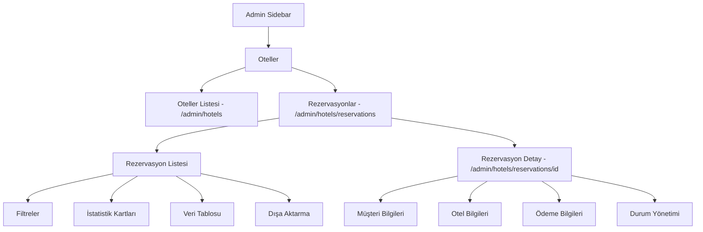

# Admin Otel Rezervasyonları Sayfası Planı

## 📋 Genel Bakış

Transferler bölümündeki rezervasyonlar yapısına benzer şekilde, Oteller bölümüne de "Rezervasyonlar" alt sayfası eklenecektir. Bu sayfa, otel rezervasyonlarını görüntüleme, filtreleme, yönetme ve dışa aktarma işlevlerini sağlayacaktır.

## 🏗️ Mimari Yapı



## 📁 Dosya Yapısı

```
web-app/src/
├── app/admin/hotels/
│   ├── page.tsx                          # Mevcut oteller listesi
│   ├── [id]/
│   │   ├── page.tsx                      # Otel düzenleme
│   │   └── _client.tsx
│   └── reservations/                     # YENİ
│       ├── page.tsx                      # Rezervasyon listesi
│       └── [id]/                         # YENİ
│           ├── page.tsx                  # Rezervasyon detay
│           └── _client.tsx               # Rezervasyon detay client
├── components/admin/
│   └── AdminSidebar.tsx                  # Güncellenecek - alt menü eklenecek
└── lib/firebase/
    └── admin-domain.ts                   # Güncellenecek - otel rezervasyon fonksiyonları
```

## 🔧 Firebase Fonksiyonları

### Eklenecek Fonksiyonlar - [`admin-domain.ts`](web-app/src/lib/firebase/admin-domain.ts)

```typescript
// ═══════════════════════════════════════════════════════════════════════
// HOTEL RESERVATIONS
// ═══════════════════════════════════════════════════════════════════════

export interface HotelReservationFilters extends Omit<ReservationFilters, "type"> {
  hotelId?: string;
  roomType?: string;
}

export async function getHotelReservations(
  filters?: HotelReservationFilters,
): Promise<ReservationModel[]>

export async function getReservationsByHotelId(
  hotelId: string,
): Promise<ReservationModel[]>

export interface HotelReservationStats extends ReservationStats {
  confirmedReservations: number;
  cancelledReservations: number;
  todayCheckins: number;
  todayCheckouts: number;
  upcomingCheckins: number;
  averagePrice: number;
  totalNights: number;
  averageNights: number;
}

export async function getHotelReservationStats(): Promise<HotelReservationStats>
```

## 📊 Rezervasyon Listesi Sayfası Tasarımı

### İstatistik Kartları

| Kart | Açıklama | İkon | Renk |
|------|----------|------|------|
| Toplam Rezervasyon | Tüm otel rezervasyonları | CalendarCheck | Emerald |
| Bekleyen | Onay bekleyen rezervasyonlar | Activity | Amber |
| Bugünkü Girişler | Bugün check-in yapacaklar | LogIn | Blue |
| Toplam Gelir | Onaylı/tamamlanmış rezervasyon geliri | DollarSign | Green |
| Ortalama Fiyat | Rezervasyon başına ortalama | TrendingUp | Purple |

### Filtre Seçenekleri

```typescript
interface HotelReservationFilters {
  search: string;           // Rezervasyon no, müşteri, otel adı
  status: ReservationStatus | "";
  dateFrom: string;         // Giriş tarihi başlangıç
  dateTo: string;           // Giriş tarihi bitiş
  priceMin: string;         // Min fiyat
  priceMax: string;         // Max fiyat
  source: "all" | "web" | "mobile" | "admin";
  hotelCategory: string;    // Otel kategorisi filtresi
}
```

### Tablo Sütunları

| Sütun | Açıklama |
|-------|----------|
| Rezervasyon No | ID + Kısa kod |
| Müşteri | Ad Soyad + E-posta |
| Otel | Otel adı + Şehir |
| Giriş Tarihi | Check-in tarihi |
| Çıkış Tarihi | Check-out tarihi |
| Gece | Konaklama süresi |
| Fiyat | Toplam tutar |
| Durum | Status badge |
| Kaynak | Web/Mobil/Admin |
| İşlemler | Detay linki |

## 📝 Rezervasyon Detay Sayfası Tasarımı

### Sol Taraf - Ana Bilgiler

1. **Rezervasyon Detayları**
   - Rezervasyon ID
   - Otel adı
   - Oda tipi
   - Fiyat bilgisi
   - Kaynak

2. **Konaklama Bilgileri**
   - Check-in tarihi ve saati
   - Check-out tarihi ve saati
   - Gece sayısı
   - Misafir sayısı
   - Oda sayısı

3. **Otel Bilgileri**
   - Otel adı ve linki
   - Adres
   - İletişim bilgileri
   - Otel kategorisi

4. **Ödeme Bilgileri**
   - Ödeme ID
   - Ödeme durumu
   - Toplam tutar
   - Para birimi

5. **Müşteri Notu**
   - Varsa müşteri notu

6. **Admin Notu**
   - Düzenlenebilir admin notu
   - Kaydet butonu

7. **Durum Değiştirme**
   - Onayla butonu (pending -> confirmed)
   - İptal Et butonu (pending -> cancelled)
   - Tamamlandı butonu (confirmed -> completed)

### Sağ Taraf - Yan Bilgiler

1. **Müşteri Bilgileri**
   - Ad Soyad
   - E-posta
   - Telefon
   - Roller
   - Kullanıcı profili linki

2. **Zaman Çizelgesi**
   - Oluşturulma tarihi
   - Son güncelleme
   - Check-in tarihi
   - Check-out tarihi

3. **Hızlı Eylemler**
   - Listeye dön
   - Otel detayına git
   - Müşteri profiline git

## 🎨 UI Bileşenleri

### Kullanılacak Mevcut Bileşenler

- [`DataTable`](web-app/src/components/admin/DataTable.tsx) - Veri tablosu
- [`Pagination`](web-app/src/components/admin/Pagination.tsx) - Sayfalama
- [`SearchInput`](web-app/src/components/admin/SearchInput.tsx) - Arama input
- [`StatCard`](web-app/src/components/admin/StatCard.tsx) - İstatistik kartları
- [`StatusBadge`](web-app/src/components/admin/StatusBadge.tsx) - Durum rozetleri

### Durum Renkleri

| Durum | Renk | Badge Style |
|-------|------|-------------|
| pending | Amber | bg-amber-50 text-amber-700 |
| confirmed | Emerald | bg-emerald-50 text-emerald-700 |
| cancelled | Red | bg-red-50 text-red-700 |
| completed | Blue | bg-blue-50 text-blue-700 |

## 🔄 Admin Sidebar Güncellemesi

[`AdminSidebar.tsx`](web-app/src/components/admin/AdminSidebar.tsx) dosyasında Oteller menü öğesine alt başlık eklenecek:

```typescript
{
  label: "Oteller",
  href: "/admin/hotels",
  icon: Building2,
  subItems: [
    { label: "Oteller", href: "/admin/hotels" },
    { label: "Rezervasyonlar", href: "/admin/hotels/reservations" },
  ],
},
```

## 📊 Meta Veri Yapısı

Otel rezervasyonlarında `meta` alanında beklenen veriler:

```typescript
interface HotelReservationMeta {
  hotelId: string;
  hotelName: string;
  roomTypeCode?: string;
  roomName?: string;
  boardBasis?: string;           // Yemek planı (BB, HB, FB, AI)
  checkInTime?: string;
  checkOutTime?: string;
  nights?: number;
  adults?: number;
  children?: number;
  childAges?: number[];
  specialRequests?: string;
  guestInfo?: {
    title: string;
    firstName: string;
    lastName: string;
    email: string;
    phone: string;
    identityTaxNumber: string;
  };
  webbedsData?: {
    bookingReference?: string;
    confirmationNumber?: string;
    rateId?: string;
    roomTypeCode?: string;
  };
}
```

## 🚀 Uygulama Sırası

1. **Admin Sidebar Güncellemesi** - Alt menü ekleme
2. **Firebase Fonksiyonları** - Otel rezervasyon fonksiyonları
3. **Rezervasyon Liste Sayfası** - Ana liste sayfası
4. **Rezervasyon Detay Sayfası** - Detay görüntüleme ve yönetim
5. **Test ve Doğrulama** - İşlevsellik testi

## 📱 Responsive Tasarım

- Mobil: Tek sütun düzeni
- Tablet: 2 sütun düzeni
- Desktop: 3 sütun düzeni (detay sayfası)

## 🔒 Güvenlik

- Sadece admin rolüne sahip kullanıcılar erişebilir
- Rezervasyon durumu değişiklikleri loglanır
- Dışa aktarma işlemleri yetkilendirme gerektirir

## 📈 Performans

- Sayfalama ile veri yükleme (15 kayıt/sayfa)
- Lazy loading ile bileşen yükleme
- Memoization ile filtreleme işlemleri
- CSV dışa aktarma için blob kullanımı
