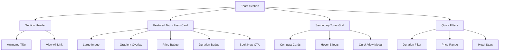
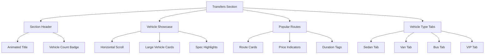

# Anasayfa Turlar ve Transferler Bölümleri - Modern Yeniden Tasarım Planı

## 📋 Mevcut Durum Analizi

### Turlar Bölümü (UpcomingUmrahTours)
- **Konum**: [`web-app/src/components/tours/UpcomingUmrahTours.tsx`](../web-app/src/components/tours/UpcomingUmrahTours.tsx)
- **Mevcut Tasarım**: Standart Card bileşeni, basit hover efektleri
- **Veri Kaynağı**: UmreDunyasi API
- **Özellikler**:
  - Grid layout (sm:2, lg:3)
  - Badge'ler (gece sayısı, süre)
  - Firma bilgisi ve doğrulama rozeti
  - Sefernur notu kutusu
  - Fiyat gösterimi

### Transferler Bölümü (TransferCard)
- **Konum**: [`web-app/src/app/page.tsx`](../web-app/src/app/page.tsx:673) (satır 673-707)
- **Mevcut Tasarım**: Basit Card bileşeni
- **Veri Kaynağı**: Firebase Firestore
- **Özellikler**:
  - Araç görseli veya fallback gradient
  - Kapasite ve süre bilgisi
  - Rota gösterimi
  - Fiyat ve rating

## 🎨 Tasarım Konsepti: "Manevi Lüks & Modern Glassmorphism"

### Estetik Yön
- **Ana Tema**: İslami motiflerle harmanlanmış modern glassmorphism
- **Renk Paleti**:
  - Turlar: Emerald/Teal gradient + Gold accents
  - Transferler: Cyan/Sky gradient + Silver accents
- **Tipografi**: Playfair Display (başlıklar) + Inter (body)
- **Efektler**:
  - Glassmorphism kartlar
  - Holografik shimmer efektleri
  - Asimetrik layout
  - Floating elements
  - Islamic pattern arka planlar

### Tasarım Prensipleri
1. **Benzersizlik**: Her kartın kendine has karakteri
2. **Derinlik**: Katmanlı gölgeler ve blur efektleri
3. **Hareket**: Smooth animasyonlar ve micro-interactions
4. **Hiyerarşi**: Gözün takip edeceği net bir akış

---

## 🔄 Turlar Bölümü Yeniden Tasarım

### Yeni Bölüm Yapısı



### Özellikler

#### 1. Section Header
- Animasyonlu başlık (fade-in + slide-up)
- Islamic pattern arka plan
- "Tümünü Gör" butonu (gradient border)

#### 2. Featured Tour (Hero Card)
- Sol tarafta büyük featured card (asimetrik)
- Full height image
- Gradient overlay (emerald to teal)
- Floating price badge (gold border)
- Holografik shimmer efekti
- "Rezervasyon Yap" butonu (animated)

#### 3. Secondary Tours Grid
- 2x2 grid layout
- Compact card design
- Hover'da reveal efektleri
- Quick view modal trigger

#### 4. Quick Filters
- Horizontal scrollable chips
- Active state glow effect
- Filter count badges

### Card Tasarımı

```tsx
// Yeni TourCard özellikleri
interface TourCardDesign {
  // Layout
  layout: "featured" | "compact";
  
  // Visual
  glassEffect: boolean;
  holographicShimmer: boolean;
  floatingBadges: boolean;
  
  // Content
  showFirmVerification: boolean;
  showSefernurNote: boolean;
  showHotelStars: boolean;
  
  // Interactive
  hoverEffect: "lift" | "glow" | "reveal";
  quickViewModal: boolean;
}
```

---

## 🚗 Transferler Bölümü Yeniden Tasarım

### Yeni Bölüm Yapısı



### Özellikler

#### 1. Section Header
- Vehicle icon animasyonu
- Gradient text effect
- Live count badge

#### 2. Vehicle Showcase
- Horizontal scrollable cards
- Large vehicle images
- Spec highlights (capacity, luggage, amenities)
- Price range indicator
- "Book Now" floating button

#### 3. Popular Routes
- Compact route cards
- Map preview (optional)
- Duration badge
- Starting price

#### 4. Vehicle Type Tabs
- Icon-based tabs
- Active state glow
- Filter functionality

### Card Tasarımı

```tsx
// Yeni TransferCard özellikleri
interface TransferCardDesign {
  // Layout
  layout: "showcase" | "compact";
  
  // Visual
  glassEffect: boolean;
  neonGlow: boolean;
  animatedBorder: boolean;
  
  // Content
  showVehicleSpecs: boolean;
  showAmenities: boolean;
  showRoutePreview: boolean;
  
  // Interactive
  hoverEffect: "scale" | "neon" | "flip";
  quickBookModal: boolean;
}
```

---

## 🎯 Ortak Tasarım Elementleri

### Renk Sistemi

```css
/* Turlar - Emerald/Gold */
--tour-primary: linear-gradient(135deg, #10b981, #14b8a6);
--tour-accent: #f59e0b;
--tour-glass: rgba(16, 185, 129, 0.1);

/* Transferler - Cyan/Silver */
--transfer-primary: linear-gradient(135deg, #06b6d4, #0ea5e9);
--transfer-accent: #94a3b8;
--transfer-glass: rgba(6, 182, 212, 0.1);

/* Common */
--glass-bg: rgba(255, 255, 255, 0.7);
--glass-border: rgba(255, 255, 255, 0.3);
--shadow-soft: 0 8px 32px rgba(0, 0, 0, 0.1);
--shadow-glow: 0 0 40px rgba(16, 185, 129, 0.3);
```

### Animasyonlar

```css
/* Shimmer Effect */
@keyframes shimmer {
  0% { background-position: -200% center; }
  100% { background-position: 200% center; }
}

/* Float Animation */
@keyframes float {
  0%, 100% { transform: translateY(0px); }
  50% { transform: translateY(-10px); }
}

/* Glow Pulse */
@keyframes glowPulse {
  0%, 100% { box-shadow: 0 0 20px rgba(16, 185, 129, 0.3); }
  50% { box-shadow: 0 0 40px rgba(16, 185, 129, 0.6); }
}

/* Reveal Animation */
@keyframes revealUp {
  from { 
    opacity: 0; 
    transform: translateY(20px); 
  }
  to { 
    opacity: 1; 
    transform: translateY(0); 
  }
}
```

### Islamic Pattern Arka Plan

```tsx
// Islamic pattern SVG component
const IslamicPattern = () => (
  <div className="absolute inset-0 opacity-5">
    <svg className="w-full h-full" xmlns="http://www.w3.org/2000/svg">
      <defs>
        <pattern id="islamic-pattern" x="0" y="0" width="100" height="100" patternUnits="userSpaceOnUse">
          {/* Geometric Islamic pattern */}
          <path d="M50 0 L100 50 L50 100 L0 50 Z" fill="none" stroke="currentColor" strokeWidth="1"/>
          <circle cx="50" cy="50" r="20" fill="none" stroke="currentColor" strokeWidth="1"/>
          <path d="M50 30 L70 50 L50 70 L30 50 Z" fill="none" stroke="currentColor" strokeWidth="0.5"/>
        </pattern>
      </defs>
      <rect width="100%" height="100%" fill="url(#islamic-pattern)"/>
    </svg>
  </div>
);
```

---

## 📁 Dosya Yapısı

### Yeni Dosyalar

```
web-app/src/components/
├── tours/
│   ├── TourCard.tsx                    # Yeni modern tour card
│   ├── FeaturedTourCard.tsx            # Hero featured card
│   ├── CompactTourCard.tsx             # Secondary grid card
│   ├── TourFilters.tsx                 # Quick filter chips
│   └── TourQuickViewModal.tsx          # Quick detail modal
│
└── transfers/
    ├── TransferCard.tsx                # Yeni modern transfer card
    ├── VehicleShowcaseCard.tsx         # Large showcase card
    ├── CompactTransferCard.tsx         # Compact variant
    ├── VehicleTypeTabs.tsx             # Vehicle type filter
    └── PopularRoutesSection.tsx        # Popular routes grid
```

### Güncellenecek Dosyalar

```
web-app/src/
├── app/
│   └── page.tsx                        # Ana sayfa - section imports
│
├── components/
│   ├── tours/
│   │   └── UpcomingUmrahTours.tsx     # Refactor with new cards
│   │
│   └── transfers/
│       └── PopularServicesSection.tsx  # Enhance with new design
│
└── styles/
    └── animations.css                  # New animation utilities
```

---

## 🔧 Uygulama Adımları

### Adım 1: Temel Bileşenleri Oluştur
1. `TourCard.tsx` - Base tour card component
2. `TransferCard.tsx` - Base transfer card component
3. `animations.css` - Animation utilities

### Adım 2: Turlar Bölümü
1. `FeaturedTourCard.tsx` - Hero card implementation
2. `CompactTourCard.tsx` - Grid card implementation
3. `TourFilters.tsx` - Filter chips
4. `UpcomingUmrahTours.tsx` - Refactor with new components

### Adım 3: Transferler Bölümü
1. `VehicleShowcaseCard.tsx` - Large card implementation
2. `CompactTransferCard.tsx` - Compact variant
3. `VehicleTypeTabs.tsx` - Type filter
4. Update `page.tsx` TransferCard section

### Adım 4: Entegrasyon
1. Update `page.tsx` with new sections
2. Add responsive breakpoints
3. Test animations and interactions
4. Performance optimization

### Adım 5: Son Dokunuşlar
1. Accessibility audit
2. SEO optimization
3. Cross-browser testing
4. Mobile responsiveness

---

## 🎨 Mockup Taslakları

### Tours Section Layout

```
┌───────────────────────────────���─────────────────────────────┐
│  ┌─────────────┐  Yaklaşan Umre Turları        Tümünü Gör → │
│  │  🕌 Pattern │  UmreDunyasi güvencesiyle...               │
│  └─────────────┘                                              │
├─────────────────────────────────────────────────────────────┤
│                                                               │
│  ┌─────────────────────────────────┐  ┌──────────────────┐  │
│  │                                 │  │                  │  │
│  │   [FEATURED TOUR - LARGE]       │  │  Compact Card 1  │  │
│  │                                 │  │                  │  │
│  │   📸 Full Height Image          │  │  [Image]         │  │
│  │   ┌─────────────────────┐       │  │  Title           │  │
│  │   │  Gradient Overlay   │       │  │  Duration       │  │
│  │   │                     │       │  │  Price          │  │
│  │   │  🏷️ $1,200         │       │  │                  │  │
│  │   │  📅 10 Gün         │       │  └──────────────────┘  │
│  │   │                     │       │  ┌──────────────────┐  │
│  │   │  [Rezervasyon Yap] │       │  │  Compact Card 2  │  │
│  │   └─────────────────────┘       │  │                  │  │
│  │                                 │  └──────────────────┘  │
│  └─────────────────────────────────┘                        │
│                                                               │
│  ┌─────────────────────────────────────────────────────┐    │
│  │  Quick Filters: [Tümü] [7 Gün] [10 Gün] [15 Gün]   │    │
│  └─────────────────────────────────────────────────────┘    │
└─────────────────────────────────────────────────────────────┘
```

### Transfers Section Layout

```
┌─────────────────────────────────────────────────────────────┐
│  ┌─────────────┐  Transfer Hizmetleri      12 Transfer    │
│  │  🚗 Pattern │  Güvenli ve konforlu...                   │
│  └─────────────┘                                              │
├─────────────────────────────────────────────────────────────┤
│                                                               │
│  ┌─────────────────────────────────────────────────────┐    │
│  │  Vehicle Type: [🚗 Sedan] [🚐 Van] [🚌 Bus] [👑 VIP] │    │
│  └─────────────────────────────────────────────────────┘    │
│                                                               │
│  ┌─────────────────────────────────┐  ┌──────────────────┐  │
│  │                                 │  │                  │  │
│  │   [VEHICLE SHOWCASE]            │  │  Vehicle 2       │  │
│  │                                 │  │                  │  │
│  │   📸 Large Vehicle Image        │  │  [Image]         │  │
│  │   ┌─────────────────────┐       │  │  Specs           │  │
│  │   │  Spec Highlights     │       │  │  Price           │  │
│  │   │  👥 4 Kişi          │       │  │  Book Now        │  │
│  │   │  🧳 2 Bagaj         │       │  │                  │  │
│  │   │  ❄️ WiFi, AC        │       │  └──────────────────┘  │
│  │   │                     │       │  ┌──────────────────┐  │
│  │   │  💰 500₺'den başlayan│       │  │  Vehicle 3       │  │
│  │   │                     │       │  │                  │  │
│  │   │  [Hemen Rezervasyon]│       │  └──────────────────┘  │
│  │   └─────────────────────┘       │                        │
│  │                                 │  ┌──────────────────┐  │
│  └─────────────────────────────────┘  │  Vehicle 4       │  │
│                                        │                  │  │
│                                        └──────────────────┘  │
└─────────────────────────────────────────────────────────────┘
```

---

## ✅ Başarı Kriterleri

### Görsel
- [ ] Glassmorphism efektleri doğru uygulanmış
- [ ] Gradient renkler tutarlı
- [ ] Animasyonlar smooth ve performanslı
- [ ] Islamic pattern arka planlar uygun opacity'de

### İşlevsel
- [ ] Tüm kartlar responsive (mobile, tablet, desktop)
- [ ] Hover efektleri tüm cihazlarda çalışıyor
- [ ] Filtreler doğru çalışıyor
- [ ] Linkler doğru sayfalara yönlendiriyor

### Erişilebilirlik
- [ ] WCAG 2.1 AA uyumlu
- [ ] Klavye navigasyonu çalışıyor
- [ ] Screen reader friendly
- [ ] Yeterli color contrast

### Performans
- [ ] Lighthouse score > 90
- [ ] Animasyonlar 60fps
- [ ] Lazy loading implement edilmiş
- [ ] Image optimization

---

## 📝 Notlar

### Typography
- Başlıklar için: Playfair Display veya benzersiz bir serif font
- Body için: Inter veya benzeri clean sans-serif
- Fiyatlar için: Tabular figures (monospace numbers)

### Color Accessibility
- Tüm text contrast ratio minimum 4.5:1
- Large text minimum 3:1
- Interactive elements clear visual feedback

### Animation Performance
- CSS transforms > position changes
- will-change property sparingly
- Reduce motion for users who prefer it

---

## 🚀 Sonraki Adımlar

Bu plan onaylandıktan sonra:
1. Code mode'a geçiş
2. Bileşenleri sırayla implement et
3. Her adımda test ve review
4. Final polish ve optimization
