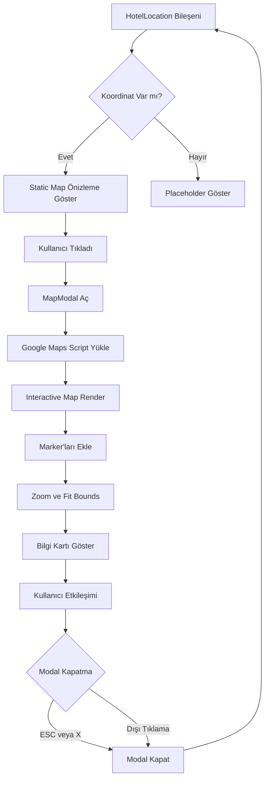

# Otel Harita Bileşeni - Modern Tasarım Planı

## 📋 Genel Bakış

Otel detay sayfalarında konumu gösteren, küçük önizleme olarak görünen ve tıklandığında tam ekran modal içinde açılan modern bir harita bileşeni tasarımı.

## 🎯 Hedefler

1. **Küçük Önizleme**: Sayfada küçük, kompakt harita görünümü
2. **Tıklanabilir**: Tıklandığında büyük modal/lightbox açılması
3. **Modern Tasarım**: Gradyan efektleri, yuvarlak köşeler, gölgeler
4. **Responsive**: Mobil ve masaüstünde mükemmel görünüm
5. **Performans**: Lazy loading ve optimizasyon
6. **Konum Bilgisi**: Kutsal mekanlara uzaklık gösterimi

## 🎨 Tasarım Özellikleri

### A. Küçük Harita Önizlemesi (Sayfada)

```
┌──────────────────────────────────────────────────┐
│  📍 Konum                                         │
│  ┌──────────────────────────────────────────┐   │
│  │                                           │   │
│  │          [Harita Önizlemesi]             │   │
│  │                                           │   │
│  │         🔍 Haritayı Büyüt                │   │
│  │                                           │   │
│  └──────────────────────────────────────────┘   │
│                                                   │
│  📌 Adres Bilgisi                                │
│  🎯 Mescid-i Haram'a 350m uzaklıkta             │
│                                                   │
│  [🗺️ Yol Tarifi Al]  [📍 Konumu Paylaş]       │
└──────────────────────────────────────────────────┘
```

**Özellikler:**
- Yükseklik: 250-300px
- Yuvarlak köşeler (rounded-xl)
- Hover efekti: Hafif scale ve gölge artışı
- Üzerine yarı saydam overlay + "Haritayı Büyüt" ikonu
- Click cursor ve interaktif görünüm

### B. Büyük Harita Modal (Açılır Pencere)

```
┌─────────────────────────────────────────────────────────┐
│                    [X Kapat]                             │
│  ┏━━━━━━━━━━━━━━━━━━━━━━━━━━━━━━━━━━━━━━━━━━━━━━━━━━┓  │
│  ┃                                                    ┃  │
│  ┃                                                    ┃  │
│  ┃              [TAM EKRAN HARİTA]                   ┃  │
│  ┃                                                    ┃  │
│  ┃         🏨 Otel İşaretçisi                        ┃  │
│  ┃         🕋 Kutsal Mekan İşaretçisi                ┃  │
│  ┃                                                    ┃  │
│  ┃                                                    ┃  │
│  ┗━━━━━━━━━━━━━━━━━━━━━━━━━━━━━━━━━━━━━━━━━━━━━━━━━━┛  │
│                                                          │
│  📍 Otel Adı | 🎯 350m uzaklık | [Yol Tarifi]          │
└─────────────────────────────────────────────────────────┘
```

**Özellikler:**
- Full screen veya 90% viewport
- Backdrop blur efekti
- Animasyonlu açılma (fade + scale)
- ESC tuşu ile kapanma
- Dışına tıklayınca kapanma
- Zoom kontrolleri
- Tam ekran butonu

## 🏗️ Bileşen Yapısı

### 1. HotelLocation.tsx (Güncellenmiş)

**Sorumluluklar:**
- Küçük harita önizlemesi gösterme
- Konum bilgileri (adres, uzaklık)
- Modal açma trigger'ı
- Static map API ile önizleme (performans için)

**Props:**
```typescript
interface HotelLocationProps {
  address: string;
  cityName?: string;
  countryName?: string;
  lat?: number;
  lng?: number;
  holySiteName?: string;
  holySiteDistance?: string;
  cityCode?: number;
  hotelName?: string;
}
```

### 2. MapModal.tsx (Yeni Bileşen)

**Sorumluluklar:**
- Full-screen modal container
- Interactive harita (Google Maps veya Leaflet)
- Zoom kontrolleri
- Marker'lar (otel + kutsal mekanlar)
- Bilgi kartı overlay

**Props:**
```typescript
interface MapModalProps {
  isOpen: boolean;
  onClose: () => void;
  lat: number;
  lng: number;
  hotelName: string;
  address: string;
  cityCode?: number;
  holySiteName?: string;
  holySiteDistance?: string;
}
```

### 3. InteractiveMap.tsx (Yeni Bileşen)

**Sorumluluklar:**
- Google Maps veya Leaflet entegrasyonu
- Custom marker'lar
- Yol tarifi çizgisi
- Touch/gesture desteği

## 🛠️ Teknoloji Kararları

### Harita Servisi Karşılaştırması

#### Google Maps API
✅ **Avantajlar:**
- Zaten Google Places API kullanılıyor (mevcut key)
- Mükemmel Türkiye ve Suudi Arabistan desteği
- Street View entegrasyonu
- Directions API (yol tarifi)
- Bilindik kullanıcı deneyimi

❌ **Dezavantajlar:**
- Ücretli (ama zaten kullanılıyor)
- Bundle size daha büyük

#### Leaflet + OpenStreetMap
✅ **Avantajlar:**
- Ücretsiz
- Lightweight (küçük bundle)
- Özelleştirilebilir
- React-Leaflet ile kolay entegrasyon

❌ **Dezavantajlar:**
- Suudi Arabistan detayları daha az
- Ekstra library dependency

### 📊 Karar: **Google Maps API**

**Neden?**
1. Zaten Firebase API key mevcut
2. Suudi Arabistan'da daha iyi detay
3. Kullanıcılar alışkın
4. Yol tarifi entegrasyonu mükemmel
5. Mevcut kod yapısı ile uyumlu

## 🎨 Stil ve Animasyon Detayları

### Küçük Harita Önizleme Stilleri

```css
.map-preview-container {
  position: relative;
  height: 280px;
  border-radius: 16px;
  overflow: hidden;
  cursor: pointer;
  transition: all 0.3s cubic-bezier(0.4, 0, 0.2, 1);
  border: 2px solid rgb(226 232 240);
  box-shadow: 0 1px 3px rgba(0,0,0,0.1);
}

.map-preview-container:hover {
  transform: scale(1.02);
  box-shadow: 0 10px 25px rgba(16, 185, 129, 0.15);
  border-color: rgb(16, 185, 129);
}

.map-overlay {
  position: absolute;
  inset: 0;
  background: linear-gradient(
    to top,
    rgba(0,0,0,0.7) 0%,
    rgba(0,0,0,0.3) 40%,
    transparent 100%
  );
  display: flex;
  align-items: center;
  justify-content: center;
  opacity: 0;
  transition: opacity 0.3s ease;
}

.map-preview-container:hover .map-overlay {
  opacity: 1;
}

.expand-button {
  background: white;
  padding: 12px 24px;
  border-radius: 12px;
  box-shadow: 0 4px 12px rgba(0,0,0,0.2);
  display: flex;
  align-items: center;
  gap: 8px;
  font-weight: 600;
  color: rgb(16, 185, 129);
  transform: translateY(10px);
  transition: transform 0.3s ease;
}

.map-preview-container:hover .expand-button {
  transform: translateY(0);
}
```

### Modal Animasyonları

```css
@keyframes modalFadeIn {
  from {
    opacity: 0;
  }
  to {
    opacity: 1;
  }
}

@keyframes modalScaleIn {
  from {
    opacity: 0;
    transform: scale(0.95) translateY(20px);
  }
  to {
    opacity: 1;
    transform: scale(1) translateY(0);
  }
}

.modal-backdrop {
  animation: modalFadeIn 0.2s ease-out;
  backdrop-filter: blur(8px);
  background: rgba(0, 0, 0, 0.5);
}

.modal-content {
  animation: modalScaleIn 0.3s cubic-bezier(0.4, 0, 0.2, 1);
}
```

## 📱 Responsive Tasarım

### Mobile (< 768px)
- Harita yüksekliği: 200px
- Modal: Full screen (100vh, 100vw)
- Tek kolonlu bilgi kartları
- Dokunma jestleri aktif

### Tablet (768px - 1024px)
- Harita yüksekliği: 250px
- Modal: 90% ekran
- İki kolonlu bilgi kartları

### Desktop (> 1024px)
- Harita yüksekliği: 300px
- Modal: Max-width 1200px, centered
- Yan yana bilgi ve kontroller
- Hover efektleri aktif

## 🎯 Custom Marker İkonları

### Otel İkonu
```javascript
const hotelMarker = {
  url: '/icons/hotel-marker.svg',
  scaledSize: new google.maps.Size(48, 48),
  origin: new google.maps.Point(0, 0),
  anchor: new google.maps.Point(24, 48)
};
```

### Kutsal Mekan İkonu (Mescid-i Haram/Nebevi)
```javascript
const holySiteMarker = {
  url: '/icons/holy-site-marker.svg',
  scaledSize: new google.maps.Size(40, 40),
  origin: new google.maps.Point(0, 0),
  anchor: new google.maps.Point(20, 40)
};
```

## 🚀 Performans Optimizasyonları

1. **Lazy Loading**: Modal sadece açıldığında Google Maps script'i yüklensin
2. **Static Map Önizleme**: Küçük önizleme için Google Static Maps API
3. **Memoization**: React.memo ve useMemo kullanımı
4. **Debounce**: Zoom/pan işlemlerinde debounce
5. **Image Optimization**: Marker ikonları WebP formatında

## 📐 Detaylı Bileşen Akışı



## 🎨 Renk Paleti

```css
/* Primary - Emerald */
--map-primary: rgb(16, 185, 129);
--map-primary-light: rgb(209, 250, 229);
--map-primary-dark: rgb(6, 95, 70);

/* Accent - Amber (Kutsal Mekanlar) */
--map-accent: rgb(245, 158, 11);
--map-accent-light: rgb(254, 243, 199);

/* Neutral */
--map-bg: rgb(248, 250, 252);
--map-border: rgb(226, 232, 240);
--map-text: rgb(51, 65, 85);

/* Overlay */
--map-overlay-bg: rgba(0, 0, 0, 0.5);
--map-backdrop: rgba(0, 0, 0, 0.4);
```

## 🔧 Kullanım Örneği

### Otel Detay Sayfasında

```tsx
<HotelLocation
  address="King Fahd Rd, Makkah"
  cityName="Mekke"
  countryName="Suudi Arabistan"
  lat={21.4225}
  lng={39.8262}
  holySiteName="Mescid-i Haram"
  holySiteDistance="350m"
  cityCode={164}
  hotelName="Hilton Suites Makkah"
/>
```

## ✨ İlave Özellikler (Opsiyonel)

1. **Street View Entegrasyonu**: Modal'da Street View seçeneği
2. **Konum Paylaşma**: Sosyal medyada konum paylaşımı
3. **Offline Destek**: Harita cache'leme
4. **Multi-language**: Harita dil desteği
5. **3D View**: Google Maps 3D görünümü
6. **Nearby Places**: Yakındaki önemli yerler (cami, market, restoran)

## 📦 Gerekli Package'lar

```json
{
  "dependencies": {
    "@react-google-maps/api": "^2.19.3",
    "framer-motion": "^10.16.16" // Modal animasyonları için
  }
}
```

## 🎯 Erişilebilirlik (a11y)

1. **Keyboard Navigation**: Tab ile modal açma/kapama
2. **ARIA Labels**: Screen reader desteği
3. **Focus Trap**: Modal içinde focus yönetimi
4. **High Contrast**: Yüksek kontrast mod desteği
5. **Semantic HTML**: Proper HTML5 semantics

## 📝 Kod Organizasyonu

```
web-app/src/components/hotels/
├── HotelLocation.tsx              (Güncellenmiş - preview)
├── MapModal.tsx                   (Yeni - full screen modal)
├── InteractiveMap.tsx             (Yeni - Google Maps wrapper)
├── map/
│   ├── CustomMarker.tsx          (Custom marker bileşeni)
│   ├── InfoCard.tsx              (Harita üzerindeki bilgi kartı)
│   ├── MapControls.tsx           (Zoom, fullscreen kontrolleri)
│   └── types.ts                  (Harita tipleri)
└── index.ts                       (Export'lar)
```

## ⚡ Implementasyon Adımları

1. **[@react-google-maps/api](https://www.npmjs.com/package/@react-google-maps/api)** paketini yükle
2. **MapModal.tsx** bileşenini oluştur
3. **InteractiveMap.tsx** bileşenini oluştur  
4. **HotelLocation.tsx** güncellemesi yap
5. Custom marker SVG'leri hazırla
6. Static Maps API preview entegrasyonu
7. Modal animasyonlarını ekle
8. Responsive testler yap
9. Performans optimizasyonları
10. Accessibility testleri

## 🎨 Örnek Görsel Referanslar

Tasarım örneğinde gördüğümüz özellikler:
- ✅ Küçük önizleme haritası
- ✅ "Haritayı Büyüt" hover efekti
- ✅ Full-screen modal açılışı
- ✅ Temiz, minimal tasarım
- ✅ Konum bilgisi kartı
- ✅ Yol tarifi butonu

## 🎯 Başarı Kriterleri

- [ ] Harita 3 saniye içinde yüklenmeli
- [ ] Modal animasyonu smooth olmalı (60fps)
- [ ] Mobilde touch gesture'lar çalışmalı
- [ ] Koordinat olmadığında graceful fallback
- [ ] Lighthouse Performance Score > 90
- [ ] Tüm tarayıcılarda çalışmalı

---

**Son Güncelleme:** 2026-03-20
**Durum:** ✅ Plan Tamamlandı - Implementasyon Hazır
