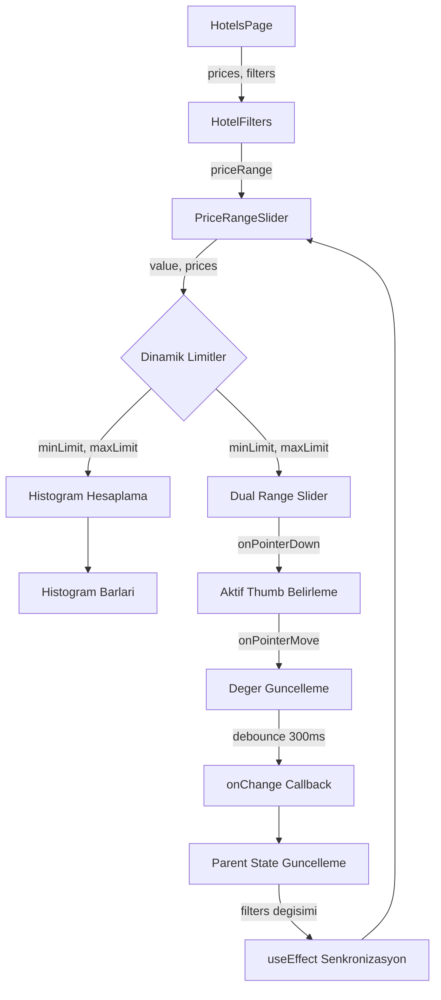

# Otel Fiyat Aralığı Filtresi - Hata Düzeltme ve İyileştirme Planı

## Tespit Edilen Sorunlar

### 🔴 Kritik Hatalar

#### 1. Dual Range Slider Çakışma Sorunu
- **Dosya:** `web-app/src/components/hotels/HotelFilters.tsx` (satır 186-207)
- **Sorun:** İki adet `<input type="range">` üst üste binmiş durumda. Her ikisi de `w-full` ve `opacity-0` ile tam genişlikte. Kullanıcı min slider üzerindeyken max slider'ı da hareket ettirebilir çünkü ikisi aynı z-index'te.
- **Çözüm:** Min slider'ın pointer-events'ini sadece sol yarıda, max slider'ın pointer-events'ini sadece sağ yarıda aktif edecek şekilde düzenlenmeli. Veya daha iyi bir yaklaşım olarak custom thumb event handler'ları yazılmalı.

#### 2. State Senkronizasyon Hatası
- **Dosya:** `web-app/src/components/hotels/HotelFilters.tsx` (satır 416)
- **Sorun:** `localFilters` state'i sadece başlangıçta `filters` prop'u ile initialize ediliyor. Parent'tan gelen `filters` değiştiğinde (örn: "Temizle" butonuna basıldığında) `localFilters` güncellenmez. Bu da filtre temizleme işleminin UI'da yansımamasına yol açar.
- **Çözüm:** `useEffect` ile `filters` prop'u değiştiğinde `localFilters`'ı güncelleyen bir senkronizasyon mekanizması eklenmeli.

#### 3. Histogram Son Bar Eksikliği
- **Dosya:** `web-app/src/components/hotels/HotelFilters.tsx` (satır 121)
- **Sorun:** `p >= barStart && p < barEnd` koşulunda son bar'ın üst sınırı (maxLimit) dahil edilmiyor. maxLimit değerindeki fiyatlar hiçbir bar'da görünmez.
- **Çözüm:** Son bar için koşul `p >= barStart && p <= barEnd` olmalı.

### 🟡 Önemli İyileştirmeler

#### 4. Varsayılan Fiyat Aralığı
- **Dosya:** `web-app/src/components/hotels/HotelFilters.tsx` (satır 466)
- **Sorun:** Fiyat aralığı hiç ayarlanmadığında `[0, 1000]` varsayılan değer kullanılıyor. Bu, gerçek fiyat verisi geldiğinde hala eski değerleri gösterebilir.
- **Çözüm:** `prices` prop'u geldiğinde slider değerlerini dinamik olarak `[minPrice, maxPrice]` arasına ayarla. İlk yüklemede otomatik olarak tüm aralığı kapsamalı.

#### 5. Step Hesaplama
- **Dosya:** `web-app/src/components/hotels/HotelFilters.tsx` (satır 190)
- **Sorun:** `Math.max(1, Math.floor((maxLimit - minLimit) / 100))` step'i çok büyük olabilir. Örn: 0-10000 aralığında step=100, hassas ayar yapılamaz.
- **Çözüm:** Fiyat aralığına göre akıllı step hesaplama. 0-500 arası 5, 500-2000 arası 10, 2000+ için 25 gibi.

#### 6. Thumb Pozisyonu Hesaplama Hatası
- **Dosya:** `web-app/src/components/hotels/HotelFilters.tsx` (satır 212-218)
- **Sorun:** `calc(${minPercent}% - 7px)` hesaplaması kenar durumlarda bozulabilir. Thumb genişliği 3.5px olduğu için 7px offset yerine doğru hesaplama yapılmalı.
- **Çözüm:** Thumb boyutunun yarısı olan 7px (w-3.5 = 14px / 2 = 7px) doğru, ancak %0 ve %100 değerlerinde taşma olabilir. Clamp ile sınırlandırılmalı.

### 🟢 UX İyileştirmeleri

#### 7. Para Birimi Gösterimi
- **Dosya:** `web-app/src/components/hotels/HotelFilters.tsx` (satır 148-150)
- **Sorun:** Fiyatlar `$` işareti ile gösteriliyor. Kullanıcıların Türk pazarına yönelik olduğu düşünülürse USD gösterimi doğru mu değerlendirilmeli.
- **Çözüm:** API'den gelen fiyat birimi ne ise onu göstermeli. Şimdilik USD ise bu doğru.

#### 8. Debounce Mekanizması
- **Sorun:** Her slider hareketi anında `onFiltersChange` tetikliyor. Bu çok fazla re-render'a ve gereksiz filtrelemeye sebep olur.
- **Çözüm:** Slider değişimlerinde debounce uygulanmalı (300ms).

#### 9. Histogram Performansı
- **Dosya:** `web-app/src/components/hotels/HotelFilters.tsx` (satır 111-137)
- **Sorun:** `histogramBars` hesaplamasında iç içe döngü var. Her bar için tüm fiyat listesi tekrar filtreleniyor (maxCount hesabı). O(n*barCount^2) karmaşıklığı.
- **Çözüm:** Önce tüm bar'ların count'larını hesapla, sonra maxCount'u bul. O(n*barCount) karmaşıklığına düşür.

## İmplementasyon Adımları

### Adım 1: State Senkronizasyonu Düzeltmesi
`HotelFilters` bileşeninde `useEffect` ile parent `filters` prop'u değiştiğinde `localFilters` state'ini güncelle.

### Adım 2: PriceRangeSlider Bileşenini Yeniden Yazma
- Dual range slider'ı doğru çalışan bir implementasyona geçir
- Custom pointer event handler'ları ile min/max thumb çakışmasını önle
- `useRef` ile track elementini referansla ve mouse pozisyonuna göre hangi thumb'ın hareket edeceğini belirle

### Adım 3: Histogram Hesaplamasını Düzeltme
- Son bar dahil etme sorununu çöz
- Performans iyileştirmesi: tek döngüde count'ları hesapla
- Bar yüksekliklerini minimum %5'ten %8'e çıkar (görünürlük)

### Adım 4: Dinamik Varsayılan Değerler
- `prices` prop'u geldiğinde varsayılan slider aralığını gerçek fiyatlara göre ayarla
- İlk render'da filtre uygulanmamış durumda tüm aralığı kapsasın

### Adım 5: Step ve Limit İyileştirmeleri
- Akıllı step hesaplama fonksiyonu ekle
- Min/max limit padding'i %10 yerine sabit bir miktara çevir

### Adım 6: Debounce Eklenmesi
- Slider değişimlerini debounce ile 300ms geciktir
- Sadece son değeri parent'a ilet

### Adım 7: Thumb Pozisyonu ve Görsel İyileştirmeler
- Thumb pozisyonu hesaplamasını kenar durumlar için düzelt
- Aktif thumb'a scale animasyonu ekle
- Hover durumunda tooltip ile fiyat göster

## Etkilenen Dosyalar

| Dosya | Değişiklik Türü |
|-------|----------------|
| `web-app/src/components/hotels/HotelFilters.tsx` | Güncelleme - PriceRangeSlider yeniden yazılacak |
| `web-app/src/app/hotels/page.tsx` | Küçük güncelleme - varsayılan filtre değerleri |

## Mimari Akış

