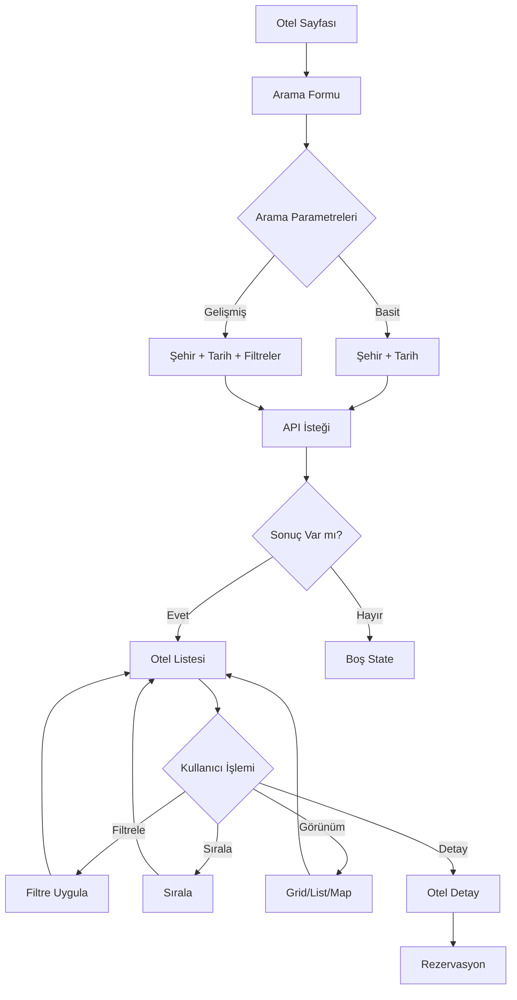
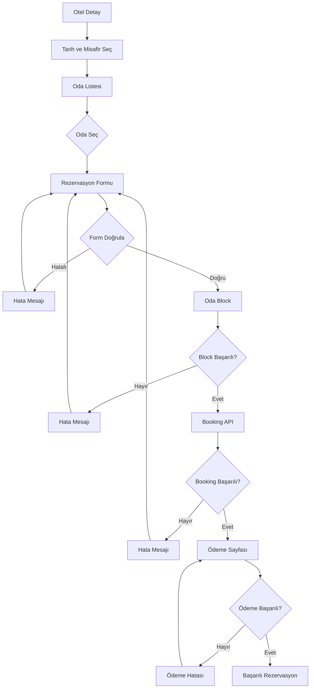

# Oteller Bölümü - Kapsamlı Tasarım ve Geliştirme Planı

## 📋 Yönetici Özeti

Bu belge, Sefernur projesindeki oteller bölümünün mevcut durum analizi, tespit edilen sorunlar ve önerilen iyileştirmeler için kapsamlı bir plan sunmaktadır.

### 🔍 Tespit Edilen Kritik Sorunlar

1. **WebBeds API Entegrasyon Sorunu**: `.env.local` dosyasında `WEBBEDS_BASE_URL` eksik
2. **Sınırlı Arama Fonksiyonalitesi**: Sadece şehir ve tarih filtrelemesi var
3. **Gelişmiş Filtreleme Eksik**: Fiyat aralığı, yıldız, olanaklar filtreleri yok
4. **Kullanıcı Deneyimi**: Otel detay sayfası karmaşık ve bilgi yoğun
5. **Responsive Tasarım**: Mobil deneyim iyileştirilmeli
6. **Performans**: API çağrıları optimize edilmeli

---

## 🎯 Proje Hedefleri

### Birincil Hedefler
- Modern, kullanıcı dostu otel arama ve rezervasyon deneyimi
- WebBeds API ile tam entegrasyon ve hata yönetimi
- Gelişmiş filtreleme ve sıralama seçenekleri
- Responsive ve erişilebilir tasarım

### İkincil Hedefler
- Performans optimizasyonu (caching, lazy loading)
- SEO iyileştirmeleri
- Admin panel geliştirmeleri
- Kullanıcı inceleme ve rating sistemi

---

## 📊 Mevcut Durum Analizi

### 1. WebBeds API Entegrasyonu

#### Mevcut Yapı
```typescript
// web-app/src/lib/webbeds/config.ts
export const WEBBEDS_CONFIG = {
  baseUrl: process.env.WEBBEDS_BASE_URL || "", // ❌ BOŞ - KRİTİK SORUN
  username: process.env.WEBBEDS_USERNAME || "",
  password: process.env.WEBBEDS_PASSWORD || "",
  companyId: process.env.WEBBEDS_COMPANY_ID || "",
  // ...
};
```

#### Sorun
- `WEBBEDS_BASE_URL` environment değişkeni tanımlı değil
- Terminal çıktısı: `TypeError: Invalid URL` hatası
- Tüm API çağrıları başarısız oluyor

#### Çözüm
```bash
# .env.local dosyasına eklenmeli:
WEBBEDS_BASE_URL=https://webbeds.xmlhub.com/v4
WEBBEDS_USERNAME=your_username
WEBBEDS_PASSWORD=your_password
WEBBEDS_COMPANY_ID=your_company_id
```

### 2. Otel Listesi Sayfası ([`hotels/page.tsx`](web-app/src/app/hotels/page.tsx))

#### Mevcut Özellikler
- ✅ Şehir seçimi (Mekke/Medine)
- ✅ Tarih seçimi (giriş/çıkış)
- ✅ Misafir sayısı seçimi
- ✅ Öne çıkan oteller gösterimi
- ✅ Arama sonucu gösterimi
- ✅ Loading/Error/Empty state'ler

#### Eksik Özellikler
- ❌ Fiyat aralığı filtresi
- ❌ Yıldız rating filtresi
- ❌ Olanaklar filtresi
- ❌ Mesafeye göre filtre (Harem'e uzaklık)
- ❌ Sıralama seçenekleri (fiyat, puan, mesafe)
- ❌ Harita görünümü
- ❌ Karşılaştırma özelliği

### 3. Otel Detay Sayfası ([`hotels/[hotelId]/_client.tsx`](web-app/src/app/hotels/[hotelId]/_client.tsx))

#### Mevcut Özellikler
- ✅ Otel bilgileri gösterimi
- ✅ Oda seçimi
- ✅ Rezervasyon formu
- ✅ Ödeme entegrasyonu (KuveytTürk)
- ✅ Görsel galeri (basit)

#### Eksik Özellikler
- ❌ Görsel galeri (lightbox, zoom)
- ❌ Olanaklar ikonları ve açıklamaları
- ❌ Harita entegrasyonu
- ❌ Yakın çevre bilgileri
- ❌ Kullanıcı yorumları
- ❌ Benzer oteller önerileri
- ❌ İptal politikası detayları

### 4. Admin Panel ([`admin/hotels/page.tsx`](web-app/src/app/admin/hotels/page.tsx))

#### Mevcut Özellikler
- ✅ Otel listesi
- ✅ CRUD işlemleri
- ✅ Arama ve filtreleme
- ✅ Aktif/Pasif toggle

#### Eksik Özellikler
- ❌ Toplu import/export
- ❌ Görsel yükleme
- ❌ WebBeds senkronizasyonu
- ❌ Rezervasyon yönetimi
- ❌ İstatistik dashboard

---

## 🎨 Tasarım Konsepti

### Renk Paleti

```css
/* Ana Renkler */
--primary: #059669;        /* Emerald 600 */
--primary-light: #10b981;  /* Emerald 500 */
--primary-dark: #047857;   /* Emerald 700 */

/* Yardımcı Renkler */
--accent: #06b6d4;         /* Cyan 600 */
--warning: #f59e0b;        /* Amber 500 */
--danger: #ef4444;         /* Red 500 */

/* Nötr Renkler */
--bg-primary: #f8fafc;     /* Slate 50 */
--bg-secondary: #ffffff;   /* White */
--text-primary: #0f172a;   /* Slate 900 */
--text-secondary: #64748b; /* Slate 500 */
--border: #e2e8f0;         /* Slate 200 */
```

### Tipografi

```css
/* Başlıklar */
--font-heading: 'Inter', system-ui, sans-serif;
--h1: 2.5rem / 3rem;       /* 40px / 48px */
--h2: 2rem / 2.5rem;       /* 32px / 40px */
--h3: 1.5rem / 2rem;       /* 24px / 32px */

/* Metin */
--font-body: 'Inter', system-ui, sans-serif;
--body: 1rem / 1.5rem;     /* 16px / 24px */
--small: 0.875rem / 1.25rem; /* 14px / 20px */
--tiny: 0.75rem / 1rem;    /* 12px / 16px */
```

### Bileşen Stilleri

#### Kart Tasarımı
```css
.hotel-card {
  background: white;
  border-radius: 16px;
  border: 1px solid var(--border);
  box-shadow: 0 1px 3px rgba(0,0,0,0.1);
  transition: all 0.2s ease;
  overflow: hidden;
}

.hotel-card:hover {
  transform: translateY(-4px);
  box-shadow: 0 12px 24px rgba(0,0,0,0.12);
  border-color: var(--primary-light);
}
```

#### Buton Stilleri
```css
.btn-primary {
  background: var(--primary);
  color: white;
  padding: 12px 24px;
  border-radius: 12px;
  font-weight: 600;
  transition: all 0.2s ease;
}

.btn-primary:hover {
  background: var(--primary-dark);
  transform: translateY(-1px);
}
```

---

## 🏗️ Bileşen Mimaris

### Sayfa Yapısı

```
/hotels
├── HotelsPage
│   ├── HeroSection
│   │   ├── SearchForm
│   │   │   ├── CitySelector
│   │   │   ├── DateRangePicker
│   │   │   ├── GuestSelector
│   │   │   └── SearchButton
│   │   └── QuickFilters
│   ├── PopularHotelsSection
│   │   └── HotelCard[]
│   ├── FiltersSidebar
│   │   ├── PriceRangeFilter
│   │   ├── StarRatingFilter
│   │   ├── AmenitiesFilter
│   │   ├── DistanceFilter
│   │   └── ClearFiltersButton
│   ├── ResultsSection
│   │   ├── SortBar
│   │   ├── ResultsCount
│   │   ├── ViewToggle (Grid/List)
│   │   └── HotelGrid
│   │       └── HotelCard[]
│   └── MapView (Toggle)
│       └── HotelMapMarker[]
│
/hotels/[hotelId]
├── HotelDetailPage
│   ├── ImageGallery
│   │   ├── MainImage
│   │   ├── ThumbnailStrip
│   │   └── Lightbox
│   ├── HotelInfo
│   │   ├── Name & Rating
│   │   ├── Location
│   │   ├── Description
│   │   └── Amenities
│   ├── BookingWidget
│   │   ├── DateSelector
│   │   ├── GuestSelector
│   │   ├── RoomList
│   │   │   └── RoomCard[]
│   │   └── PriceSummary
│   ├── ReviewsSection
│   │   ├── RatingSummary
│   │   ├── ReviewFilters
│   │   └── ReviewList
│   │       └── ReviewCard[]
│   ├── NearbyHotels
│   │   └── HotelCard[]
│   └── LocationMap
```

### Yeni Bileşenler

#### 1. AdvancedSearchForm
```typescript
interface AdvancedSearchFormProps {
  onSearch: (params: HotelSearchParams) => void;
  initialParams?: HotelSearchParams;
  loading?: boolean;
}

// Özellikler:
- Çoklu şehir seçimi
- Tarih aralığı (flexible dates)
- Misafir sayısı (yetişkin/çocuk)
- Oda sayısı
- Bütçe aralığı
- Hızlı seçimler (Bu hafta sonu, Gelecek ay)
```

#### 2. HotelCard (Geliştirilmiş)
```typescript
interface HotelCardProps {
  hotel: Hotel;
  viewMode: 'grid' | 'list' | 'map';
  showDistance?: boolean;
  onCompare?: (hotel: Hotel) => void;
  onFavorite?: (hotelId: string) => void;
}

// Özellikler:
- Grid/List/Map görünümü
- Favori butonu
- Karşılaştırma butonu
- Harem'e uzaklık
- İndirim badge'i
- Ücretsiz iptal badge'i
```

#### 3. RoomCard (Geliştirilmiş)
```typescript
interface RoomCardProps {
  room: Room;
  selected: boolean;
  onSelect: () => void;
  nightCount: number;
  showCancellation?: boolean;
}

// Özellikler:
- Oda görselleri
- İptal politikası detayları
- Dahil olan hizmetler
- Promosyon bilgileri
- Son x oda kaldı uyarısı
```

#### 4. FilterSidebar
```typescript
interface FilterSidebarProps {
  filters: HotelFilters;
  onFiltersChange: (filters: HotelFilters) => void;
  resultsCount: number;
  onClear: () => void;
}

// Filtreler:
- Fiyat aralığı (slider)
- Yıldız ratingi (checkbox)
- Olanaklar (checkbox group)
- Mesafe (Harem'e uzaklık)
- Otel tipi
- Ödeme seçenekleri
- İptal politikası
```

#### 5. ImageGallery
```typescript
interface ImageGalleryProps {
  images: string[];
  hotelName: string;
}

// Özellikler:
- Ana görsel
- Thumbnail strip
- Lightbox modal
- Zoom özelliği
- Slayt gösterisi
- Indirme butonu
```

---

## 🔄 Kullanıcı Akışları

### Otel Arama Akışı



### Rezervasyon Akışı



---

## 📱 Responsive Tasarım Stratejisi

### Breakpoint'ler

```css
/* Mobile First */
/* xs: 0px - 639px */
/* sm: 640px - 767px */
/* md: 768px - 1023px */
/* lg: 1024px - 1279px */
/* xl: 1280px - 1535px */
/* 2xl: 1536px+ */
```

### Grid Yapıları

#### Otel Listesi
```css
/* Mobile: 1 kolon */
.hotel-grid {
  display: grid;
  grid-template-columns: 1fr;
  gap: 16px;
}

/* Tablet: 2 kolon */
@media (min-width: 768px) {
  .hotel-grid {
    grid-template-columns: repeat(2, 1fr);
  }
}

/* Desktop: 3 kolon */
@media (min-width: 1024px) {
  .hotel-grid {
    grid-template-columns: repeat(3, 1fr);
  }
}

/* Large Desktop: 4 kolon */
@media (min-width: 1280px) {
  .hotel-grid {
    grid-template-columns: repeat(4, 1fr);
  }
}
```

#### Otel Detay
```css
/* Mobile: Stack */
.hotel-detail {
  display: flex;
  flex-direction: column;
}

/* Desktop: 2 kolon (Galeri + Bilgi) */
@media (min-width: 1024px) {
  .hotel-detail {
    display: grid;
    grid-template-columns: 2fr 1fr;
    gap: 32px;
  }
}
```

### Mobil Optimizasyonlar

1. **Arama Formu**
   - Collapsible (hamburger menu)
   - Sticky header
   - Hızlı tarih seçici

2. **Filtreler**
   - Bottom sheet (iOS style)
   - Apply/Cancel butonları
   - Seçili filtre sayısı badge

3. **Otel Kartları**
   - Swipe actions (favori, paylaş)
   - Quick view modal
   - Map preview

4. **Navigasyon**
   - Back button
   - Breadcrumb
   - Progress indicator

---

## ⚡ Performans Optimizasyonu

### 1. API Optimizasyonları

#### Debounce
```typescript
// Arama input'u için debounce
const debouncedSearch = useMemo(
  () => debounce((query: string) => {
    // API çağrısı
  }, 500),
  []
);
```

#### Request Cancellation
```typescript
// Önceki isteği iptal et
useEffect(() => {
  const controller = new AbortController();
  
  fetchHotels(params, { signal: controller.signal });
  
  return () => controller.abort();
}, [params]);
```

#### Parallel Requests
```typescript
// Phase 1: Hotel IDs + Pricing
// Phase 2: Hotel Details (parallel batches)
const [pricingData, detailsData] = await Promise.all([
  fetchPricing(params),
  fetchDetails(hotelIds)
]);
```

### 2. Caching Stratejisi

#### React Query Cache
```typescript
const hotelsQuery = useQuery({
  queryKey: ['hotels', searchParams],
  queryFn: fetchHotels,
  staleTime: 5 * 60 * 1000, // 5 dakika
  cacheTime: 30 * 60 * 1000, // 30 dakika
});
```

#### Local Storage Cache
```typescript
// Son aramaları cache'le
const recentSearches = JSON.parse(
  localStorage.getItem('recentHotelSearches') || '[]'
);
```

### 3. Code Splitting

```typescript
// Dinamik import
const HotelMap = lazy(() => import('@/components/hotels/HotelMap'));
const ImageLightbox = lazy(() => import('@/components/hotels/ImageLightbox'));
```

### 4. Image Optimization

```typescript
// Next.js Image component
import Image from 'next/image';

<Image
  src={hotel.image}
  alt={hotel.name}
  width={400}
  height={300}
  loading="lazy"
  placeholder="blur"
/>
```

---

## 🔍 SEO ve Erişilebilirlik

### Meta Tags

```typescript
// Otel detay sayfası
export const metadata = {
  title: `${hotel.name} - Otel Rezervasyonu`,
  description: hotel.description,
  openGraph: {
    title: hotel.name,
    description: hotel.description,
    images: [hotel.image],
  },
  alternates: {
    canonical: `/hotels/${hotel.id}`,
  },
};
```

### Structured Data

```typescript
// JSON-LD
const hotelSchema = {
  "@context": "https://schema.org",
  "@type": "Hotel",
  "name": hotel.name,
  "address": hotel.address,
  "starRating": hotel.stars,
  "priceRange": hotel.priceRange,
  "aggregateRating": hotel.rating,
};
```

### Erişilebilirlik

1. **ARIA Labels**
```typescript
<button aria-label="Favorilere ekle">
  <Heart />
</button>
```

2. **Keyboard Navigation**
```typescript
const handleKeyDown = (e: KeyboardEvent) => {
  if (e.key === 'Enter' || e.key === ' ') {
    // Action
  }
};
```

3. **Focus Management**
```typescript
// Modal açıldığında focus'u yönet
useEffect(() => {
  if (isOpen) {
    modalRef.current?.focus();
  }
}, [isOpen]);
```

---

## 📋 Implementasyon Adımları

### Faz 1: Kritik Sorunlar (Yüksek Öncelik)

1. **WebBeds API Entegrasyonu**
   - [ ] `.env.local` dosyasına eksik değişkenleri ekle
   - [ ] API hata yönetimini iyileştir
   - [ ] Fallback mekanizması ekle

2. **Arama Formu İyileştirmeleri**
   - [ ] Tarih validasyonu
   - [ ] Misafir sayısı component'i
   - [ ] Loading state'ler

3. **Otel Kartı Tasarımı**
   - [ ] Responsive grid
   - [ ] Hover efektleri
   - [ ] Favori butonu

### Faz 2: Gelişmiş Özellikler (Orta Öncelik)

4. **Filtreleme Sistemi**
   - [ ] Fiyat aralığı slider
   - [ ] Yıldız rating filtresi
   - [ ] Olanaklar filtresi
   - [ ] Mesafe filtresi

5. **Sıralama**
   - [ ] Fiyata göre sırala
   - [ ] Puana göre sırala
   - [ ] Mesafeye göre sırala

6. **Görünüm Seçenekleri**
   - [ ] Grid/List toggle
   - [ ] Map görünümü

### Faz 3: Detay Sayfası (Orta Öncelik)

7. **Görsel Galeri**
   - [ ] Lightbox modal
   - [ ] Thumbnail strip
   - [ ] Zoom özelliği

8. **Oda Seçimi**
   - [ ] Gelişmiş oda kartları
   - [ ] İptal politikası
   - [ ] Promosyon bilgileri

9. **Rezervasyon Formu**
   - [ ] Multi-step form
   - [ ] Validasyon
   - [ ] Progress indicator

### Faz 4: Admin Panel (Düşük Öncelik)

10. **Otel Yönetimi**
    - [ ] Toplu import/export
    - [ ] Görsel yükleme
    - [ ] WebBeds senkronizasyonu

11. **Rezervasyon Yönetimi**
    - [ ] Rezervasyon listesi
    - [ ] Durum güncelleme
    - [ ] İptal işlemleri

### Faz 5: İleri Özellikler (Düşük Öncelik)

12. **Kullanıcı Yorumları**
    - [ ] Yorum ekleme
    - [ ] Rating sistemi
    - [ ] Moderasyon

13. **Karşılaştırma**
    - [ ] Karşılaştırma paneli
    - [ ] Side-by-side görünüm

14. **Harita Entegrasyonu**
    - [ ] Otel konumları
    - [ ] Harem mesafesi
    - [ ] Yakın çevre

---

## 🎯 Başarı Kriterleri

### Fonksiyonel Gereksinimler
- [ ] WebBeds API sorunsuz çalışıyor
- [ ] Tüm filtreler doğru çalışıyor
- [ ] Sıralama seçenekleri aktif
- [ ] Rezervasyon akışı tamamlanabiliyor
- [ ] Ödeme entegrasyonu çalışıyor

### UI/UX Gereksinimler
- [ ] Responsive tasarım (mobile-first)
- [ ] Loading state'ler kullanıcı dostu
- [ ] Error state'ler açıklayıcı
- [ ] Hover efektleri smooth
- [ ] Renk kontrastı WCAG AA uyumlu

### Performans Gereksinimler
- [ ] Sayfa yükleme < 3 saniye
- [ ] API yanıt süresi < 2 saniye
- [ ] Lighthouse skoru > 90
- [ ] CLS < 0.1

### SEO Gereksinimler
- [ ] Meta tags tam ve doğru
- [ ] Structured data ekli
- [ ] Canonical URL'ler doğru
- [ ] Sitemap güncel

---

## 📚 Referanslar

### İlgili Dosyalar
- [`web-app/src/app/hotels/page.tsx`](web-app/src/app/hotels/page.tsx) - Otel listesi sayfası
- [`web-app/src/app/hotels/[hotelId]/_client.tsx`](web-app/src/app/hotels/[hotelId]/_client.tsx) - Otel detay sayfası
- [`web-app/src/lib/webbeds/config.ts`](web-app/src/lib/webbeds/config.ts) - WebBeds yapılandırma
- [`web-app/src/lib/webbeds/xml-builder.ts`](web-app/src/lib/webbeds/xml-builder.ts) - XML oluşturucu
- [`web-app/src/lib/webbeds/xml-parser.ts`](web-app/src/lib/webbeds/xml-parser.ts) - XML ayrıştırıcı
- [`web-app/src/app/api/webbeds/search/route.ts`](web-app/src/app/api/webbeds/search/route.ts) - Arama API
- [`web-app/src/app/api/webbeds/rooms/route.ts`](web-app/src/app/api/webbeds/rooms/route.ts) - Odalar API
- [`web-app/src/app/api/webbeds/booking/route.ts`](web-app/src/app/api/webbeds/booking/route.ts) - Rezervasyon API
- [`web-app/src/app/api/webbeds/block/route.ts`](web-app/src/app/api/webbeds/block/route.ts) - Block API
- [`web-app/src/app/admin/hotels/page.tsx`](web-app/src/app/admin/hotels/page.tsx) - Admin panel
- [`web-app/src/components/layout/Header.tsx`](web-app/src/components/layout/Header.tsx) - Header navigasyon

### Benzer Projeler
- [`plans/popular-services-architecture.md`](plans/popular-services-architecture.md) - Transferler mimari planı
- [`plans/popular-services-simplified-plan.md`](plans/popular-services-simplified-plan.md) - Transferler basitleştirilmiş plan

---

## 🚀 Sonraki Adımlar

Bu plan onaylandıktan sonra:

1. **Code moduna geçiş**: Implementasyon için
2. **Faz 1 başlatma**: Kritik sorunların çözümü
3. **Test planı**: QA için test senaryoları
4. **Deployment**: Production'a yayınlama

---

*Belge Tarihi: 2025-03-08*
*Versiyon: 1.0*
*Durum: Taslak - Onay Bekliyor*
