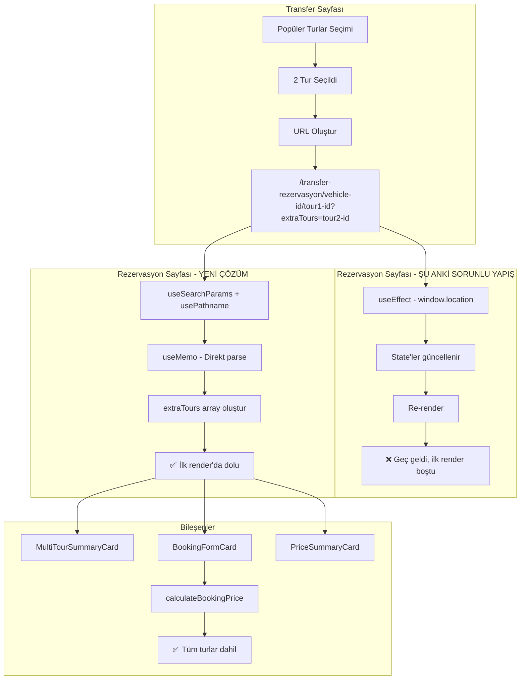

# Çoklu Tur Rezervasyon Sorunu - Detaylı Çözüm Planı

## 🔍 Sorun Tanımı

### Kullanıcı Senaryosu
1. Kullanıcı `/transferler` sayfasında Popüler Turlar bölümünden **2 tur** seçiyor
2. Transfer kartındaki fiyat **doğru şekilde** güncelleniyor (her iki turun toplam fiyatı)
3. Kullanıcı araca tıklayınca `/transfer-rezervasyon/[vehicle]/[tour1]?extraTours=tour2` sayfasına yönlendiriliyor
4. ❌ **SORUN:** Rezervasyon sayfasında sadece **tek tur** için fiyat ve bilgiler gösteriliyor

### Beklenen Davranış
- Rezervasyon sayfasında **her iki tur da** listelenmeli
- [`MultiTourSummaryCard`](web-app/src/components/transfers/booking/MultiTourSummaryCard.tsx) bileşeni tüm turları göstermeli
- Toplam fiyat her iki turun fiyatını içermeli
- Rezervasyon oluşturulduğunda tüm turlar kayıt altına alınmalı

---

## 🎯 Kök Neden Analizi

### Dosya: [`_client.tsx`](web-app/src/app/transfer-rezervasyon/[slug]/[tourSlug]/_client.tsx)

#### Sorun 1: URL Parsing Hatası (Satır 38-52)
```typescript
// ❌ SORUNLU KOD
useEffect(() => {
  const segments = window.location.pathname.split("/").filter(Boolean);
  if (segments.length >= 3 && segments[0] === "transfer-rezervasyon") {
    setVehicleSlug(segments[1] || "");
    setTourSlug(segments[2] || "");
  }

  const params = new URLSearchParams(window.location.search);
  const extraToursParam = params.get("extraTours");
  if (extraToursParam) {
    setExtraTourIds(extraToursParam.split(",").filter(Boolean));
  }
}, []);
```

**Problemler:**
1. ❌ Next.js'te `window.location` kullanımı anti-pattern
2. ❌ `useSearchParams` hook'u kullanılmamış
3. ❌ State güncellemeleri asenkron, ilk render'da boş geliyor
4. ❌ `useEffect` dependency array'i boş, sadece mount'ta çalışıyor

#### Sorun 2: State Yönetimi Sorunu (Satır 22-25)
```typescript
// ❌ SORUNLU KOD
const [vehicleSlug, setVehicleSlug] = useState("");
const [tourSlug, setTourSlug] = useState("");
const [extraTourIds, setExtraTourIds] = useState<string[]>([]);
```

**Problemler:**
1. ❌ State'ler boş string/array olarak başlıyor
2. ❌ useEffect çalışana kadar component boş state ile render ediliyor
3. ❌ `extraTours` useMemo bu boş state'e bağımlı

#### Sorun 3: React Rendering Timeline

```
1. Component Mount → state'ler boş
2. İlk Render → extraTours = [] (boş)
3. BookingFormCard render → extraTours = [] ile fiyat hesaplama
4. useEffect çalışır → state'ler güncellenir
5. Re-render → Ancak bu sırada bazı hesaplamalar zaten yapılmış
```

---

## 💡 Çözüm Mimarisi

### Mimari Değişiklikler



### Veri Akışı

```typescript
// URL: /transfer-rezervasyon/vito-vip-abc123/mekke-turu-tour1?extraTours=medine-turu-tour2,taif-turu-tour3

// 1. URL Parsing (Client-side, useMemo ile)
const urlData = useMemo(() => {
  // pathname: /transfer-rezervasyon/vito-vip-abc123/mekke-turu-tour1
  // searchParams: extraTours=medine-turu-tour2,taif-turu-tour3
  
  return {
    vehicleSlug: "vito-vip-abc123",
    tourSlug: "mekke-turu-tour1",
    extraTourIds: ["medine-turu-tour2", "taif-turu-tour3"]
  };
}, [pathname, searchParams]);

// 2. ID Extraction
const transferId = parseSlugWithId(urlData.vehicleSlug).id; // "abc123"
const mainTourId = parseSlugWithId(urlData.tourSlug).id; // "tour1"

// 3. Data Loading
const mainTour = getServiceById(mainTourId); // Mekke Turu
const extraTours = urlData.extraTourIds.map(getServiceById); // [Medine Turu, Taif Turu]

// 4. Combine
const allTours = [mainTour, ...extraTours]; // [Mekke, Medine, Taif]

// 5. Pass to Components
<BookingFormCard 
  transfer={transfer}
  tour={mainTour}
  extraTours={extraTours} // ✅ Dolu array
/>
```

---

## 🔧 Uygulama Planı

### Adım 1: `_client.tsx` Dosyasını Düzelt

**Değişiklikler:**

1. **Import'ları Güncelle**
```typescript
import { useSearchParams } from "next/navigation";
import { usePathname } from "next/navigation";
```

2. **State'leri Kaldır, useMemo Kullan**
```typescript
// ❌ Eski kod - KALDIRILACAK
const [vehicleSlug, setVehicleSlug] = useState("");
const [tourSlug, setTourSlug] = useState("");
const [extraTourIds, setExtraTourIds] = useState<string[]>([]);

useEffect(() => {
  // ... window.location kullanımı
}, []);

// ✅ Yeni kod
const pathname = usePathname();
const searchParams = useSearchParams();

const urlData = useMemo(() => {
  const segments = pathname.split("/").filter(Boolean);
  
  // /transfer-rezervasyon/[vehicleSlug]/[tourSlug]
  const vehicleSlug = segments[1] || "";
  const tourSlug = segments[2] || "";
  
  // Query param: ?extraTours=id1,id2,id3
  const extraToursParam = searchParams.get("extraTours");
  const extraTourIds = extraToursParam 
    ? extraToursParam.split(",").filter(Boolean) 
    : [];
  
  return { vehicleSlug, tourSlug, extraTourIds };
}, [pathname, searchParams]);
```

3. **ID Parsing'i Güncelle**
```typescript
// ✅ Yeni kod
const { id: transferId } = parseSlugWithId(urlData.vehicleSlug);
const { id: tourId } = parseSlugWithId(urlData.tourSlug);
```

4. **extraTours useMemo'yu Güncelle**
```typescript
// ✅ Yeni kod - urlData.extraTourIds kullan
const extraTours = useMemo(() => {
  return urlData.extraTourIds
    .map(id => getServiceById(id))
    .filter(Boolean) as PopularService[];
}, [urlData.extraTourIds]);
```

### Adım 2: Debug Logging Ekle (Geçici)

```typescript
// Component içinde, geliştirme aşamasında
useEffect(() => {
  console.log("🔍 URL Data:", urlData);
  console.log("🎯 Main Tour:", mainTour);
  console.log("📦 Extra Tours:", extraTours);
  console.log("🎫 All Tours:", allTours);
}, [urlData, mainTour, extraTours, allTours]);
```

### Adım 3: BookingFormCard'ı Doğrula

**Dosya:** [`BookingFormCard.tsx`](web-app/src/components/transfers/booking/BookingFormCard.tsx)

Mevcut kod zaten doğru görünüyor (satır 179-205), ancak doğrulama yapalım:

```typescript
// ✅ Bu kod zaten var, kontrol et
const priceResult = useMemo(() => {
  // Ana tur ile temel fiyat hesapla
  const baseResult = calculateBookingPrice({
    transfer,
    tour,
    dateTime,
    passengers,
    luggageCount,
    childSeatNeeded,
    couponCode: couponCode.trim() || undefined,
  });

  // Ek turların fiyatlarını topla
  if (extraTours.length > 0) { // ✅ Kontrol et
    let extraTourTotal = 0;
    for (const extraTour of extraTours) {
      if (extraTour.price.type === "per_person") {
        extraTourTotal += extraTour.price.baseAmount * getTotalPassengers(passengers);
      } else {
        extraTourTotal += extraTour.price.baseAmount;
      }
    }

    // Ek tur fiyatlarını mevcut sonuca ekle
    baseResult.price.tourPrice += extraTourTotal;
    baseResult.price.subtotal += extraTourTotal;
    baseResult.price.total += extraTourTotal;
  }

  return baseResult;
}, [transfer, tour, extraTours, dateTime, passengers, luggageCount, childSeatNeeded, couponCode]);
```

### Adım 4: Test Senaryoları

#### Test 1: Tek Tur Seçimi
```
URL: /transfer-rezervasyon/vito-abc/mekke-tur-tour1
Beklenen:
- mainTour: Mekke Turu
- extraTours: []
- allTours: [Mekke Turu]
- Fiyat: Transfer + Mekke Turu
```

#### Test 2: İki Tur Seçimi
```
URL: /transfer-rezervasyon/vito-abc/mekke-tur-tour1?extraTours=medine-tur-tour2
Beklenen:
- mainTour: Mekke Turu
- extraTours: [Medine Turu]
- allTours: [Mekke Turu, Medine Turu]
- Fiyat: Transfer + Mekke Turu + Medine Turu
- MultiTourSummaryCard: 2 tur göstermeli
```

#### Test 3: Üç+ Tur Seçimi
```
URL: /transfer-rezervasyon/vito-abc/mekke-tur-tour1?extraTours=medine-tur-tour2,taif-tur-tour3
Beklenen:
- mainTour: Mekke Turu
- extraTours: [Medine Turu, Taif Turu]
- allTours: [Mekke Turu, Medine Turu, Taif Turu]
- Fiyat: Transfer + 3 Tur Toplamı
```

#### Test 4: Tursuz Rezervasyon
```
URL: /transfer-rezervasyon/vito-abc/tursuz
Beklenen:
- mainTour: undefined
- extraTours: []
- allTours: []
- Fiyat: Sadece Transfer
```

---

## 📋 Uygulama Adımları

### Öncelik Sırası

1. ✅ **Sorun Analizi Tamamlandı**
2. ⏳ **Kod Değişiklikleri** (Code mode'da uygulanacak)
   - `_client.tsx` dosyasını düzelt
   - useSearchParams + usePathname kullan
   - State'leri useMemo ile değiştir
3. ⏳ **Test ve Doğrulama**
   - Her 4 test senaryosunu dene
   - Console log'ları kontrol et
   - UI'da doğru görüntülendiğini doğrula
4. ⏳ **Cleanup**
   - Debug log'ları kaldır
   - TypeScript hatalarını düzelt
   - Build test yap

---

## 🎨 UI/UX Geliştirmeleri (Opsiyonel)

### MultiTourSummaryCard İyileştirmeleri

1. **Tur Sıralaması Göstergesi**
   - Her turun yanında numara badge'i (1, 2, 3...)
   - Renkli badge'ler (turuncu degradé)

2. **Toplam Özet**
   - Toplam süre hesaplama
   - Toplam mesafe gösterimi
   - Günlük tur sayısı uyarısı

3. **Tur Kaldırma**
   - "X" butonu ile tur kaldırabilme
   - Kaldırınca URL'yi güncelle
   - Fiyatı otomatik yeniden hesapla

---

## 🔒 Güvenlik ve Validasyon

### URL Validasyonu

```typescript
// Geçersiz tour ID'lerini filtrele
const extraTours = useMemo(() => {
  return urlData.extraTourIds
    .map(id => {
      const service = getServiceById(id);
      if (!service) {
        console.warn(`❌ Geçersiz tur ID: ${id}`);
      }
      return service;
    })
    .filter(Boolean) as PopularService[];
}, [urlData.extraTourIds]);

// Uyarı göster
if (urlData.extraTourIds.length !== extraTours.length) {
  // Toast veya banner ile kullanıcıyı bilgilendir
  console.warn("Bazı turlar bulunamadı ve listeden çıkarıldı");
}
```

---

## 📊 Performans Optimizasyonu

### useMemo Kullanımı
```typescript
// ✅ Her hesaplama useMemo ile cache'leniyor
const urlData = useMemo(...);
const extraTours = useMemo(...);
const allTours = useMemo(...);
const tourNamesSummary = useMemo(...);
```

### Gereksiz Re-render'ları Önleme
- State sayısını minimize ettik (3 state → 0 state)
- useEffect dependency'leri doğru tanımlandı
- useMemo ile pahalı hesaplamalar cache'leniyor

---

## 🚀 Sonuç

### Değişen Dosyalar
1. [`web-app/src/app/transfer-rezervasyon/[slug]/[tourSlug]/_client.tsx`](web-app/src/app/transfer-rezervasyon/[slug]/[tourSlug]/_client.tsx)
   - useSearchParams kullanımı
   - State'lerin useMemo ile değiştirilmesi
   - useEffect kaldırılması

### Değişmeyen Dosyalar (Zaten Doğru)
- [`BookingFormCard.tsx`](web-app/src/components/transfers/booking/BookingFormCard.tsx) ✅
- [`MultiTourSummaryCard.tsx`](web-app/src/components/transfers/booking/MultiTourSummaryCard.tsx) ✅
- [`PriceSummaryCard.tsx`](web-app/src/components/transfers/booking/PriceSummaryCard.tsx) ✅
- [`transfers/page.tsx`](web-app/src/app/transfers/page.tsx) ✅

### Beklenen Sonuç
✅ Kullanıcı 2 tur seçip araca tıkladığında:
- Rezervasyon sayfası yüklenir yüklenmez her iki tur da görünür
- MultiTourSummaryCard her iki turu da listeler (index badge'leri ile)
- PriceSummaryCard doğru toplam fiyatı gösterir (transfer + tur1 + tur2)
- BookingFormCard tüm turları içeren rezervasyon oluşturur

---

## 📝 Notlar

- Next.js App Router kullanıldığı için `useSearchParams` ve `usePathname` hook'ları tercih edildi
- Client Component olduğu için `window.location` yerine Next.js hook'ları kullanıldı
- State yönetimi basitleştirilerek performans iyileştirildi
- React rendering lifecycle'ı dikkate alınarak ilk render'da doğru veri sağlandı

---

**Plan Hazırlayan:** Roo (Architect Mode)  
**Tarih:** 2026-03-10  
**Durum:** ✅ Analiz Tamamlandı - Code Mode'a Geçmeye Hazır
