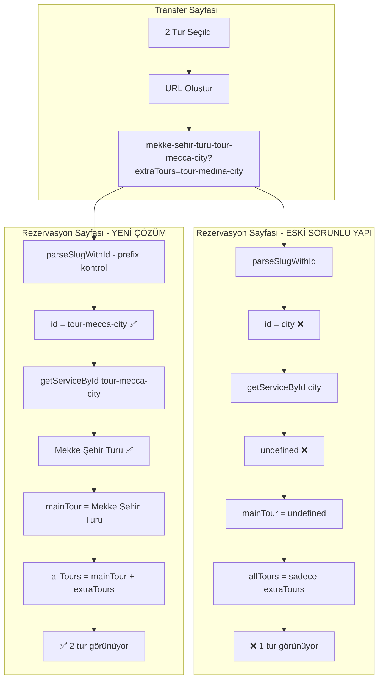

# Çoklu Tur Rezervasyon Off-by-One Sorunu - Çözüm Planı

## 🔍 Sorun Tanımı

### Kullanıcı Senaryosu
1. Kullanıcı `/transferler` sayfasında **2 tur** seçiyor
2. Transfer kartındaki fiyat **doğru şekilde** güncelleniyor (2 tur için)
3. Kullanıcı araca tıklayınca rezervasyon sayfasına yönlendiriliyor
4. ❌ **SORUN:** Rezervasyon sayfasında sadece **1 tur** görünüyor
5. Kullanıcı **3 tur** seçtiğinde rezervasyonda **2 tur** görünüyor

### Beklenen Davranış
- Seçilen tüm turlar rezervasyon sayfasında görünmeli
- Fiyat hesaplaması tüm seçili turları içermeli

---

## 🎯 Kök Neden Analizi

### Sorunlu Kod: [`transfers/page.tsx`](web-app/src/app/transfers/page.tsx) Satır 251-266

```typescript
// ❌ SORUNLU KOD
const bookingUrl = useMemo(() => {
  if (selectedServices.length === 0) {
    return `/transfer-rezervasyon/${vehicleSlug}/tursuz`;
  }
  // İlk turu slug olarak kullan
  const firstService = selectedServices[0];
  const tourSlug = `${createSlug(firstService.name)}-${firstService.id}`;
  const baseUrl = `/transfer-rezervasyon/${vehicleSlug}/${tourSlug}`;

  // Birden fazla tur seçilmişse, ek turları query param olarak ekle
  if (selectedServices.length > 1) {
    const extraTourIds = selectedServices.slice(1).map(s => s.id).join(',');
    return `${baseUrl}?extraTours=${extraTourIds}`;
  }
  return baseUrl;
}, [selectedServices, vehicleSlug]);
```

### Sorunlu Kod: [`_client.tsx`](web-app/src/app/transfer-rezervasyon/[slug]/[tourSlug]/_client.tsx) Satır 28-45

```typescript
// ❌ SORUNLU KOD
const urlData = useMemo(() => {
  const segments = pathname.split("/").filter(Boolean);
  // /transfer-rezervasyon/[slug]/[tourSlug]
  const vehicleSlug = segments.length >= 2 ? segments[1] || "" : "";
  const tourSlug = segments.length >= 3 ? segments[2] || "" : "";

  // Query param'dan ek turları al: ?extraTours=id1,id2,id3
  const extraToursParam = searchParams.get("extraTours");
  const extraTourIds = extraToursParam
    ? extraToursParam.split(",").filter(Boolean)
    : [];

  return { vehicleSlug, tourSlug, extraTourIds };
}, [pathname, searchParams]);
```

### Sorunlu Kod: [`_client.tsx`](web-app/src/app/transfer-rezervasyon/[slug]/[tourSlug]/_client.tsx) Satır 62-76

```typescript
// ❌ SORUNLU KOD
// Ana tur verisi (client-side)
const mainTour = tourId ? getServiceById(tourId) : undefined;

// Ek turların verileri (client-side)
const extraTours = useMemo(() => {
  return urlData.extraTourIds
    .map(id => getServiceById(id))
    .filter(Boolean) as PopularService[];
}, [urlData.extraTourIds]);

// Tüm turlar (ana tur + ek turlar)
const allTours = useMemo(() => {
  if (!mainTour) return extraTours;
  return [mainTour, ...extraTours];
}, [mainTour, extraTours]);
```

---

## 🔴 Kök Neden

### Sorun 1: URL Segment Index Hatası

`pathname.split("/").filter(Boolean)` sonucu:
- URL: `/transfer-rezervasyon/vehicle-slug-123/tour-slug-456`
- segments: `["transfer-rezervasyon", "vehicle-slug-123", "tour-slug-456"]`
- segments[0] = "transfer-rezervasyon"
- segments[1] = "vehicle-slug-123"
- segments[2] = "tour-slug-456"

**Ancak kodda:**
```typescript
const vehicleSlug = segments.length >= 2 ? segments[1] || "" : "";  // ✅ Doğru
const tourSlug = segments.length >= 3 ? segments[2] || "" : "";     // ✅ Doğru
```

Bu kısım doğru görünüyor. Sorun başka yerde!

### Sorun 2: `parseSlugWithId` Fonksiyonu

[`booking.ts`](web-app/src/lib/transfers/booking.ts) Satır 320-326:

```typescript
export function parseSlugWithId(slug: string): { slug: string; id: string } {
  const parts = slug.split("-");
  const id = parts[parts.length - 1];
  const slugPart = parts.slice(0, -1).join("-");

  return { slug: slugPart, id: id };
}
```

**Test:**
- Input: `"mekke-sehir-turu-tour-mecca-city"`
- parts: `["mekke", "sehir", "turu", "tour", "mecca", "city"]`
- id: `"city"` ❌ **YANLIŞ!**
- Beklenen id: `"tour-mecca-city"`

### Gerçek Sorun: Slug Formatı Uyuşmazlığı

**URL oluşturma:**
```typescript
const tourSlug = `${createSlug(firstService.name)}-${firstService.id}`;
// "mekke-sehir-turu-tour-mecca-city"
```

**ID çıkarma:**
```typescript
const { id: tourId } = parseSlugWithId(urlData.tourSlug);
// parseSlugWithId("mekke-sehir-turu-tour-mecca-city")
// id = "city" ❌
```

**Tur ID'leri:**
- `"tour-mecca-city"`
- `"tour-medina-city"`
- `"guide-cebeli-nur"`

`parseSlugWithId` sadece son tire sonrasını alıyor, ama ID'ler tire içeriyor!

---

## 💡 Çözüm

### Çözüm 1: `parseSlugWithId` Fonksiyonunu Düzelt

**Mevcut davranış:** Slug'ın son tire sonrasını ID kabul ediyor
**Doğru davranış:** Bilinen ID formatlarına göre parse etmeli

```typescript
// ✅ DÜZELTİLMİŞ KOD
export function parseSlugWithId(slug: string): { slug: string; id: string } {
  // Tur ID formatları: tour-*, guide-*, transfer-*
  // Bu formatlara göre ID'yi bul

  // Önce bilinen prefix'leri kontrol et
  const knownPrefixes = ['tour-', 'guide-', 'transfer-'];

  for (const prefix of knownPrefixes) {
    const prefixIndex = slug.lastIndexOf(prefix);
    if (prefixIndex !== -1) {
      // Prefix bulundu, sonrası ID'dir
      const id = slug.substring(prefixIndex);
      const slugPart = slug.substring(0, prefixIndex - 1); // -1 tire için
      return { slug: slugPart, id };
    }
  }

  // Fallback: Eski davranış (son tire)
  const parts = slug.split("-");
  const id = parts[parts.length - 1];
  const slugPart = parts.slice(0, -1).join("-");

  return { slug: slugPart, id };
}
```

### Çözüm 2: URL Oluşturma Formatını Değiştir (Alternatif)

```typescript
// ✅ ALTERNATİF: ID'yi slug içine gömmek yerine sonuna eklemek
const tourSlug = `${createSlug(firstService.name)}-${firstService.id}`;
// Bu zaten doğru, sorun parseSlugWithId'de
```

---

## 🔧 Uygulama Adımları

### Adım 1: `parseSlugWithId` Fonksiyonunu Düzelt

**Dosya:** [`web-app/src/lib/transfers/booking.ts`](web-app/src/lib/transfers/booking.ts)

**Değiştirilecek kod:** Satır 320-326

```typescript
// ❌ ESKİ KOD
export function parseSlugWithId(slug: string): { slug: string; id: string } {
  const parts = slug.split("-");
  const id = parts[parts.length - 1];
  const slugPart = parts.slice(0, -1).join("-");

  return { slug: slugPart, id };
}

// ✅ YENİ KOD
export function parseSlugWithId(slug: string): { slug: string; id: string } {
  // Tur ID formatları: tour-*, guide-*, transfer-*
  // Bu formatlara göre ID'yi bul

  // Önce bilinen prefix'leri kontrol et
  const knownPrefixes = ['tour-', 'guide-', 'transfer-'];

  for (const prefix of knownPrefixes) {
    const prefixIndex = slug.lastIndexOf(prefix);
    if (prefixIndex !== -1) {
      // Prefix bulundu, sonrası ID'dir
      const id = slug.substring(prefixIndex);
      const slugPart = slug.substring(0, prefixIndex - 1); // -1 tire için
      return { slug: slugPart, id };
    }
  }

  // Fallback: Eski davranış (son tire)
  const parts = slug.split("-");
  const id = parts[parts.length - 1];
  const slugPart = parts.slice(0, -1).join("-");

  return { slug: slugPart, id };
}
```

### Adım 2: Test Senaryoları

#### Test 1: Tek Tur Seçimi
```
URL: /transfer-rezervasyon/vito-vip-abc123/mekke-sehir-turu-tour-mecca-city
Beklenen:
- tourSlug: "mekke-sehir-turu-tour-mecca-city"
- parseSlugWithId("mekke-sehir-turu-tour-mecca-city")
  → slug: "mekke-sehir-turu"
  → id: "tour-mecca-city" ✅
- mainTour: Mekke Şehir Turu ✅
- extraTours: []
- allTours: [Mekke Şehir Turu]
```

#### Test 2: İki Tur Seçimi
```
URL: /transfer-rezervasyon/vito-vip-abc123/mekke-sehir-turu-tour-mecca-city?extraTours=tour-medina-city
Beklenen:
- tourSlug: "mekke-sehir-turu-tour-mecca-city"
- parseSlugWithId("mekke-sehir-turu-tour-mecca-city")
  → id: "tour-mecca-city" ✅
- mainTour: Mekke Şehir Turu ✅
- extraTours: [Medine Şehir Turu] ✅
- allTours: [Mekke Şehir Turu, Medine Şehir Turu] ✅
```

#### Test 3: Üç Tur Seçimi
```
URL: /transfer-rezervasyon/vito-vip-abc123/mekke-sehir-turu-tour-mecca-city?extraTours=tour-medina-city,tour-arafat-mina
Beklenen:
- mainTour: Mekke Şehir Turu ✅
- extraTours: [Medine Şehir Turu, Arafat-Mina-Müzdelife] ✅
- allTours: 3 tur ✅
```

#### Test 4: Rehber Seçimi
```
URL: /transfer-rezervasyon/vito-vip-abc123/cebeli-nur-guide-cebeli-nur
Beklenen:
- parseSlugWithId("cebeli-nur-guide-cebeli-nur")
  → slug: "cebeli-nur"
  → id: "guide-cebeli-nur" ✅
- mainTour: Cebeli Nur (Hira Mağarası) ✅
```

---

## 📊 Değişen Dosyalar

1. **[`web-app/src/lib/transfers/booking.ts`](web-app/src/lib/transfers/booking.ts)**
   - `parseSlugWithId` fonksiyonunu düzelt
   - Tire içeren ID'leri doğru parse et

---

## 🎨 Akış Diyagramı



---

## 🔒 Güvenlik ve Validasyon

### Geçersiz ID Kontrolü

```typescript
// _client.tsx içinde
const mainTour = tourId ? getServiceById(tourId) : undefined;

// Debug için log
if (tourId && !mainTour) {
  console.warn(`⚠️ Tur bulunamadı: ${tourId}`);
}
```

---

## 📝 Notlar

- Tur ID'leri tire içeriyor: `tour-mecca-city`, `guide-cebeli-nur`
- `parseSlugWithId` sadece son tire sonrasını aldığı için yanlış ID çıkıyor
- Çözüm: Bilinen prefix'leri kontrol ederek doğru ID'yi bulmak
- Bu değişiklik tüm tur ve rehber ID'leri için çalışacak

---

**Plan Hazırlayan:** Roo (Architect Mode)
**Tarih:** 2026-03-10
**Durum:** ✅ Analiz Tamamlandı - Code Mode'a Geçmeye Hazır
