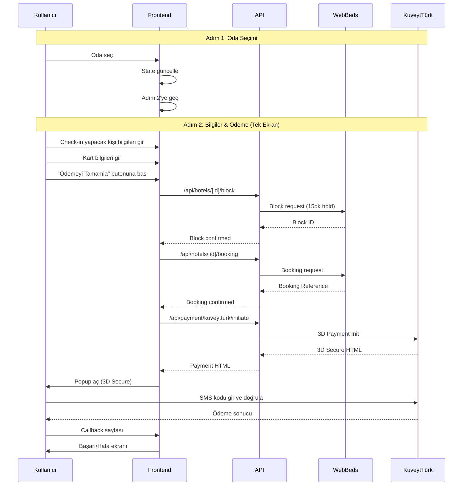

# Otel Rezervasyon - 2 Aşamalı Akış Planı

## Proje Özeti

Mevcut otel detay sayfasındaki rezervasyon formunu kaldırıp, ayrı bir **2 aşamalı** rezervasyon sayfası oluşturulacak. Misafir bilgileri ve ödeme bilgileri **tek ekranda** olacak. Sadece bir kişinin (check-in yapacak kişinin) bilgileri girilecek.

## Referans Görseller Analizi

**Screenshot_7.png** - Booking.com benzeri arama sonucu:
- Filtreler sol tarafta (sticky)
- Oda kartları grid düzeninde
- Her kartta fiyat, özellikler ve "Seç" butonu
- Mobil uyumlu tasarım

**Screenshot_8.png** - Oda seçimi ekranı:
- Oda tipleri listeleniyor
- Fiyat karşılaştırması
- İptal politikası bilgisi
- "Rezervasyon Yap" butonu

**Screenshot_9.png** - Ödeme ekranı:
- Sol tarafta özet bilgiler
- Sağ tarafta ödeme formu
- Güvenlik badge'leri
- Tek ekranda tüm bilgiler

## Mevcut Durum Analizi

### Şu Anki Yapı
```
/hotels/[hotelId]/_client.tsx
├── Oda listesi gösterimi
├── Oda seçimi
└── Aynı sayfada rezervasyon formu (BookingFormSection)
    ├── Yolcu bilgileri
    ├── Kart bilgileri
    └── Ödeme butonu
```

### Sorunlar
1. Oda detay sayfası çok kalabalık
2. Rezervasyon formu oda seçimiyle aynı sayfada
3. Kullanıcı deneyimi parçalı
4. Mobilde scroll gerekiyor

## Yeni Yapı Tasarımı (2 Adım)

### Route Yapısı
```
/otel-rezervasyon/[hotelSlug]
├── page.tsx (Server Component)
└── _client.tsx (Client Component - Ana akış)
    ├── Step 1: Oda Seçimi
    └── Step 2: Bilgiler & Ödeme (tek ekran)
```

### URL Parametreleri
```
/otel-rezervasyon/[hotelSlug]?checkIn=2024-03-20&checkOut=2024-03-25&adults=2&cityCode=164
```

Oda ön-seçili gelsin diye opsiyonel parametre:
```
&preselectRoom=rateId123
```

## Bileşen Mimarisi

```
web-app/src/app/otel-rezervasyon/
├── [hotelSlug]/
│   ├── page.tsx                    # Server component (metadata)
│   └── _client.tsx                 # Ana client component (2 adımlı akış)
│
web-app/src/components/hotels/booking/
├── index.ts                        # Export'lar
├── BookingStepper.tsx              # 2 adımlı gösterge
├── RoomSelectionStep.tsx           # Adım 1: Oda seçimi
├── CheckoutStep.tsx                # Adım 2: Bilgiler + Ödeme (tek ekran)
├── BookingSummaryCard.tsx          # Özet kartı (sticky sidebar)
├── HotelBookingHeader.tsx          # Sayfa başlığı + geri butonu
└── types.ts                        # Bileşen tipleri
```

## Adım Akışı Detayları

### Adım 1: Oda Seçimi (RoomSelectionStep)
```typescript
interface RoomSelectionStepProps {
  rooms: NormalizedRoom[];
  selectedRoom: NormalizedRoom | null;
  onSelectRoom: (room: NormalizedRoom) => void;
  nightCount: number;
  hotelInfo: HotelInfo;
}
```

**Özellikler:**
- Oda kartları grid düzeninde (desktop 2 kolon, mobil 1 kolon)
- Her kartta:
  - Oda adı (Türkçe çeviri)
  - Yatak kapasitesi badge
  - Pansiyon tipi badge (Kahvaltı Dahil, Tam Pansiyon vb.)
  - İptal politikası (Ücretsiz iptal / İade kısıtlı)
  - Kalan oda sayısı (Son X oda!)
  - Fiyat (TL/USD çifti, gece başına)
  - "Seç ve Devam Et" butonu
- Seçili oda emerald border ile vurgulanır
- Oda seçildiğinde otomatik Adım 2'ye geçiş

### Adım 2: Bilgiler & Ödeme - Tek Ekran (CheckoutStep)
```typescript
interface CheckoutStepProps {
  selectedRoom: NormalizedRoom;
  hotelInfo: HotelInfo;
  checkIn: string;
  checkOut: string;
  nightCount: number;
  adults: number;
  onBack: () => void;
  onSubmit: (data: CheckoutFormData) => void;
  isProcessing: boolean;
  error: string | null;
  successMessage: string | null;
}
```

**Tek ekranda 3 bölüm:**

**Bölüm A: Check-in Yapacak Kişi Bilgileri**
- Unvan (Mr/Mrs/Ms) select
- Ad input
- Soyad input
- E-posta input
- Telefon input
- TC Kimlik / Vergi No input

**Bölüm B: Kart Bilgileri**
- Kart üzerindeki isim
- Kart numarası (formatlı, 16 hane)
- Son kullanma (Ay/Yıl) - 2 input yan yana
- CVV (şifreli input)

**Bölüm C: Son Adım**
- Özel talepler (textarea, opsiyonel)
- Güvenlik badge'leri (KuveytTürk 3D Secure, SSL, vb.)
- "Ödemeyi Tamamla" butonu (tam genişlik)

## Stepper Bileşeni (2 Adım)

```typescript
const steps = [
  { id: 'room', label: 'Oda Seçimi', icon: BedDouble },
  { id: 'checkout', label: 'Bilgiler & Ödeme', icon: CreditCard }
];
```

## State Yönetimi

```typescript
interface BookingState {
  // Otel bilgileri (URL'den)
  hotelId: string;
  hotelName: string;
  hotelImage: string;
  checkIn: string;
  checkOut: string;
  adults: number;
  cityCode: number;

  // Adım
  currentStep: 'room' | 'checkout';

  // Seçimler
  selectedRoom: NormalizedRoom | null;

  // Tek form - check-in yapacak kişi
  guestInfo: GuestInfo;
  paymentInfo: PaymentInfo;
  specialRequests: string;

  // UI state
  isProcessing: boolean;
  errors: Record<string, string>;
  bookingError: string | null;
  bookingMessage: string | null;
}
```

## Ödeme Akışı (2 Adımlı)



## Sayfa Düzeni

### Desktop (1280px+)

**Adım 1: Oda Seçimi**
```
┌─────────────────────────────────────────────────────────────┐
│  Header (Sticky) - Geri + Başlık                            │
├─────────────────────────────────────────────────────────────┤
│  Stepper: [1. Oda Seçimi (aktif)] [2. Bilgiler & Ödeme]    │
├─────────────────────────────────┬───────────────────────────┤
│                                 │                           │
│  Main Content (2/3)             │  Sidebar (Sticky 1/3)     │
│  - Oda kartları (2 kolon grid) │  - Otel bilgisi           │
│    * Oda adı                    │  - Giriş/Çıkış tarihleri  │
│    * Kapasiteler                │  - Gece sayısı            │
│    * Pansiyon tipi              │  - Misafir sayısı         │
│    * İptal politikası           │  - En düşük fiyat         │
│    * Fiyat                      │                           │
│    * [Seç ve Devam Et] butonu   │                           │
│                                 │                           │
└─────────────────────────────────┴───────────────────────────┘
```

**Adım 2: Bilgiler & Ödeme**
```
┌─────────────────────────────────────────────────────────────┐
│  Header (Sticky) - Geri + Başlık                            │
├─────────────────────────────────────────────────────────────┤
│  Stepper: [1. Oda Seçimi ✓] [2. Bilgiler & Ödeme (aktif)]  │
├─────────────────────────────────┬───────────────────────────┤
│                                 │                           │
│  Main Content (2/3)             │  Sidebar (Sticky 1/3)     │
│                                 │                           │
│  ┌───────────────────────────┐  │  - Otel adı ve görsel     │
│  │ Check-in Yapacak Kişi     │  │  - Seçili oda bilgisi     │
│  │ - Unvan, Ad, Soyad        │  │  - Tarihler               │
│  │ - E-posta, Telefon        │  │  - Fiyat özeti            │
│  │ - TC Kimlik               │  │    * Oda fiyatı           │
│  └───────────────────────────┘  │    * Vergiler             │
│                                 │    * Toplam               │
│  ┌───────────────────────────┐  │  - Güvenlik badge'leri    │
│  │ Kart Bilgileri            │  │                           │
│  │ - Kart ismi               │  │                           │
│  │ - Kart numarası           │  │                           │
│  │ - Son kullanma, CVV       │  │                           │
│  └───────────────────────────┘  │                           │
│                                 │                           │
│  - Özel talepler (opsiyonel)   │                           │
│  - Güvenlik bilgisi            │                           │
│  - [Ödemeyi Tamamla] butonu    │                           │
│                                 │                           │
└─────────────────────────────────┴───────────────────────────┘
```

### Mobile (<768px)

**Adım 1: Oda Seçimi**
```
┌─────────────────────┐
│  Header + Geri      │
├─────────────────────┤
│  Stepper (2 nokta)  │
├─────────────────────┤
│  Otel Özeti Card    │
│  (Tarihler, vb.)    │
├─────────────────────┤
│                     │
│  Oda Kartları       │
│  (1 kolon, stack)   │
│                     │
│  [Seç ve Devam Et]  │
│                     │
└─────────────────────┘
```

**Adım 2: Bilgiler & Ödeme**
```
┌─────────────────────┐
│  Header + Geri      │
├─────────────────────┤
│  Stepper (2 nokta)  │
├─────────────────────┤
│  Özet Card          │
│  (Collapse edilebilir)│
├─────────────────────┤
│                     │
│  Check-in Bilgileri │
│  Form               │
│                     │
├─────────────────────┤
│                     │
│  Kart Bilgileri     │
│  Form               │
│                     │
├─────────────────────┤
│  Özel Talepler      │
├─────────────────────┤
│  [Ödemeyi Tamamla]  │
│  Button (sticky)    │
└─────────────────────┘
```

## API Entegrasyonu

### Mevcut API'ler (Kullanılacak)
- `/api/hotels/[hotelId]` - Otel detayları
- `/api/hotels/[hotelId]/rooms` - Oda listesi
- `/api/hotels/[hotelId]/block` - Oda bloklama
- `/api/hotels/[hotelId]/booking` - Rezervasyon oluşturma
- `/api/payment/kuveytturk/initiate` - Ödeme başlatma

### Yeni API'ler (Gerekirse)
- `/api/hotels/booking/validate` - Form validasyonu
- `/api/hotels/booking/calculate` - Fiyat hesaplama

## Type Tanımlamaları

```typescript
// web-app/src/types/hotel-booking.ts
export interface HotelBookingState {
  step: 'room' | 'checkout' | 'success';
  hotel: HotelBasicInfo;
  searchParams: HotelSearchParams;
  selectedRoom: SelectedRoom | null;
  guestInfo: GuestInfo;
  paymentInfo: PaymentInfo;
  specialRequests: string;
}

export interface GuestInfo {
  title: 'Mr' | 'Mrs' | 'Ms';
  firstName: string;
  lastName: string;
  email: string;
  phone: string;
  identityTaxNumber: string;
}

export interface PaymentInfo {
  cardHolderName: string;
  cardNumber: string;
  cardExpireMonth: string;
  cardExpireYear: string;
  cardCvv: string;
}

export interface SelectedRoom {
  rateId: string;
  roomTypeCode: string;
  roomName: string;
  boardBasis: string;
  price: number;
  currency: string;
  allocationDetails: string;
  maxAdults: number;
  maxChildren: number;
  refundable: boolean;
}

export interface CheckoutFormData {
  guestInfo: GuestInfo;
  paymentInfo: PaymentInfo;
  specialRequests: string;
}
```

## Güvenlik ve Validasyon

### Client-Side Validasyon
- Zorunlu alan kontrolü
- E-posta formatı
- Telefon formatı
- TC Kimlik (11 hane)
- Kart numarası (Luhn algoritması)
- CVV (3-4 hane)

### Server-Side Validasyon
- Tüm alanların tekrar kontrolü
- Oda müsaitlik kontrolü
- Fiyat doğrulama
- Block ID geçerliliği

## SEO ve URL Yapısı

### Türkçe URL'ler
```
/otel-rezervasyon/makkah-hilton-hotel-12345
/otel-rezervasyon/madinah-hilton-67890
```

### Meta Tags
```typescript
export async function generateMetadata({ params }: PageProps): Promise<Metadata> {
  return {
    title: `${hotelName} - Rezervasyon`,
    description: `${hotelName} için kolay ve güvenli rezervasyon`,
    openGraph: {
      title: hotelName,
      images: [hotelImage],
    },
  };
}
```

## Yönlendirme Stratejisi

### Otel Detay Sayfası Değişiklikleri
```typescript
// web-app/src/app/hotels/[hotelId]/_client.tsx
// Mevcut "Rezervasyon Yap" butonu değiştirilecek:

// ESKİ:
<Button onClick={scrollToBookingForm}>Rezervasyon Yap</Button>

// YENİ:
<Link href={`/otel-rezervasyon/${hotelSlug}?checkIn=${checkIn}&checkOut=${checkOut}&adults=${adults}&cityCode=${cityCode}`}>
  <Button>Rezervasyon Yap</Button>
</Link>
```

### Oda Kartlarından Yönlendirme
```typescript
// Her oda kartında "Rezervasyon Yap" butonu
const bookingUrl = `/otel-rezervasyon/${hotelSlug}?checkIn=${checkIn}&checkOut=${checkOut}&adults=${adults}&cityCode=${cityCode}&preselectRoom=${room.rateId}`;
```

## Stil ve Tema

### Renk Paleti
- Primary: Emerald-500 (#10b981)
- Secondary: Cyan-600 (#0891b2)
- Success: Green-500 (#22c55e)
- Warning: Amber-500 (#f59e0b)
- Error: Red-500 (#ef4444)

### Komponent Stilleri
- Rounded corners: xl (12px)
- Shadows: lg, xl
- Border: slate-200
- Background: slate-50

## Responsive Davranış

### Breakpoints
- sm: 640px
- md: 768px
- lg: 1024px
- xl: 1280px
- 2xl: 1536px

### Mobile Optimizasyonları
- Sticky header
- Bottom sheet summary
- Touch-friendly buttons (min 44px)
- Auto-focus on first input

## Erişilebilirlik

- ARIA labels
- Keyboard navigation
- Screen reader support
- Focus management
- Error announcements

## Performans Optimizasyonları

- Lazy loading for images
- Code splitting for steps
- Optimistic UI updates
- Debounced validation
- Cached API responses

## Test Senaryoları

1. **Oda Seçimi**
   - Oda listesi yüklenir
   - Oda seçilir
   - Seçim değiştirilir

2. **Bilgiler & Ödeme**
   - Form doldurulur
   - Validasyon hataları gösterilir
   - Ödeme başlatılır

3. **Hata Durumları**
   - Oda müsait değil
   - Ödeme başarısız
   - Network hatası

## Migration Planı

### Faz 1: Altyapı
- [ ] Route yapısı oluştur
- [ ] Type tanımlamaları ekle
- [ ] Boş bileşenleri oluştur

### Faz 2: UI Bileşenleri
- [ ] Stepper bileşeni (2 adım)
- [ ] Oda seçim adımı
- [ ] Checkout adımı (bilgiler + ödeme tek ekran)
- [ ] Özet kartı (sticky sidebar)

### Faz 3: Entegrasyon
- [ ] API bağlantıları
- [ ] State yönetimi
- [ ] Validasyon
- [ ] Error handling

### Faz 4: Yönlendirme
- [ ] Otel detay sayfası güncellemesi
- [ ] Oda kartları güncellemesi
- [ ] URL parametreleri

### Faz 5: Test ve Deploy
- [ ] E2E testler
- [ ] Responsive testler
- [ ] Performance test
- [ ] Deploy

## Başarı Kriterleri

1. Kullanıcı 2 adımda rezervasyon yapabilmeli
2. Her adımda geri dönüp bilgi değiştirebilmeli
3. Mobilde sorunsuz çalışmalı
4. Ödeme başarılı olduğunda onay almalı
5. SEO uyumlu URL'ler olmalı
6. Sadece check-in yapacak kişinin bilgileri istenmeli
7. Ödeme ve bilgiler tek ekranda olmalı
