# Otel Rezervasyon Mimarisi - Diyagramlar

## 1. Kullanıcı Akış Diyagramı

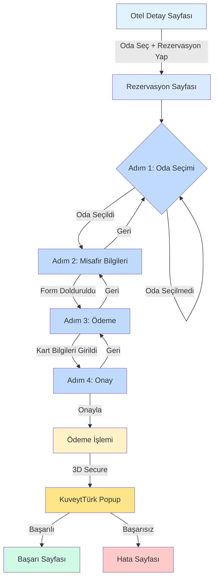

## 2. Komponent Hiyerarşisi

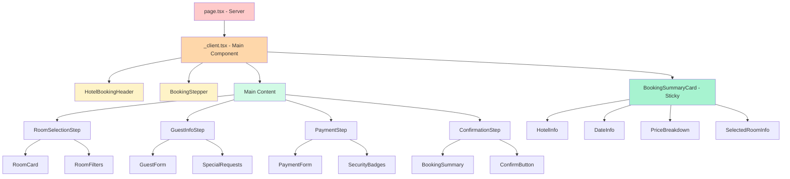

## 3. State Yönetimi

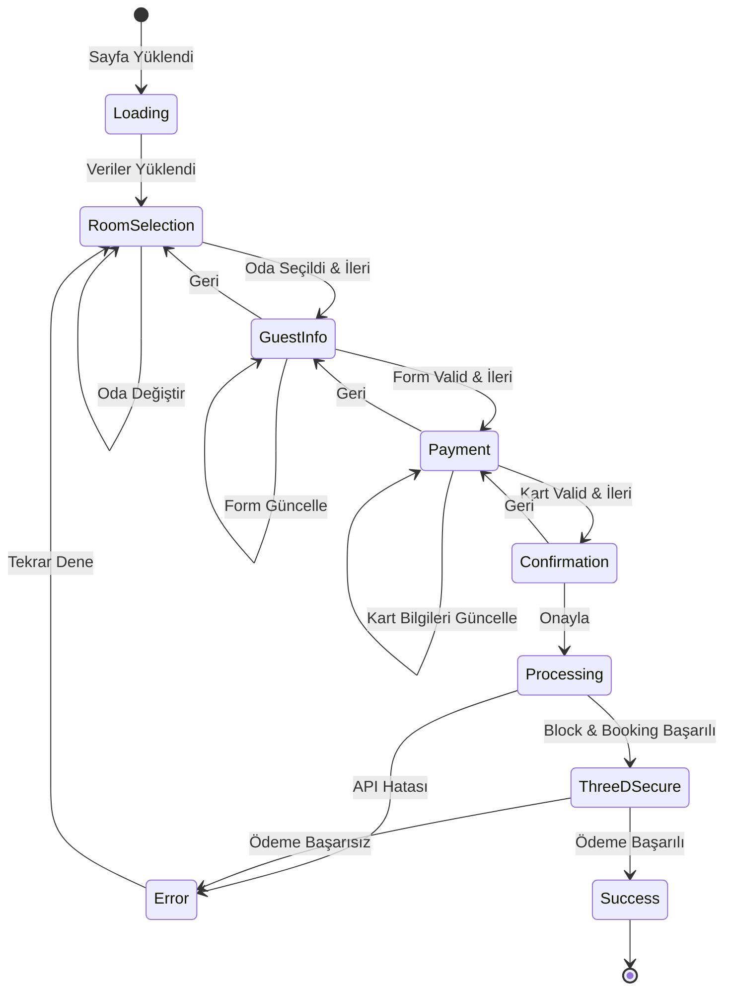

## 4. API Akış Diyagramı

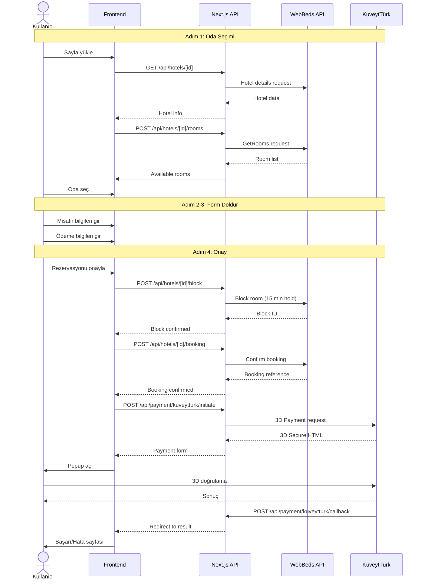

## 5. Dosya Yapısı Diyagramı

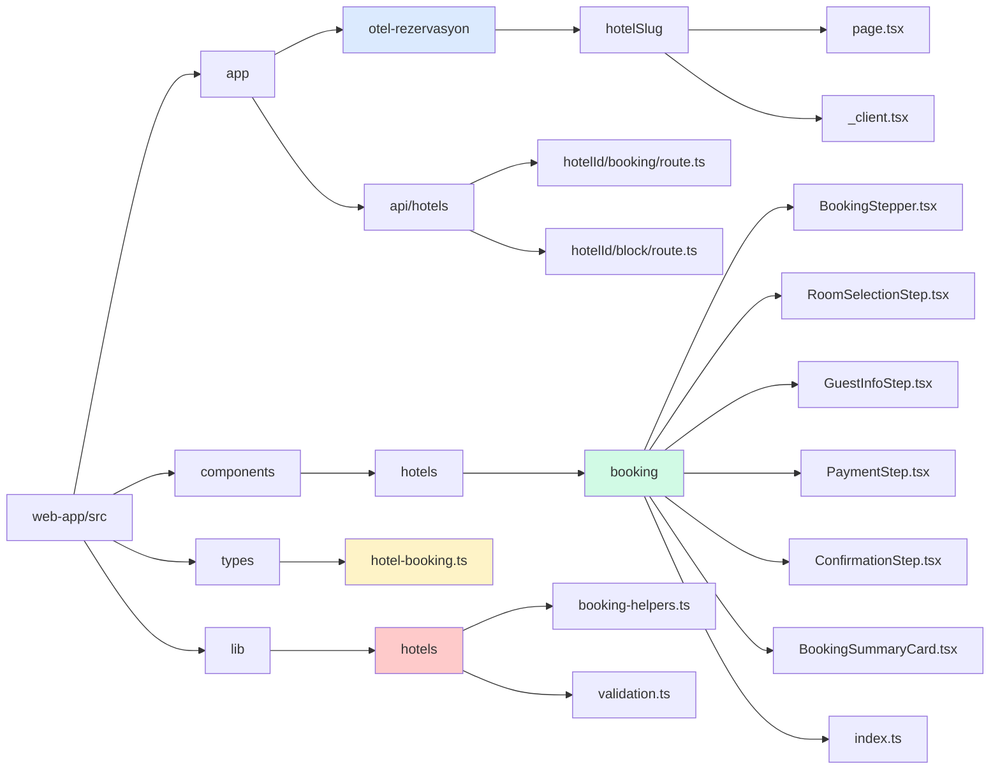

## 6. Responsive Layout Diyagramı

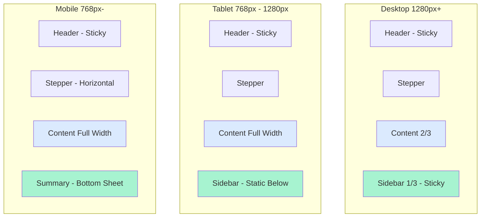

## 7. Veri Akışı (State Flow)

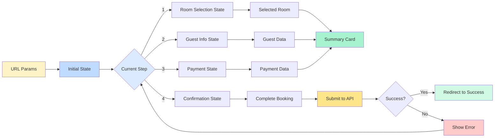

## 8. Hata Yönetimi Akışı

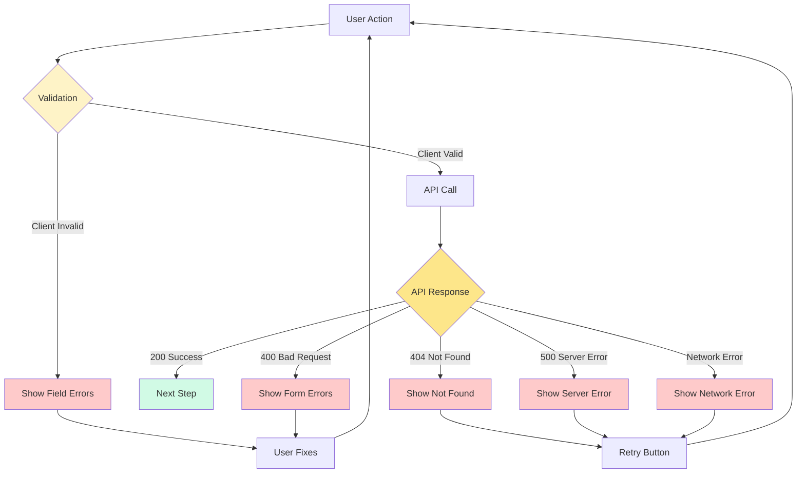

## 9. Ödeme Güvenlik Akışı

```mermaid
sequenceDiagram
    participant U as User
    participant F as Frontend
    participant V as Validator
    participant A as API
    participant B as Block
    participant R as Reserve
    participant P as Payment
    participant T as 3D Secure

    U->>F: Ödeme bilgileri gir
    F->>V: Client-side validation
    
    alt Invalid
        V-->>F: Validation errors
        F-->>U: Hata göster
    else Valid
        V-->>F: Valid
        F->>A: Submit booking
        
        A->>B: Block room (15 min)
        B-->>A: Block ID
        
        A->>R: Create reservation
        R-->>A: Booking reference
        
        A->>P: Initialize payment
        P-->>A: Payment HTML
        
        A-->>F: Payment form
        F->>U: Open 3D popup
        
        U->>T: Authenticate
        T->>P: Verify
        
        alt Success
            P-->>F: Success callback
            F-->>U: Başarı sayfası
        else Failure
            P-->>F: Failure callback
            F-->>U: Hata sayfası
        end
    end
```

## 10. Mobil Optimizasyon Stratejisi

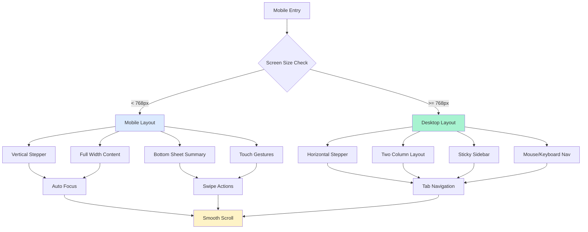

## 11. Performance Optimizasyon Stratejisi

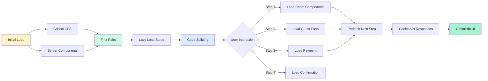

## 12. SEO ve Meta Tags Yapısı

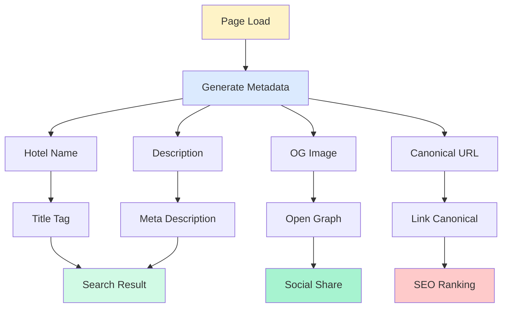

## Notlar

- Tüm diyagramlar Mermaid formatında
- Renk kodları tutarlı kullanılmış
- Her diyagram belirli bir bakış açısını gösteriyor
- Implementation sırasında referans olarak kullanılabilir
