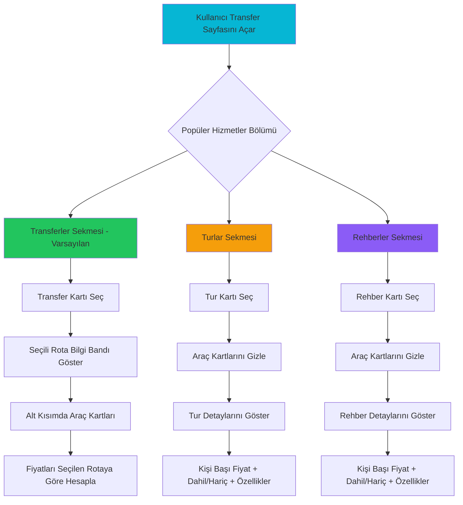

# Popüler Transferler, Turlar ve Rehberler Sistemi - Genişletilmiş Plan

## 📋 Genel Bakış

Transfer sayfasında kullanıcılara popüler transferler, turlar ve rehberlik hizmetlerini gösterecek, seçime göre dinamik davranış sergileyecek bir sistem.

## 🎯 Kullanıcı Gereksinimleri

1. Transfer sayfasında **Transferler**, **Turlar** ve **Rehberler** sekmeli yapı
2. Her sekmede o kategoriye ait popüler hizmetler
3. **Transfer** seçildiğinde: Alt kısımdaki araç kartlarının fiyatları seçilen rotaya göre güncellenir
4. **Tur/Rehber** seçildiğinde: Araç kartları gizlenir, yerine tur/rehber detayları gösterilir
5. Yeni hizmetler eklenmeli:
   - Hurma Bahçeleri Gezisi (Medine)
   - Uhud Dağı Ziyareti (Medine)
   - Mekke Tarihi Yerler Turu
   - Cidde Kızıldeniz Sahili Turu
   - Arafat-Mina-Müzdelife Ziyareti

## 🏗️ Mimari Tasarım

### Veri Katmanı

```
lib/transfers/popular-services.ts
├── PopularService (interface)
├── ServiceType: 'transfer' | 'guide' | 'tour'
└── POPULAR_SERVICES (array)
    ├── Transferler (8 adet)
    ├── Turlar (5+ adet - YENİ eklenecek)
    └── Rehberler (5+ adet - YENİ eklenecek)
```

#### Eklenecek Yeni Hizmetler

**1. Hurma Bahçeleri Gezisi**
```typescript
{
  id: 'medina-date-gardens-tour',
  type: 'tour',
  category: 'medina_tour',
  name: 'Medine Hurma Bahçeleri Gezisi',
  description: 'Medine\'nin meşhur hurma bahçelerini gezin',
  icon: '🌴',
  duration: { hours: 3, text: '3 saat' },
  pricing: {
    basePrice: 150,
    includes: ['Türkçe rehber', 'Araç transferi', 'Hurma tatımı', 'Su ikramı'],
  },
  highlights: [
    'Medine hurma bahçeleri',
    'Hurma çeşitleri tanıtımı',
    'Hurma tatımı',
    'Yerel üretici ziyareti',
  ],
}
```

**2. Uhud Dağı Ziyareti**
```typescript
{
  id: 'medina-uhud-visit',
  type: 'guide',
  category: 'medina_tour',
  name: 'Uhud Dağı ve Şehitleri Ziyareti',
  description: 'Uhud Savaşı\'nın geçtiği tarihi yerleri ziyaret edin',
  icon: '⛰️',
  duration: { hours: 2.5, text: '2.5 saat' },
  pricing: {
    basePrice: 120,
    includes: ['Türkçe rehber', 'Araç transferi', 'Tarihi anlatım'],
  },
  highlights: [
    'Uhud Dağı',
    'Şehitler Mezarlığı',
    'Hz. Hamza Kabri',
    'Uhud Savaşı anlatımı',
  ],
}
```

**3. Arafat-Mina-Müzdelife Ziyareti**
```typescript
{
  id: 'mecca-arafat-mina-tour',
  type: 'tour',
  category: 'mecca_tour',
  name: 'Arafat-Mina-Müzdelife Hac Yerleri',
  description: 'Hac ibadetinin yapıldığı kutsal yerleri gezin',
  icon: '🕋',
  duration: { hours: 5, text: '5 saat' },
  pricing: {
    basePrice: 200,
    includes: ['Türkçe rehber', 'Araç transferi', 'Öğle yemeği', 'Su ikramı'],
  },
  highlights: [
    'Arafat Vakfesi Yeri',
    'Mina Çadır Kenti',
    'Müzdelife',
    'Cemre (Şeytan Taşlama)',
    'Hac ibadeti anlatımı',
  ],
}
```

**4. Cidde Kızıldeniz Sahili Turu**
```typescript
{
  id: 'jeddah-red-sea-tour',
  type: 'tour',
  category: 'jeddah_tour',
  name: 'Cidde Kızıldeniz Sahili Turu',
  description: 'Kızıldeniz sahilinde gün batımı ve modern Cidde',
  icon: '🌊',
  duration: { hours: 4, text: '4 saat' },
  pricing: {
    basePrice: 180,
    includes: ['Türkçe rehber', 'Araç transferi', 'Su ikramı', 'Giriş ücretleri'],
  },
  highlights: [
    'Kızıldeniz sahili',
    'Cidde Çeşmesi',
    'Corniche gezisi',
    'Gün batımı manzarası',
    'Modern alışveriş merkezleri',
  ],
}
```

**5. Mekke Tarihi Yerler Turu (Genişletilmiş)**
```typescript
{
  id: 'mecca-historical-tour',
  type: 'guide',
  category: 'mecca_tour',
  name: 'Mekke Tarihi Yerler Rehberli Tur',
  description: 'Mekke\'nin tüm tarihi ve kutsal yerlerini detaylı gezin',
  icon: '🕌',
  duration: { hours: 6, text: 'Tam gün (6 saat)' },
  pricing: {
    basePrice: 250,
    includes: ['Türkçe rehber', 'Araç transferi', 'Öğle yemeği', 'Giriş ücretleri'],
  },
  highlights: [
    'Cebeli Nur (Hira Mağarası)',
    'Cebeli Sevr',
    'Mina, Arafat, Müzdelife',
    'Cemreler (Şeytan Taşlama)',
    'Cehennem Vadisi',
    'Mikat noktaları',
  ],
}
```

### Bileşen Katmanı

```
components/transfers/
├── PopularServicesSection.tsx (YENİDEN TASARLANACAK)
│   ├── Props:
│   │   ├── onServiceSelect?: (serviceId: string, type: ServiceType) => void
│   │   ├── selectedServiceId?: string | null
│   │   ├── selectedServiceType?: ServiceType | null
│   │   └── className?: string
│   ├── State:
│   │   └── activeTab: ServiceType (default: 'transfer')
│   └── UI:
│       ├── Sekme başlıkları (Transferler | Turlar | Rehberler)
│       ├── Aktif sekmeye göre filtrelenmiş hizmet kartları
│       └── Her kart: Icon, İsim, Süre, Kısa açıklama, Seçim durumu
│
├── ServiceDetailCard.tsx (YENİ OLUŞTURULACAK)
│   ├── Props:
│   │   └── service: PopularService
│   └── UI:
│       ├── Başlık ve icon
│       ├── Detaylı açıklama
│       ├── Süre ve kişi sayısı
│       ├── Fiyat (kişi başı)
│       ├── Dahil olan hizmetler (✓ listesi)
│       ├── Dahil olmayan hizmetler (✗ listesi)
│       ├── Öne çıkan özellikler (highlights)
│       ├── Dil seçenekleri
│       └── "Rezervasyon Yap" butonu
│
└── ServiceTypeTabs.tsx (MEVCUT - Kullanılacak)
```

### Sayfa Katmanı

```typescript
// app/transfers/page.tsx

interface TransfersPageState {
  // Popüler hizmet seçimi
  selectedServiceId: string | null;
  selectedServiceType: ServiceType | null;
  
  // Mevcut filtreler
  searchQuery: string;
  vehicleType: "all" | VehicleType;
  capacityFilter: string;
}

// Davranış Mantığı
┌─────────────────────────────────────────────────────────┐
│ Kullanıcı Transfer Seçerse:                            │
│ ✓ selectedServiceType = 'transfer'                     │
│ ✓ Araç kartları görünür                                │
│ ✓ Seçilen transfer rotasına göre fiyatlar güncellenir  │
│ ✓ Seçili rota bilgi bandı gösterilir                   │
└─────────────────────────────────────────────────────────┘

┌─────────────────────────────────────────────────────────┐
│ Kullanıcı Tur/Rehber Seçerse:                          │
│ ✓ selectedServiceType = 'tour' | 'guide'               │
│ ✓ Araç kartları GİZLENİR                               │
│ ✓ Seçilen tur/rehber detayları gösterilir              │
│ ✓ Kişi başı fiyat, dahil/hariç olanlar, özellikler     │
└─────────────────────────────────────────────────────────┘
```

## 🎨 UI/UX Tasarımı

### Sekme Yapısı

```
╔════════════════════════════════════════════════════════╗
║  [Transferler]  [Turlar]  [Rehberler]                 ║
╚════════════════════════════════════════════════════════╝

Transferler Sekmesi:
┌──────────┐ ┌──────────┐ ┌──────────┐ ┌──────────┐
│ ✈️       │ │ 🕌       │ │ ✈️       │ │ 🏨       │
│ Cidde →  │ │ Mekke →  │ │ Medine → │ │ Harem →  │
│ Mekke    │ │ Medine   │ │ Cidde    │ │ Otel     │
│ 75 km    │ │ 450 km   │ │ 420 km   │ │ Değişken │
│ 60-90 dk │ │ 4-5 saat │ │ 4 saat   │ │ 5-30 dk  │
└──────────┘ └──────────┘ └──────────┘ └──────────┘

Turlar Sekmesi:
┌──────────┐ ┌──────────┐ ┌──────────┐ ┌──────────┐
│ 🏔️       │ │ 🕋       │ │ 🌴       │ │ 🌊       │
│ Taif     │ │ Arafat-  │ │ Hurma    │ │ Kızıl-   │
│ Günübirlik│ │ Mina-    │ │ Bahçeleri│ │ deniz    │
│ 8 saat   │ │ Müzdelife│ │ 3 saat   │ │ Sahili   │
│ 280₺/kişi│ │ 5 saat   │ │ 150₺/kişi│ │ 4 saat   │
└──────────┘ └──────────┘ └──────────┘ └──────────┘

Rehberler Sekmesi:
┌──────────┐ ┌──────────┐ ┌──────────┐ ┌──────────┐
│ 🕌       │ │ 🕌       │ │ ⛰️       │ │ 🕋       │
│ Mekke    │ │ Medine   │ │ Uhud Dağı│ │ Umre     │
│ Şehir    │ │ Şehir    │ │ Ziyareti │ │ Ziyaret  │
│ Turu     │ │ Turu     │ │ 2.5 saat │ │ Noktaları│
│ 4 saat   │ │ 5 saat   │ │ 120₺/kişi│ │ 3 saat   │
└──────────┘ └──────────┘ └──────────┘ └──────────┘
```

### Seçim Sonrası Görünüm

**Transfer Seçiliyse:**
```
┌────────────────────────────────────────────────────────┐
│ ✓ SEÇİLİ ROTA: Cidde Havalimanı → Mekke (75 km)      │
│   [Seçimi Kaldır]                                      │
└────────────────────────────────────────────────────────┘

[Araç Kartları - Fiyatlar Güncellendi]
┌─────────────┐ ┌─────────────┐ ┌─────────────┐
│ Sedan       │ │ VIP         │ │ Van         │
│ 4 kişi      │ │ 4 kişi      │ │ 8 kişi      │
│ 150₺        │ │ 300₺        │ │ 240₺        │
└─────────────┘ └─────────────┘ └─────────────┘
```

**Tur/Rehber Seçiliyse:**
```
┌────────────────────────────────────────────────────────┐
│ ✓ SEÇİLİ HİZMET: Taif Günübirlik Turu                 │
│   [Seçimi Kaldır]                                      │
└────────────────────────────────────────────────────────┘

[Tur Detayları - Araç Kartları Gizli]
╔════════════════════════════════════════════════════════╗
║ 🏔️ TAİF GÜNÜBİRLİK TURU                              ║
║                                                        ║
║ Taif'in tarihi ve doğal güzelliklerini keşfedin       ║
║                                                        ║
║ 📍 Başlangıç: Mekke Otel                              ║
║ 🕒 Süre: 8 saat (Tam gün)                             ║
║ 👥 Kişi Sayısı: 6-40 kişi                             ║
║ 💰 Fiyat: 280₺/kişi                                    ║
║                                                        ║
║ ✅ FİYATA DAHİL:                                       ║
║   • Türkçe rehber                                     ║
║   • Araç transferi                                    ║
║   • Öğle yemeği                                       ║
║   • Su ikramı                                         ║
║   • Giriş ücretleri                                   ║
║                                                        ║
║ ❌ FİYATA DAHİL DEĞİL:                                ║
║   • Kişisel harcamalar                                ║
║                                                        ║
║ ⭐ ÖNE ÇIKANLAR:                                       ║
║   • Taif Gül Bahçeleri                                ║
║   • Şifa Bahçeleri                                    ║
║   • Taif Kalesi                                       ║
║   • Abdullah ibn Abbas Türbesi                        ║
║   • Yerel pazar ziyareti                              ║
║                                                        ║
║ 🗣️ Diller: Türkçe, Arapça                            ║
║                                                        ║
║           [📅 REZERVASYON YAP]                        ║
╚════════════════════════════════════════════════════════╝
```

## 📊 Davranış Akışı



## 🔧 Teknik Uygulama

### 1. Veri Güncellemesi
- **Dosya**: `lib/transfers/popular-services.ts`
- **İşlem**: 5 yeni hizmet ekle (Hurma Bahçeleri, Uhud Dağı, vb.)
- **Kategori**: Mevcut kategorilere uygun şekilde yerleştir

### 2. Bileşen Güncellemesi
- **Dosya**: `components/transfers/PopularServicesSection.tsx`
- **İşlem**: Yeniden tasarla
  - Sekme yapısı (ServiceTypeTabs kullan)
  - Aktif sekmeye göre filtreleme
  - Seçim durumu gösterimi
  - Basit kart yapısı (fiyatsız)

### 3. Yeni Bileşen Oluşturma
- **Dosya**: `components/transfers/ServiceDetailCard.tsx`
- **İşlem**: Tur/rehber detaylarını gösteren kart bileşeni
  - Tam detaylı görünüm
  - Dahil/hariç listeleri
  - Özellikler
  - Rezervasyon butonu

### 4. Sayfa Güncellemesi
- **Dosya**: `app/transfers/page.tsx`
- **İşlem**: State yönetimi ve koşullu render
  - `selectedServiceType` state ekle
  - Transfer seçiliyse: araç kartları göster
  - Tur/rehber seçiliyse: detay kartı göster

## ✅ Kabul Kriterleri

- [ ] Transferler, Turlar ve Rehberler sekmeleri çalışıyor
- [ ] Her sekmede ilgili hizmetler listeleniyor
- [ ] 5 yeni hizmet eklendi ve görünüyor
- [ ] Transfer seçildiğinde araç kartları fiyatları güncelleniyor
- [ ] Tur/rehber seçildiğinde araç kartları gizleniyor
- [ ] Tur/rehber detayları düzgün gösteriliyor
- [ ] Seçim durumu görsel olarak belli
- [ ] Hover ve aktif durumlar çalışıyor
- [ ] Mobil uyumlu (responsive)
- [ ] TypeScript hataları yok

## 📝 Notlar

- Mevcut `PopularServicesSection.tsx` kompleks ve fazla özellik içeriyor
- Yeni versiyon daha basit, kullanıcı dostu olacak
- Fiyat gösterimi sadece seçim sonrası ve hizmet tipine göre
- Transfer: araç kartlarında dinamik fiyat
- Tur/Rehber: detay kartında kişi başı sabit fiyat
