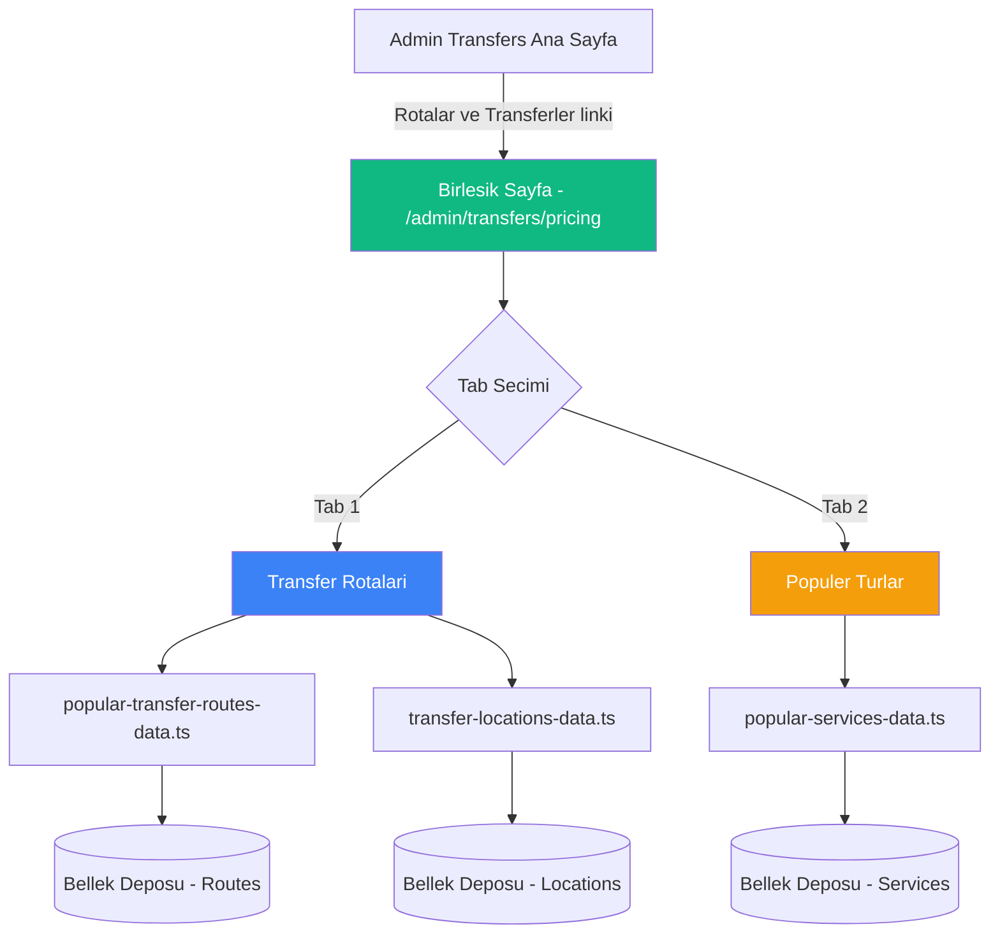

# Rotalar ve Transferler - Sayfa Birleştirme Planı

## Özet

Admin paneldeki `/admin/transfers/pricing` (Fiyat/Popüler Turlar) ve `/admin/transfers/routes` (Popüler Transfer Rotaları) sayfalarını tek bir sayfa altında birleştiriyoruz. Yeni sayfa adı: **"Rotalar ve Transferler"**.

## Mevcut Yapı

### Pricing Sayfası (`/admin/transfers/pricing`)
- **Veri kaynağı:** `popular-services-data.ts` → `PopularServiceModel`
- **İçerik:** Turlar (Mekke Şehir Turu, Medine Şehir Turu vb.) ve araç bazlı fiyatları
- **Özellikler:** Filtreleme, sıralama, CRUD, emoji picker, araç fiyatları, dışa aktarma
- **Filtre:** Sadece `type === "tour"` olanları gösteriyor

### Routes Sayfası (`/admin/transfers/routes`)
- **Veri kaynağı:** `popular-transfer-routes-data.ts` → `PopularTransferRouteModel`
- **İçerik:** Transfer rotaları (Cidde Havalimanı → Mekke vb.) ve araç bazlı fiyatları
- **Özellikler:** Filtreleme, sıralama, CRUD, lokasyon seçimi, araç fiyatları, dışa aktarma

### Ana Sayfa Linki (`/admin/transfers`)
- "Quick Navigation" bölümünde "Fiyat" adıyla `/admin/transfers/pricing` linki var (satır 583-590)

## Yeni Tasarım

### Yaklaşım: Tab-Based Birleştirme

Tek bir sayfada iki tab ile yönetim:

```
┌─────────────────────────────────────────────────────┐
│  🗺️ Rotalar ve Transferler                         │
│  Popüler transfer rotalarını ve turları yönetin     │
├─────────────────────────────────────────────────────┤
│                                                     │
│  ┌──────────────────┐ ┌──────────────────┐          │
│  │ 🗺️ Transfer      │ │ 🕌 Popüler       │          │
│  │    Rotaları       │ │    Turlar         │          │
│  └──────────────────┘ └──────────────────┘          │
│                                                     │
│  [İstatistik Kartları - Birleşik]                   │
│                                                     │
│  Tab içeriğine göre ilgili tablo + filtreler        │
│                                                     │
└─────────────────────────────────────────────────────┘
```

### Dosya Yapısı

```
web-app/src/app/admin/transfers/pricing/page.tsx  ← YENİDEN YAZILACAK (birleşik sayfa)
web-app/src/app/admin/transfers/routes/page.tsx   ← KALDIRILACAK (opsiyonel redirect)
```

## Uygulama Adımları

### Adım 1: Ana Transfer Sayfası Link Güncellemesi
**Dosya:** `web-app/src/app/admin/transfers/page.tsx`
- Satır 583-590'daki "Fiyat" linkinin metnini "Rotalar ve Transferler" olarak değiştir
- İkonu `MapPin` veya uygun bir ikon ile güncelle
- Link hala `/admin/transfers/pricing` adresine yönlensin

### Adım 2: Birleşik Sayfa Oluşturma
**Dosya:** `web-app/src/app/admin/transfers/pricing/page.tsx`

Yeni sayfa şu özelliklere sahip olacak:

#### Header
- Başlık: "Rotalar ve Transferler"
- Alt metin: "Popüler transfer rotalarını ve turları yönetin"

#### Birleşik İstatistik Kartları
- Toplam Rota (routes count)
- Toplam Tur (pricing/tours count)
- Aktif Rota
- Popüler Rota/Tur

#### Tab Sistemi
- **Tab 1 - Transfer Rotaları:** Mevcut routes sayfasının içeriği
  - Routes tablosunu göster
  - Routes filtrelerini göster
  - Routes CRUD işlemleri
  - Routes form modalı
  
- **Tab 2 - Popüler Turlar:** Mevcut pricing sayfasının içeriği
  - Turlar tablosunu göster
  - Turlar filtrelerini göster
  - Turlar CRUD işlemleri
  - Turlar form modalı

#### Ortak Butonlar
- "Yeni Rota" / "Yeni Tur" (aktif tab'a göre)
- "Dışa Aktar" (aktif tab'a göre)

### Adım 3: Routes Sayfası İşleme
**Dosya:** `web-app/src/app/admin/transfers/routes/page.tsx`
- Seçenek A: Dosyayı sil
- Seçenek B: `/admin/transfers/pricing` adresine redirect ekle (geriye uyumluluk)

### Adım 4: Import ve Bağımlılıklar
Her iki tab için gereken importlar:

**Transfer Rotaları (Routes) Tab:**
- `popular-transfer-routes-data.ts` fonksiyonları
- `transfer-locations-data.ts` fonksiyonları
- `PopularTransferRouteWithLocations` tipi
- `TransferLocationModel` tipi

**Popüler Turlar (Pricing) Tab:**
- `popular-services-data.ts` fonksiyonları
- `PopularServiceModel` tipi

## Mimari Diyagram



## Etkilenen Dosyalar

| Dosya | Değişiklik |
|-------|-----------|
| `web-app/src/app/admin/transfers/page.tsx` | "Fiyat" → "Rotalar ve Transferler" link güncellemesi |
| `web-app/src/app/admin/transfers/pricing/page.tsx` | Tam yeniden yazım - birleşik tab sayfa |
| `web-app/src/app/admin/transfers/routes/page.tsx` | Silinecek veya redirect eklenecek |

## Teknik Notlar

1. **State Yönetimi:** Her tab kendi state'ini yönetir (data, filters, sort, page). Tab değiştiğinde state korunur.
2. **Veri Yükleme:** Her iki tab'ın verisi sayfa ilk yüklendiğinde paralel olarak çekilir (Promise.all).
3. **Cache:** `useQueryClient` ile her iki veri kaynağı için cache invalidation yapılır.
4. **Form Modalları:** Her tab kendi form modalına sahip olacak (ServiceForm ve RouteForm).
5. **URL State:** Tab seçimi URL'de tutulabilir (`?tab=routes` veya `?tab=tours`) - opsiyonel.
