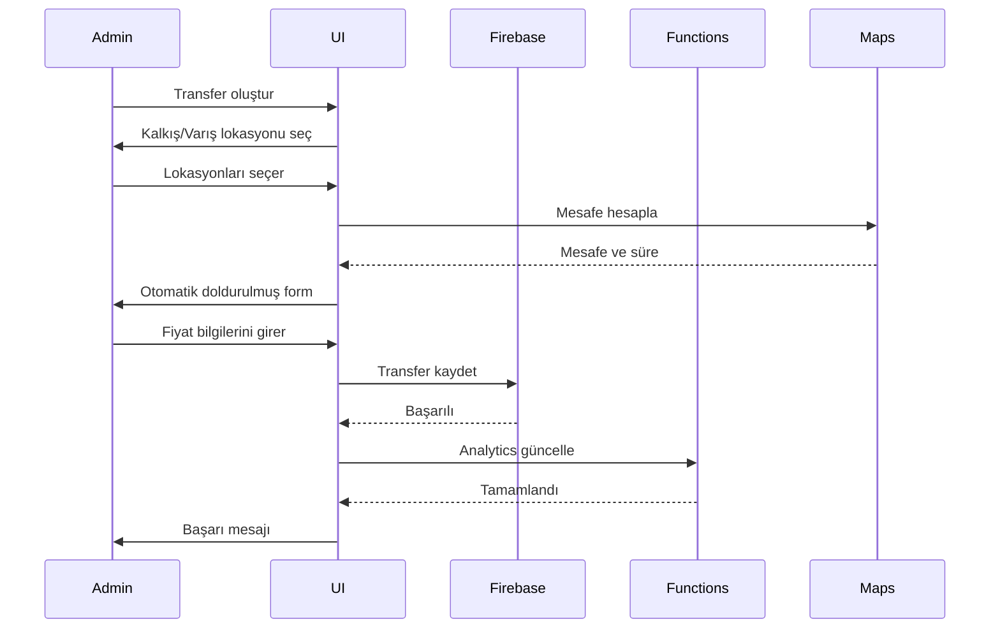

# Transfer Admin Paneli - Kapsamlı Plan

## 📋 Genel Bakış

Transfer bölümü için eksiksiz admin paneli planı. Tüm verileri yönetme, değişikliklere hakim olma ve sistem kontrolü.

**Hedef URL:** `http://localhost:3000/admin/transfers/`

**Mevcut Durum:**
- ✅ Temel transfer listesi var
- ✅ CRUD operasyonları çalışıyor
- ✅ Filtreleme ve arama var
- ❌ Popüler hizmetler yönetimi yok
- ❌ Fiyatlandırma yönetimi yok
- ❌ Lokasyon yönetimi yok
- ❌ Gelişmiş raporlama yok

---

## 🎯 Özellikler ve Geliştirmeler

### 1. Transfer Listesi Sayfası (`/admin/transfers`)

#### Mevcut Özellikler
```typescript
// Var olan özellikler:
- Transfer listesi görüntüleme
- Araç tipi filtresi
- Arama (güzergah, araç, firma)
- Aktif/Pasif toggle
- Silme işlemi
- Düzenleme linki
- Sayfalama (15 kayıt/sayfa)
```

#### Yeni Eklenecek Özellikler

##### A. Gelişmiş Filtreleme
```typescript
interface TransferFilters {
  // Mevcut
  search: string;
  vehicleType: VehicleType | "";
  
  // Yeni eklenecek
  capacityRange: "all" | "1-4" | "5-8" | "9-15" | "16+";
  priceRange: {
    min: number;
    max: number;
  };
  fromCity: string;
  toCity: string;
  isPopular: boolean | null;
  isActive: boolean | null;
  hasAvailability: boolean | null;
  company: string;
  amenities: VehicleAmenity[];
  dateRange: {
    start: Date | null;
    end: Date | null;
  };
}
```

##### B. Toplu İşlemler
```typescript
interface BulkOperations {
  selectedIds: string[];
  actions: {
    activate: () => Promise<void>;
    deactivate: () => Promise<void>;
    delete: () => Promise<void>;
    markAsPopular: () => Promise<void>;
    unmarkAsPopular: () => Promise<void>;
    updatePrice: (newPrice: number) => Promise<void>;
    exportData: (format: 'excel' | 'csv' | 'pdf') => void;
  };
}
```

##### C. Sıralama Seçenekleri
```typescript
type SortField = 
  | "vehicleName" 
  | "basePrice" 
  | "capacity" 
  | "rating" 
  | "reviewCount"
  | "createdAt"
  | "updatedAt";

type SortOrder = "asc" | "desc";
```

##### D. Görüntüleme Modları
- Liste görünümü (mevcut)
- Kart görünümü (görsellerle)
- Tablo görünümü (kompakt)

##### E. Hızlı Önizleme Modalı
```typescript
interface QuickPreview {
  transfer: TransferModel;
  tabs: [
    "overview",      // Genel bakış
    "pricing",       // Fiyatlandırma detayları
    "reservations",  // Son rezervasyonlar
    "reviews"        // Değerlendirmeler
  ];
}
```

##### F. İstatistikler Widget'ı
```typescript
interface TransferStats {
  total: number;
  active: number;
  popular: number;
  avgPrice: number;
  avgRating: number;
  mostBookedVehicle: string;
  revenueThisMonth: number;
}
```

---

### 2. Transfer Detay Sayfası (`/admin/transfers/[id]`)

#### Sekme Yapısı

```typescript
type TransferDetailTab = 
  | "basic"          // Temel bilgiler
  | "route"          // Güzergah
  | "pricing"        // Fiyatlandırma
  | "availability"   // Müsaitlik
  | "images"         // Görseller
  | "reviews"        // Değerlendirmeler
  | "reservations"   // Rezervasyonlar
  | "analytics";     // Analitikler
```

#### Sekme 1: Temel Bilgiler
```typescript
interface BasicInfo {
  vehicleName: string;           // required
  vehicleType: VehicleType;      // required
  capacity: number;              // required, 1-50
  luggageCapacity: number;       // required, 0-20
  childSeatCount: number;        // 0-5
  amenities: VehicleAmenity[];   // Çoklu seçim
  company: string;               // required
  phone?: string;                // Format: +966XXXXXXXXX
  email?: string;                // Email validasyonu
  whatsapp?: string;             // Format: +966XXXXXXXXX
  description?: string;          // Rich text editor
  isActive: boolean;
  isPopular: boolean;
}
```

#### Sekme 2: Güzergah Bilgileri
```typescript
interface RouteInfo {
  fromAddress: {
    address: string;
    city: string;
    country: string;
    state?: string;
    location?: LatLng;           // Harita üzerinde seçim
    type: LocationType;          // airport, hotel, holy_site, city
  };
  toAddress: {
    address: string;
    city: string;
    country: string;
    state?: string;
    location?: LatLng;
    type: LocationType;
  };
  distanceKm: number;            // Otomatik hesaplama
  durationMinutes: number;       // Tahmini süre
  routeId?: string;              // Popüler rota ID'si
  viaPoints?: LatLng[];          // Ara duraklar
}

// Harita Özellikleri
interface MapFeatures {
  showRoute: boolean;
  showMarkers: boolean;
  allowDragMarkers: boolean;
  calculateDistance: () => number;
  showNearbyLocations: (radius: number) => void;
}
```

#### Sekme 3: Fiyatlandırma
```typescript
interface PricingConfig {
  basePrice: number;             // required, min: 0
  
  // Araç tipine göre otomatik doldurulabilir
  pricePerKm?: number;
  nightSurcharge?: number;       // % veya sabit tutar
  waitingFeePerHour?: number;
  luggageFee?: number;
  
  // Özel fiyatlandırma
  routeSpecificPrice?: number;   // Rota bazlı sabit fiyat
  
  // İndirimler
  earlyBookingDiscount?: {
    enabled: boolean;
    daysInAdvance: number;       // 7+ gün için
    discountPercent: number;     // %5
  };
  
  // Fiyat hesaplama önizleme
  previewCalculation: {
    passengerCount: number;
    luggageCount: number;
    pickupTime: string;
    waitingHours: number;
    result: PriceCalculationResult;
  };
}
```

#### Sekme 4: Müsaitlik Takvimi
```typescript
interface AvailabilityCalendar {
  // Günlük müsaitlik
  dailyAvailability: Record<string, {
    date: string;              // YYYY-MM-DD
    isAvailable: boolean;
    availableSeats: number;    // Kapasitenin ne kadarı müsait
    specialPrice?: number;     // O gün için özel fiyat
    note?: string;             // Admin notu
  }>;
  
  // Toplu ayarlar
  bulkSettings: {
    setAvailableForRange: (start: Date, end: Date) => void;
    blockDates: (dates: Date[]) => void;
    setSpecialPrice: (dates: Date[], price: number) => void;
  };
  
  // Recurring patterns
  recurringPatterns?: {
    weekdays: boolean[];       // [true, true, true, true, true, false, false]
    timeSlots?: string[];      // ["09:00-12:00", "14:00-18:00"]
  };
}
```

#### Sekme 5: Görsel Yönetimi
```typescript
interface ImageManagement {
  images: Array<{
    id: string;
    url: string;
    order: number;
    isMain: boolean;
    caption?: string;
    uploadedAt: Date;
  }>;
  
  actions: {
    upload: (file: File) => Promise<string>;
    reorder: (imageIds: string[]) => void;
    delete: (imageId: string) => void;
    setMain: (imageId: string) => void;
    addCaption: (imageId: string, caption: string) => void;
  };
  
  // Görsel optimizasyonu
  optimization: {
    resize: boolean;           // 1920x1080
    compress: boolean;         // 80% quality
    convertToWebP: boolean;
  };
}
```

#### Sekme 6: Değerlendirmeler
```typescript
interface ReviewManagement {
  reviews: Array<{
    id: string;
    userId: string;
    userName: string;
    rating: number;            // 1-5
    comment: string;
    createdAt: Date;
    isVerified: boolean;       // Rezervasyon yapan mı?
    adminResponse?: string;
    photos?: string[];
  }>;
  
  stats: {
    avgRating: number;
    totalReviews: number;
    ratingDistribution: Record<1 | 2 | 3 | 4 | 5, number>;
    recentRatings: number[];   // Son 30 gün
  };
  
  actions: {
    respondToReview: (reviewId: string, response: string) => void;
    flagReview: (reviewId: string, reason: string) => void;
    deleteReview: (reviewId: string) => void;
  };
}
```

#### Sekme 7: Rezervasyon Geçmişi
```typescript
interface ReservationHistory {
  reservations: Array<{
    id: string;
    userId: string;
    userName: string;
    status: ReservationStatus;
    price: number;
    pickupDate: Date;
    pickupTime: string;
    passengers: number;
    createdAt: Date;
    specialRequests?: string;
  }>;
  
  stats: {
    totalBookings: number;
    confirmedBookings: number;
    cancelledBookings: number;
    totalRevenue: number;
    avgBookingValue: number;
    bookingTrend: Array<{ month: string; count: number }>;
  };
  
  filters: {
    status: ReservationStatus | "all";
    dateRange: { start: Date; end: Date };
    minPrice: number;
    maxPrice: number;
  };
}
```

#### Sekme 8: Analitikler
```typescript
interface TransferAnalytics {
  // Performans metrikleri
  performance: {
    views: number;                    // Kaç kez görüntülendi
    clicks: number;                   // Kaç kez tıklandı
    conversions: number;              // Kaç rezervasyon yapıldı
    conversionRate: number;           // %
    avgTimeToBook: number;            // Dakika
    returnCustomerRate: number;       // %
  };
  
  // Gelir analizi
  revenue: {
    total: number;
    byMonth: Array<{ month: string; revenue: number }>;
    bySource: Record<string, number>;  // web, mobile, api
  };
  
  // Müşteri davranışı
  customerBehavior: {
    mostBookedDays: string[];         // ["Saturday", "Friday"]
    mostBookedHours: string[];        // ["09:00", "10:00"]
    avgPartySize: number;
    cancellationRate: number;         // %
  };
  
  // Rekabet analizi
  competition: {
    similarVehicles: Array<{
      id: string;
      name: string;
      price: number;
      rating: number;
    }>;
    pricePosition: "lowest" | "average" | "highest";
  };
}
```

---

### 3. Popüler Hizmetler Yönetimi (`/admin/transfers/popular-services`)

**Yeni Sayfa** - Şu an sadece kod dosyasında mevcut

```typescript
interface PopularServiceAdmin {
  // Liste görünümü
  list: {
    services: PopularService[];
    filters: {
      type: ServiceType | "all";
      isPopular: boolean | null;
      minPrice: number;
      maxPrice: number;
    };
    sorting: {
      field: "name" | "price" | "duration" | "popularity";
      order: "asc" | "desc";
    };
  };
  
  // Form alanları
  form: {
    id: string;                      // Auto-generated
    type: ServiceType;               // transfer, tour, guide
    name: string;
    description: string;
    icon: string;                    // Emoji picker
    
    duration: {
      text: string;                  // "4 saat"
      hours: number;
    };
    
    distance?: {
      km: number;
      text: string;
    };
    
    price: {
      display: string;               // "800₺"
      baseAmount: number;
      type: "per_km" | "per_person" | "fixed";
    };
    
    route?: {
      from: string;
      to: string;
      stops?: string[];
    };
    
    tourDetails?: {
      highlights: string[];          // Çoklu input
      includes: string[];
      minParticipants: number;
      maxParticipants: number;
      fullDescription?: string;      // Rich text
      stopsDescription?: Array<{
        stopName: string;
        description: string;
      }>;
    };
    
    isPopular: boolean;
  };
  
  // Drag & drop ile sıralama
  reorderServices: (serviceIds: string[]) => void;
}
```

---

### 4. Fiyatlandırma Yönetimi (`/admin/transfers/pricing`)

**Yeni Sayfa** - Merkezi fiyatlandırma yönetimi

```typescript
interface PricingManagement {
  // Araç tipi bazlı fiyatlandırma
  vehiclePricing: {
    vehicleType: VehicleType;
    settings: {
      basePrice: number;
      pricePerKm: number;
      nightSurcharge: number;        // Gece 00:00-06:00 arası
      waitingFeePerHour: number;
      luggageFee: number;            // Fazla bagaj başına
    };
  }[];
  
  // Rota bazlı sabit fiyatlar
  routePricing: Array<{
    routeId: string;
    routeName: string;              // "Cidde Havalimanı → Mekke"
    fromCity: string;
    toCity: string;
    distanceKm: number;
    prices: {
      sedan: number;
      van: number;
      coster: number;
      bus?: number;                 // Otomatik: coster * 1.5
      vip?: number;                 // Otomatik: sedan * 2
      jeep?: number;                // Otomatik: sedan * 1.3
    };
  }>;
  
  // Dinamik fiyatlandırma kuralları
  dynamicPricing: {
    enabled: boolean;
    rules: Array<{
      name: string;
      condition: "high_demand" | "low_demand" | "special_date" | "weather";
      adjustment: {
        type: "percent" | "fixed";
        value: number;
      };
      priority: number;
    }>;
  };
  
  // Fiyat hesaplama simulatörü
  simulator: {
    vehicleType: VehicleType;
    routeId?: string;
    distanceKm: number;
    pickupTime: string;
    waitingHours: number;
    extraLuggage: number;
    passengerCount: number;
    result: PriceCalculationResult;
  };
}
```

---

### 5. Lokasyon Yönetimi (`/admin/transfers/locations`)

**Yeni Sayfa** - Transfer lokasyonları yönetimi

```typescript
interface LocationManagement {
  // Lokasyon listesi
  locations: Array<{
    id: string;
    name: string;
    nameEn: string;
    nameTr: string;
    type: LocationType;            // airport, hotel, holy_site, city, landmark
    city: string;
    country: string;
    coordinates: LatLng;
    icon: string;                  // Emoji veya icon
    description?: string;
    isPopular: boolean;
    usageCount: number;            // Kaç rotada kullanılıyor
  }>;
  
  // Lokasyon form
  form: {
    name: string;
    nameEn: string;
    nameTr: string;
    type: LocationType;
    city: string;
    country: string;
    address?: string;
    coordinates: {
      latitude: number;
      longitude: number;
      // Harita üzerinde seçim yapılabilir
    };
    icon: string;
    description?: string;
    isPopular: boolean;
  };
  
  // Harita görünümü
  mapView: {
    showAllLocations: boolean;
    filterByType: LocationType[];
    clustering: boolean;
    searchNearby: (location: LatLng, radius: number) => void;
  };
  
  // Rota oluşturma
  routeBuilder: {
    from: string;                  // Location ID
    to: string;                    // Location ID
    via?: string[];                // Ara duraklar
    category: "transfer" | "tour";
    subCategory?: string;
    distanceKm: number;            // Otomatik hesaplama
    durationMinutes: number;       // Otomatik hesaplama
    icon: string;
    description: string;
  };
}
```

---

### 6. Raporlama ve Analitik (`/admin/transfers/reports`)

**Yeni Sayfa** - Kapsamlı raporlama

```typescript
interface TransferReports {
  // Özet istatistikler
  summary: {
    totalTransfers: number;
    activeTransfers: number;
    totalReservations: number;
    totalRevenue: number;
    avgRating: number;
    periodComparison: {
      reservations: { current: number; previous: number; change: number };
      revenue: { current: number; previous: number; change: number };
    };
  };
  
  // Grafik verileri
  charts: {
    // Aylık rezervasyon trendi
    reservationTrend: Array<{
      month: string;
      count: number;
      revenue: number;
    }>;
    
    // Araç tipi kullanım oranları
    vehicleTypeUsage: Array<{
      type: VehicleType;
      count: number;
      percentage: number;
    }>;
    
    // Popüler rotalar
    popularRoutes: Array<{
      route: string;
      count: number;
      revenue: number;
    }>;
    
    // Günlük rezervasyon dağılımı
    dailyDistribution: Array<{
      day: string;
      count: number;
    }>;
    
    // Saatlik rezervasyon dağılımı
    hourlyDistribution: Array<{
      hour: string;
      count: number;
    }>;
  };
  
  // Detaylı raporlar
  detailedReports: {
    // Gelir raporu
    revenue: {
      byVehicle: Array<{ vehicle: string; revenue: number }>;
      byRoute: Array<{ route: string; revenue: number }>;
      byMonth: Array<{ month: string; revenue: number }>;
      bySource: Array<{ source: string; revenue: number }>;
    };
    
    // Performans raporu
    performance: {
      topPerformers: Array<{
        transferId: string;
        name: string;
        bookings: number;
        revenue: number;
        rating: number;
      }>;
      lowestPerformers: Array<{
        transferId: string;
        name: string;
        bookings: number;
        revenue: number;
        issues?: string[];
      }>;
    };
    
    // Müşteri raporu
    customer: {
      totalCustomers: number;
      returnCustomers: number;
      avgBookingValue: number;
      customerLifetimeValue: number;
      satisfactionScore: number;
    };
  };
  
  // Export seçenekleri
  export: {
    format: "excel" | "pdf" | "csv";
    dateRange: { start: Date; end: Date };
    sections: string[];            // Hangi bölümler dahil edilsin
  };
}
```

---

## 🗄️ Veri Modelleri ve Firebase Koleksiyonları

### Mevcut Koleksiyonlar

#### 1. `transfers` Koleksiyonu
```typescript
interface TransferDocument {
  // Mevcut alanlar
  fromAddress: AddressModel;
  toAddress: AddressModel;
  vehicleType: VehicleType;
  vehicleName: string;
  capacity: number;
  luggageCapacity: number;
  childSeatCount: number;
  amenities: VehicleAmenity[];
  basePrice: number;
  durationMinutes: number;
  company: string;
  phone?: string;
  email?: string;
  whatsapp?: string;
  rating: number;
  reviewCount: number;
  images: string[];
  availability?: Record<string, TransferDailyAvailability>;
  isActive: boolean;
  isPopular: boolean;
  favoriteUserIds?: string[];
  createdAt: Timestamp;
  updatedAt: Timestamp;
}
```

### Yeni Eklenecek Koleksiyonlar

#### 2. `popular_services` Koleksiyonu
```typescript
interface PopularServiceDocument {
  id: string;
  type: "transfer" | "tour" | "guide";
  name: string;
  nameEn?: string;
  nameTr?: string;
  description: string;
  descriptionEn?: string;
  descriptionTr?: string;
  icon: string;
  
  duration: {
    text: string;
    hours: number;
  };
  
  distance?: {
    km: number;
    text: string;
  };
  
  price: {
    display: string;
    baseAmount: number;
    type: "per_km" | "per_person" | "fixed";
  };
  
  route?: {
    from: string;
    to: string;
    stops?: string[];
  };
  
  tourDetails?: {
    highlights: string[];
    includes: string[];
    minParticipants: number;
    maxParticipants: number;
    fullDescription?: string;
    stopsDescription?: Array<{
      stopName: string;
      description: string;
    }>;
  };
  
  isPopular: boolean;
  order: number;                   // Sıralama için
  createdAt: Timestamp;
  updatedAt: Timestamp;
}
```

#### 3. `transfer_locations` Koleksiyonu
```typescript
interface TransferLocationDocument {
  id: string;
  name: string;
  nameEn: string;
  nameTr: string;
  type: "airport" | "hotel" | "holy_site" | "city" | "landmark" | "train_station";
  city: string;
  country: string;
  address?: string;
  coordinates: {
    latitude: number;
    longitude: number;
  };
  icon: string;
  description?: string;
  descriptionEn?: string;
  descriptionTr?: string;
  isPopular: boolean;
  usageCount: number;              // Denormalize edilmiş
  createdAt: Timestamp;
  updatedAt: Timestamp;
}
```

#### 4. `transfer_routes` Koleksiyonu
```typescript
interface TransferRouteDocument {
  id: string;
  fromLocationId: string;
  toLocationId: string;
  viaLocationIds?: string[];       // Ara duraklar
  category: "transfer" | "tour";
  subCategory?: string;
  distanceKm: number;
  durationMinutes: number;
  icon: string;
  description: string;
  descriptionEn?: string;
  descriptionTr?: string;
  isPopular: boolean;
  usageCount: number;
  createdAt: Timestamp;
  updatedAt: Timestamp;
}
```

#### 5. `transfer_pricing` Koleksiyonu
```typescript
interface TransferPricingDocument {
  id: string;                      // vehicle_type or route_id
  type: "vehicle_type" | "route";
  
  // Araç tipi fiyatlandırması
  vehicleType?: VehicleType;
  basePrice?: number;
  pricePerKm?: number;
  nightSurcharge?: number;
  waitingFeePerHour?: number;
  luggageFee?: number;
  
  // Rota bazlı fiyatlandırma
  routeId?: string;
  routePrices?: {
    sedan: number;
    van: number;
    coster: number;
    bus?: number;
    vip?: number;
    jeep?: number;
  };
  
  updatedAt: Timestamp;
  updatedBy: string;               // Admin user ID
}
```

#### 6. `transfer_analytics` Koleksiyonu
```typescript
interface TransferAnalyticsDocument {
  transferId: string;
  date: string;                    // YYYY-MM-DD
  views: number;
  clicks: number;
  bookings: number;
  revenue: number;
  avgRating: number;
  createdAt: Timestamp;
}
```

---

## 🔧 Firebase Functions

### Yeni Cloud Functions

#### 1. `calculateTransferDistance`
```typescript
// Harita API kullanarak mesafe hesaplama
export const calculateTransferDistance = functions.https.onCall(
  async (data: { fromLocation: LatLng; toLocation: LatLng }) => {
    // Google Maps Distance Matrix API
    const distance = await calculateDistance(data.fromLocation, data.toLocation);
    return {
      distanceKm: distance.distanceKm,
      durationMinutes: distance.durationMinutes,
    };
  }
);
```

#### 2. `updateTransferAnalytics`
```typescript
// Transfer görüntüleme, tıklama ve rezervasyon takibi
export const updateTransferAnalytics = functions.firestore
  .document("reservations/{reservationId}")
  .onCreate(async (snap, context) => {
    const reservation = snap.data();
    if (reservation.type !== "transfer") return;
    
    // Analytics güncelle
    await updateAnalyticsDoc(reservation.transferId, {
      bookings: FieldValue.increment(1),
      revenue: FieldValue.increment(reservation.price),
    });
  });
```

#### 3. `syncRouteFixedPrices`
```typescript
// Kod dosyasındaki ROUTE_FIXED_PRICES'ı Firestore'a senkronize et
export const syncRouteFixedPrices = functions.https.onCall(async () => {
  const batch = firestore.batch();
  
  ROUTE_FIXED_PRICES.forEach(route => {
    const ref = firestore.collection("transfer_pricing").doc(route.routeId);
    batch.set(ref, {
      type: "route",
      routeId: route.routeId,
      routePrices: {
        sedan: route.sedan,
        van: route.van,
        coster: route.coster,
      },
      updatedAt: FieldValue.serverTimestamp(),
    });
  });
  
  await batch.commit();
});
```

---

## 🎨 UI Bileşenleri

### Yeni Bileşenler

#### 1. `TransferCard` - Gelişmiş Kart
```typescript
interface TransferCardProps {
  transfer: TransferModel;
  view: "list" | "grid" | "compact";
  onEdit?: () => void;
  onDelete?: () => void;
  onToggleActive?: () => void;
  onQuickView?: () => void;
  showAnalytics?: boolean;
}
```

#### 2. `PricingForm` - Fiyatlandırma Formu
```typescript
interface PricingFormProps {
  vehicleType?: VehicleType;
  routeId?: string;
  initialValues?: TransferPricing;
  onSave: (pricing: TransferPricing) => Promise<void>;
  showSimulator?: boolean;
}
```

#### 3. `LocationPicker` - Lokasyon Seçici
```typescript
interface LocationPickerProps {
  value?: LatLng;
  onChange: (location: LatLng) => void;
  allowSearch?: boolean;
  showNearby?: boolean;
  showSavedLocations?: boolean;
}
```

#### 4. `AvailabilityCalendar` - Müsaitlik Takvimi
```typescript
interface AvailabilityCalendarProps {
  availability: Record<string, TransferDailyAvailability>;
  capacity: number;
  onUpdate: (date: string, availability: TransferDailyAvailability) => void;
  onBulkUpdate?: (dates: string[], availability: Partial<TransferDailyAvailability>) => void;
}
```

#### 5. `ImageManager` - Görsel Yöneticisi
```typescript
interface ImageManagerProps {
  images: string[];
  onUpload: (file: File) => Promise<string>;
  onReorder: (imageIds: string[]) => void;
  onDelete: (imageUrl: string) => void;
  maxImages?: number;
  allowReorder?: boolean;
}
```

#### 6. `RevenueChart` - Gelir Grafiği
```typescript
interface RevenueChartProps {
  data: Array<{ month: string; revenue: number }>;
  type: "line" | "bar" | "area";
  showComparison?: boolean;
  period?: "week" | "month" | "year";
}
```

---

## 📊 Mermaid Diyagramları

### Admin Panel Navigasyon Yapısı

```mermaid
graph TB
    Dashboard[Admin Dashboard] --> Transfers[Transferler]
    
    Transfers --> List[Transfer Listesi]
    Transfers --> Services[Popüler Hizmetler]
    Transfers --> Pricing[Fiyatlandırma]
    Transfers --> Locations[Lokasyonlar]
    Transfers --> Reports[Raporlar]
    
    List --> New[Yeni Transfer]
    List --> Edit[Transfer Düzenle]
    List --> Bulk[Toplu İşlemler]
    
    Edit --> BasicTab[Temel Bilgiler]
    Edit --> RouteTab[Güzergah]
    Edit --> PricingTab[Fiyatlandırma]
    Edit --> AvailTab[Müsaitlik]
    Edit --> ImagesTab[Görseller]
    Edit --> ReviewsTab[Değerlendirmeler]
    Edit --> BookingsTab[Rezervasyonlar]
    Edit --> AnalyticsTab[Analitikler]
    
    Services --> ServiceList[Hizmet Listesi]
    Services --> ServiceNew[Yeni Hizmet]
    Services --> ServiceEdit[Hizmet Düzenle]
    
    Pricing --> VehiclePricing[Araç Fiyatları]
    Pricing --> RoutePricing[Rota Fiyatları]
    Pricing --> Simulator[Fiyat Simulatörü]
    
    Locations --> LocList[Lokasyon Listesi]
    Locations --> LocNew[Yeni Lokasyon]
    Locations --> LocMap[Harita Görünümü]
    Locations --> RouteBuilder[Rota Oluşturucu]
    
    Reports --> Summary[Özet İstatistikler]
    Reports --> Charts[Grafikler]
    Reports --> Detailed[Detaylı Raporlar]
    Reports --> Export[Export]
```



### Veri Akışı



### Firebase Koleksiyon İlişkileri

```mermaid
erDiagram
    TRANSFERS ||--o{ RESERVATIONS : has
    TRANSFERS ||--o{ REVIEWS : has
    TRANSFERS }o--|| TRANSFER_PRICING : uses
    TRANSFERS ||--o{ TRANSFER_ANALYTICS : tracks
    
    TRANSFER_ROUTES ||--|| TRANSFER_LOCATIONS : from
    TRANSFER_ROUTES ||--|| TRANSFER_LOCATIONS : to
    TRANSFER_ROUTES }o--o{ TRANSFER_LOCATIONS : via
    
    POPULAR_SERVICES }o--o| TRANSFER_ROUTES : references
    
    TRANSFERS {
        string id PK
        object fromAddress
        object toAddress
        string vehicleType
        number basePrice
        boolean isActive
        boolean isPopular
    }
    
    TRANSFER_LOCATIONS {
        string id PK
        string name
        string type
        object coordinates
        boolean isPopular
    }
    
    TRANSFER_ROUTES {
        string id PK
        string fromLocationId FK
        string toLocationId FK
        array viaLocationIds
        number distanceKm
    }
    
    POPULAR_SERVICES {
        string id PK
        string type
        string name
        object price
        boolean isPopular
    }
    
    TRANSFER_PRICING {
        string id PK
        string type
        object prices
    }
    
    RESERVATIONS {
        string id PK
        string transferId FK
        string userId
        number price
        string status
    }
```

---

## 🔄 Implementasyon Sırası

### Faz 1: Temel İyileştirmeler (1-2 gün)
1. ✅ Transfer listesi gelişmiş filtreleme
2. ✅ Toplu işlemler UI
3. ✅ Hızlı önizleme modalı
4. ✅ İstatistik widget'ları

### Faz 2: Transfer Detay Sayfası (2-3 gün)
1. ✅ Sekme yapısı oluştur
2. ✅ Temel bilgiler sekmesi geliştir
3. ✅ Güzergah sekmesi + harita entegrasyonu
4. ✅ Fiyatlandırma sekmesi + hesaplama önizleme
5. ✅ Müsaitlik takvimi
6. ✅ Görsel yönetimi
7. ✅ Değerlendirmeler görüntüleme
8. ✅ Rezervasyon geçmişi
9. ✅ Analitikler

### Faz 3: Popüler Hizmetler (1-2 gün)
1. ✅ Firebase koleksiyonu oluştur
2. ✅ Admin sayfası oluştur
3. ✅ CRUD operasyonları
4. ✅ Mevcut verilerden migrasyon
5. ✅ Drag & drop sıralama

### Faz 4: Fiyatlandırma Yönetimi (1-2 gün)
1. ✅ Firebase koleksiyonu oluştur
2. ✅ Admin sayfası oluştur
3. ✅ Araç tipi fiyatlandırma
4. ✅ Rota bazlı fiyatlandırma
5. ✅ Fiyat simulatörü
6. ✅ Mevcut verilerden migrasyon

### Faz 5: Lokasyon Yönetimi (1-2 gün)
1. ✅ Firebase koleksiyonları oluştur
2. ✅ Admin sayfası oluştur
3. ✅ Lokasyon CRUD
4. ✅ Harita entegrasyonu
5. ✅ Rota oluşturucu

### Faz 6: Raporlama (1 gün)
1. ✅ Analytics toplama sistemi
2. ✅ Raporlama sayfası
3. ✅ Grafikler
4. ✅ Export fonksiyonları

### Faz 7: Testing & Optimizasyon (1 gün)
1. ✅ Performans optimizasyonu
2. ✅ Responsive tasarım kontrolü
3. ✅ Bug fixing
4. ✅ Dokümantasyon

**Toplam Tahmini Süre:** 8-12 gün

---

## 🚀 Öneriler ve Best Practices

### Performans
- Transfer listesinde pagination + infinite scroll
- Görsel lazy loading
- Firebase query optimizasyonu (composite indexes)
- Cache stratejisi (React Query kullanımı)

### Güvenlik
- Admin yetkisi kontrolü her route'ta
- Firebase Security Rules güncelleme
- Input validasyonu (client + server side)
- SQL injection önleme (Firestore zaten güvenli)

### UX İyileştirmeleri
- Skeleton loading states
- Optimistic updates
- Error boundaries
- Toast notifications
- Confirm dialogları
- Form auto-save (draft sistemi)

### SEO & Analytics
- Transfer sayfaları için meta tags
- Google Analytics entegrasyonu
- Conversion tracking
- A/B testing hazırlığı

### Bakım
- Düzenli veri yedekleme
- Performans monitoring
- Error tracking (Sentry)
- Usage analytics

---

## 📝 Notlar

### Önemli Kararlar
1. **Popüler hizmetler** Firebase'e taşınacak (şu an sadece kod dosyasında)
2. **Fiyatlandırma** merkezi yönetim için ayrı koleksiyon
3. **Lokasyonlar** rota oluşturmak için normalize edilecek
4. **Analytics** her transfer için günlük kayıt

### Teknik Borçlar
- [ ] Mevcut `popular-services-simple.ts` verilerinin Firestore'a migrasyonu
- [ ] Eski fiyatlandırma sisteminden yeni sisteme geçiş
- [ ] Harita API key yönetimi
- [ ] Görsel upload için storage bucket konfigürasyonu

### İleriye Dönük
- AI destekli fiyat önerisi
- Dinamik fiyatlandırma (talebe göre)
- Müşteri segmentasyonu
- Personalized recommendations
- WhatsApp entegrasyonu (rezervasyon bildirimleri)

---

## 🎯 Sonuç

Bu plan, transfer admin panelinin eksiksiz bir roadmap'ini sunuyor. Tüm özellikler implement edildikinde:

- ✅ Tüm transfer verilerini tek yerden yönetebilirsiniz
- ✅ Popüler hizmetleri kolayca düzenleyebilirsiniz
- ✅ Fiyatlandırmayı merkezi olarak kontrol edebilirsiniz
- ✅ Lokasyonları ve rotaları yönetebilirsiniz
- ✅ Detaylı raporlara erişebilirsiniz
- ✅ Sistem performansını takip edebilirsiniz

**Hedef:** Profesyonel, kullanıcı dostu, kapsamlı bir admin paneli oluşturmak.
