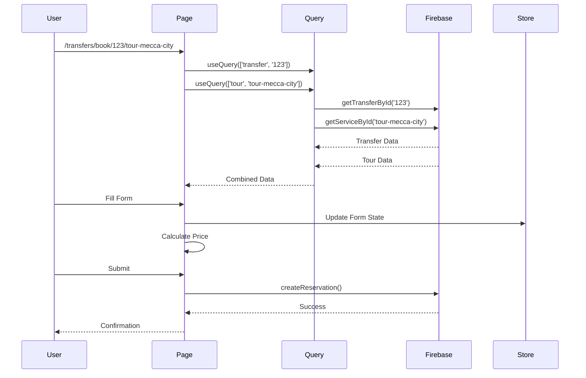

# Transfer Rezervasyon Akışı Yeniden Tasarım Planı

## 1. Mevcut Durum Analizi

### 1.1 Mevcut Akış
```
/transfers (Ana Sayfa)
  ├─ Tur seçimi (PopularServicesSection)
  ├─ Araç listesi (TransferCard)
  └─ /transfers/[transferId] (Detay Sayfası)
      ├─ Araç bilgileri
      ├─ Rezervasyon formu
      └─ İletişim bilgileri
```

### 1.2 Tespit Edilen Sorunlar

| Sorun | Açıklama | Öncelik |
|-------|----------|---------|
| **Tur Bağlamı Kayboluyor** | Araç detay sayfasına geçildiğinde seçili tur bilgisi görünmüyor | KRİTİK |
| **Fiyat Ayrışması** | Ana sayfadaki fiyat (transfer + tur) ile detay sayfasındaki fiyat (sadece transfer) tutarsız | KRİTİK |
| **Tur Detayları Eksik** | Seçili tura ait detaylar araç sayfasında gösterilmiyor | YÜKSEK |
| **Ödeme Akışı Kopuk** | Tur seçimi yapıp araç seçtiğinde ödeme formunda tur bilgisi yok | YÜKSEK |
| **URL Parametresi Eksik** | Seçili tur ID'si URL'de taşınmıyor | ORTA |

### 1.3 Kullanıcı Senaryosu

```
1. Kullanıcı /transfers sayfasına gelir
2. "Mekke Şehir Turu"nu seçer (seçili tur: tour-mecca-city)
3. Araç listesinden bir VIP Vito seçer (fiyat: 800₺ tur + 500₺ transfer = 1300₺)
4. Araç kartına tıklar -> /transfers/[transferId] sayfasına gider
5. ❌ SORUN: Tur bilgisi görünmüyor, fiyat sadece 500₺ gösteriyor
6. ❌ SORUN: Ödeme formunda tur seçimi hatırlanmıyor
```

---

## 2. Yeni Sayfa Yapısı ve Kullanıcı Deneyimi

### 2.1 Yeni URL Yapısı

```
/transfers
  └─ /book
      └─ /[transferId]?tour=[tourId]&date=[date]&passengers=[count]
```

**Alternatif (Daha Temiz):**
```
/transfers/book/[transferId]/[tourId]
```

### 2.2 Yeni Akış Diyagramı

```mermaid
flowchart TD
    A[Transfers Ana Sayfa] -->|Tur Seç| B[PopularServicesSection]
    B -->|Seçili Tur ID| C[TransferCard Listesi]
    C -->|Araç Seç + Tur ID| D[/transfers/book/transferId/tourId]
    D --> E[BookingPage]
    
    E --> F[Sol Kolon: Detaylar]
    E --> G[Sağ Kolon: Booking Form]
    
    F --> F1[Araç Bilgileri]
    F --> F2[Tur Bilgileri]
    F --> F3[Fiyat Özeti]
    
    G --> G1[Tarih ve Saat]
    G --> G2[Yolcu Bilgileri]
    G --> G3[Ödeme Özeti]
    G --> G4[Onay Butonu]
    
    G4 --> H[Rezervasyon Başarılı]
```

### 2.3 Sayfa Bölümleri

#### Sol Kolon (Detaylar - %60)
1. **Araç Bilgileri Card**
   - Araç görselleri (gallery)
   - Araç tipi, kapasite, bagaj
   - Araç özellikleri (WiFi, su, koltuk tipi vb.)
   - Şirket bilgisi
   - Değerlendirme

2. **Tur Bilgileri Card** (YENİ)
   - Tur adı ve ikonu
   - Tur süresi ve mesafe
   - Güzergah haritası (görsel)
   - Ziyaret edilecek yerler
   - Fiyata dahil olanlar
   - Tur detay butonu (modal açar)

3. **Fiyat Özeti Card** (YENİ)
   - Transfer ücreti
   - Tur ücreti
   - Toplam fiyat
   - Para birimi seçeneği

#### Sağ Kolon (Booking Form - %40)
1. **Tarih ve Saat Seçimi**
   - Alış tarihi
   - Alış saati
   - Dönüş tarihi (opsiyonel)

2. **Yolcu ve Bagaj Bilgileri**
   - Yetişkin sayısı
   - Çocuk sayısı
   - Bebek koltuğu ihtiyacı
   - Bagaj sayısı

3. **İletişim Bilgileri**
   - Ad soyad
   - Telefon
   - E-posta
   - WhatsApp (opsiyonel)

4. **Adres Bilgileri**
   - Alış adresi (otel adı veya adres)
   - Bırakış adresi
   - Uçuş bilgisi (opsiyonel)

5. **Ödeme Özeti ve Onay**
   - Fiyat breakdown
   - Kupon/kod alanı
   - Onay butonu

---

## 3. UI/UX Tasarım Sistemi

### 3.1 Renk Paleti

```css
/* Ana Renkler */
--primary: #0891b2;        /* Cyan-600 */
--primary-dark: #0e7490;   /* Cyan-700 */
--primary-light: #06b6d4;  /* Cyan-500 */

/* Tur Renkleri */
--tour-bg: #fff7ed;        /* Orange-50 */
--tour-border: #fed7aa;    /* Orange-200 */
--tour-text: #ea580c;      /* Orange-600 */

/* Araç Renkleri */
--vehicle-bg: #f0f9ff;     /* Sky-50 */
--vehicle-border: #bae6fd; /* Sky-200 */
--vehicle-text: #0284c7;   /* Sky-600 */

/* Fiyat Renkleri */
--price-bg: #ecfdf5;       /* Emerald-50 */
--price-border: #a7f3d0;   /* Emerald-200 */
--price-text: #059669;     /* Emerald-600 */
```

### 3.2 Tipografi

```css
/* Başlıklar */
--heading-xl: 28px / 36px, bold;
--heading-lg: 20px / 28px, semibold;
--heading-md: 16px / 24px, medium;

/* Body */
--body-lg: 16px / 24px, regular;
--body-md: 14px / 20px, regular;
--body-sm: 12px / 16px, regular;

/* Etiketler */
--label: 11px / 16px, medium, uppercase;
```

### 3.3 Spacing (8px Grid)

```css
--space-xs: 4px;
--space-sm: 8px;
--space-md: 16px;
--space-lg: 24px;
--space-xl: 32px;
--space-2xl: 48px;
```

### 3.4 Border Radius

```css
--radius-sm: 8px;
--radius-md: 12px;
--radius-lg: 16px;
--radius-xl: 20px;
--radius-full: 9999px;
```

### 3.5 Shadow

```css
--shadow-sm: 0 1px 2px rgba(0,0,0,0.05);
--shadow-md: 0 4px 6px rgba(0,0,0,0.07);
--shadow-lg: 0 10px 15px rgba(0,0,0,0.1);
--shadow-xl: 0 20px 25px rgba(0,0,0,0.15);
```

---

## 4. Component Yapısı

### 4.1 Yeni Sayfa Component Hiyerarşisi

```
BookingPage
├── PageHeader (Geri butonu, başlık)
├── MainContent (Grid 2 kolon)
│   ├── LeftColumn
│   │   ├── VehicleInfoCard
│   │   │   ├── ImageGallery
│   │   │   ├── VehicleTitle
│   │   │   ├── VehicleSpecs
│   │   │   └── VehicleAmenities
│   │   ├── TourInfoCard (YENİ)
│   │   │   ├── TourHeader
│   │   │   ├── TourRoute
│   │   │   ├── TourHighlights
│   │   │   ├── TourIncludes
│   │   │   └── TourDetailButton
│   │   └── PriceSummaryCard (YENİ)
│   │       ├── TransferPrice
│   │       ├── TourPrice
│   │       └── TotalPrice
│   └── RightColumn (Sticky)
│       └── BookingFormCard
│           ├── DateTimeSection
│           ├── PassengerSection
│           ├── ContactSection
│           ├── AddressSection
│           ├── FlightInfoSection (Opsiyonel)
│           ├── CouponSection
│           └── SubmitButton
└── TourDetailModal (Mevcut)
```

### 4.2 Yeni Component Tanımları

#### VehicleInfoCard
```typescript
interface VehicleInfoCardProps {
  vehicle: TransferModel;
  onImageChange?: (index: number) => void;
}
```

#### TourInfoCard (YENİ)
```typescript
interface TourInfoCardProps {
  tour: PopularService;
  onShowDetail: () => void;
}
```

#### PriceSummaryCard (YENİ)
```typescript
interface PriceSummaryCardProps {
  transferPrice: number;
  tourPrice: number;
  passengerCount: number;
  currency: 'TRY' | 'USD';
}
```

#### BookingFormCard
```typescript
interface BookingFormCardProps {
  transfer: TransferModel;
  tour?: PopularService;
  onSubmit: (data: BookingData) => void;
}

interface BookingData {
  date: Date;
  time: string;
  passengers: {
    adults: number;
    children: number;
    infants: number;
  };
  luggage: number;
  contact: {
    name: string;
    phone: string;
    email: string;
    whatsapp?: string;
  };
  addresses: {
    pickup: string;
    dropoff: string;
  };
  flightInfo?: {
    flightNumber: string;
    arrivalTime: string;
  };
  notes?: string;
  couponCode?: string;
}
```

---

## 5. Ödeme Formu ve Bilgi Toplama Akışı

### 5.1 Form Bölümleri (Step-by-Step veya Single Page)

**Seçenek 1: Single Page (Tercih Edilen)**
- Tüm bilgiler tek sayfada
- Sticky sidebar ile form her zaman görünür
- Daha hızlı işlem

**Seçenek 2: Multi-Step**
- Adım 1: Tarih ve Saat
- Adım 2: Yolcu Bilgileri
- Adım 3: İletişim ve Adres
- Adım 4: Ödeme ve Onay

### 5.2 Form Validasyon Kuralları

| Alan | Kural | Hata Mesajı |
|------|------|-------------|
| Tarih | Bugünden sonraki 7 gün içinde | En az 1 gün önceden rezervasyon gerekli |
| Saat | 06:00 - 22:00 arası | 06:00-22:00 arasında seçim yapın |
| Yetişkin | 1-16 arası | En az 1 yetişkin gerekli |
| Telefon | Türkiye formatı | Geçerli bir telefon numarası girin |
| E-posta | Valid email | Geçerli bir e-posta adresi girin |
| Alış Adresi | Minimum 10 karakter | Lütfen detaylı adres girin |

### 5.3 Fiyat Hesaplama Mantığı

```typescript
function calculateTotalPrice(params: {
  transfer: TransferModel;
  tour?: PopularService;
  passengers: number;
  isNightTime: boolean;
  waitingHours?: number;
}): PriceBreakdown {
  const { transfer, tour, passengers, isNightTime, waitingHours } = params;
  
  // Transfer fiyatı
  let transferPrice = transfer.basePrice;
  
  // Gece mesai ücreti (22:00 - 06:00)
  if (isNightTime) {
    transferPrice *= 1.5; // %50 artış
  }
  
  // Bekleme ücreti
  if (waitingHours && waitingHours > 0) {
    transferPrice += waitingHours * 100; // Saat başı 100₺
  }
  
  // Tur fiyatı (kişi başı)
  let tourPrice = 0;
  if (tour) {
    if (tour.price.type === 'per_person') {
      tourPrice = tour.price.baseAmount * passengers;
    } else {
      tourPrice = tour.price.baseAmount;
    }
  }
  
  const total = transferPrice + tourPrice;
  
  return {
    transferPrice,
    tourPrice,
    total,
    currency: 'TRY',
  };
}
```

---

## 6. Tur Bilgilerinin Entegrasyonu

### 6.1 URL Parametresi ile Taşıma

```typescript
// Ana sayfadan link
<Link href={`/transfers/book/${transfer.id}/${selectedTourId}`}>
  <TransferCard />
</Link>

// Booking sayfasında
const params = useParams();
const transferId = params.transferId;
const tourId = params.tourId;

// Veri çekme
const transfer = useQuery(['transfer', transferId], () => getTransferById(transferId));
const tour = useQuery(['tour', tourId], () => getServiceById(tourId));
```

### 6.2 State Management (Alternatif)

```typescript
// Zustand store
interface BookingStore {
  selectedTourId: string | null;
  setSelectedTourId: (id: string | null) => void;
  clearBooking: () => void;
}
```

### 6.3 Tur Bilgisi Gösterimi

**TourInfoCard Component:**
```tsx
<Card className="border-orange-200 bg-orange-50">
  <CardContent className="p-5">
    <div className="flex items-center gap-3 mb-4">
      <div className="w-12 h-12 rounded-xl bg-orange-100 flex items-center justify-center text-2xl">
        {tour.icon}
      </div>
      <div>
        <Badge className="bg-orange-200 text-orange-800 mb-1">Seçili Tur</Badge>
        <h3 className="font-semibold text-slate-900">{tour.name}</h3>
      </div>
    </div>
    
    <div className="grid grid-cols-3 gap-3 mb-4">
      <InfoItem icon={<Clock />} label="Süre" value={tour.duration.text} />
      <InfoItem icon={<MapPin />} label="Mesafe" value={tour.distance?.text} />
      <InfoItem icon={<Users />} label="Kişi" value={`${tour.tourDetails.minParticipants}-${tour.tourDetails.maxParticipants}`} />
    </div>
    
    <div className="bg-white rounded-lg p-3 mb-4">
      <p className="text-sm text-slate-600">{tour.description}</p>
    </div>
    
    <Button 
      variant="outline" 
      className="w-full"
      onClick={onShowDetail}
    >
      <Info className="w-4 h-4 mr-2" />
      Tur Detaylarını Gör
    </Button>
  </CardContent>
</Card>
```

---

## 7. Teknik Mimari ve Veri Akışı

### 7.1 Dosya Yapısı

```
web-app/src/
├── app/
│   └── transfers/
│       ├── page.tsx (Mevcut - Ana sayfa)
│       └── book/
│           └── [transferId]/
│               └── [tourId]/
│                   ├── page.tsx
│                   └── _client.tsx (YENİ - BookingPage)
├── components/
│   └── transfers/
│       ├── booking/ (YENİ KLASÖR)
│       │   ├── BookingPage.tsx
│       │   ├── VehicleInfoCard.tsx
│       │   ├── TourInfoCard.tsx
│       │   ├── PriceSummaryCard.tsx
│       │   ├── BookingFormCard.tsx
│       │   ├── DateTimeSection.tsx
│       │   ├── PassengerSection.tsx
│       │   ├── ContactSection.tsx
│       │   ├── AddressSection.tsx
│       │   └── FlightInfoSection.tsx
│       ├── TourDetailModal.tsx (Mevcut)
│       ├── PopularServicesSection.tsx (Mevcut - Güncellenecek)
│       └── TransferCard.tsx (Mevcut - Güncellenecek)
├── lib/
│   └── transfers/
│       ├── pricing.ts (Mevcut - Güncellenecek)
│       └── booking.ts (YENİ)
└── types/
    └── booking.ts (YENİ)
```

### 7.2 Veri Akışı



### 7.3 Yeni Type Tanımları

```typescript
// types/booking.ts
export interface BookingFormData {
  // Transfer bilgileri
  transferId: string;
  transferPrice: number;
  
  // Tur bilgileri (opsiyonel)
  tourId?: string;
  tourPrice?: number;
  
  // Tarih ve saat
  pickupDate: Date;
  pickupTime: string;
  returnDate?: Date;
  
  // Yolcu bilgileri
  passengers: {
    adults: number;
    children: number;
    infants: number;
  };
  luggageCount: number;
  childSeatNeeded: boolean;
  
  // İletişim
  contactName: string;
  contactPhone: string;
  contactEmail: string;
  contactWhatsapp?: string;
  
  // Adres
  pickupAddress: string;
  dropoffAddress: string;
  
  // Uçuş (opsiyonel)
  flightNumber?: string;
  arrivalTime?: string;
  
  // Notlar
  notes?: string;
  couponCode?: string;
}

export interface PriceBreakdown {
  transferPrice: number;
  tourPrice: number;
  nightSurcharge: number;
  waitingFee: number;
  discount: number;
  total: number;
  currency: 'TRY' | 'USD';
}
```

---

## 8. Responsive Tasarım

### 8.1 Breakpoint'ler

```css
/* Mobile First */
/* Default: < 640px (Mobile) */
@media (min-width: 640px)  { /* sm */ }
@media (min-width: 768px)  { /* md */ }
@media (min-width: 1024px) { /* lg */ }
@media (min-width: 1280px) { /* xl */ }
```

### 8.2 Layout Dönüşümleri

```
Mobile (< 768px):
┌─────────────────┐
│   Header        │
├─────────────────┤
│   Vehicle Info  │
├─────────────────┤
│   Tour Info     │
├─────────────────┤
│   Price Summary │
├─────────────────┤
│   Booking Form  │
└─────────────────┘

Desktop (>= 1024px):
┌─────────────────────────────────┬──────────────┐
│   Header                        │              │
├─────────────────────────────────┤              │
│   Vehicle Info                  │              │
├─────────────────────────────────┤   Booking    │
│   Tour Info                     │   Form       │
│   (Sticky)                      │   (Sticky)   │
├─────────────────────────────────┤              │
│   Price Summary                 │              │
└─────────────────────────────────┴──────────────┘
```

---

## 9. Erişilebilirlik (Accessibility)

### 9.1 ARIA Etiketleri

```tsx
<!-- Form alanları -->
<input
  aria-label="Telefon numarası"
  aria-describedby="phone-hint"
  aria-invalid={hasError}
  aria-required="true"
/>
<p id="phone-hint">Türkiye formatı: +90 5XX XXX XX XX</p>

<!-- Butonlar -->
<button aria-label="Önceki görsel">
  <ChevronLeft />
</button>
```

### 9.2 Klavye Navigasyonu

- Tab order: Header → Vehicle → Tour → Form
- Enter/Space: Butonları tetikler
- Escape: Modal'ı kapatır
- Arrow keys: Gallery navigasyonu

### 9.3 Renk Kontrastı

| Element | Foreground | Background | Ratio |
|---------|------------|------------|-------|
| Ana metin | #0F172A | #FFFFFF | 16.1:1 ✓ |
| İkincil metin | #475569 | #FFFFFF | 7.5:1 ✓ |
| Link | #0891B2 | #FFFFFF | 4.8:1 ✓ |
| Buton metin | #FFFFFF | #0891B2 | 4.8:1 ✓ |

---

## 10. Implementasyon Sırası

### Faz 1: Temel Yapı
1. [ ] Yeni route oluştur: `/transfers/book/[transferId]/[tourId]`
2. [ ] BookingPage component skeleton
3. [ ] URL parametrelerini oku
4. [ ] Transfer ve tur verilerini çek

### Faz 2: Component Geliştirme
5. [ ] VehicleInfoCard (mevcut detay sayfasından refactor)
6. [ ] TourInfoCard (yeni)
7. [ ] PriceSummaryCard (yeni)
8. [ ] BookingFormCard (yeni)

### Faz 3: Form Bölümleri
9. [ ] DateTimeSection
10. [ ] PassengerSection
11. [ ] ContactSection
12. [ ] AddressSection
13. [ ] FlightInfoSection (opsiyonel)

### Faz 4: Entegrasyon
14. [ ] Fiyat hesaplama mantığı
15. [ ] Form validasyonu
16. [ ] Rezervasyon oluşturma
17. [ ] Başarı/hata durumları

### Faz 5: UI/UX İyileştirmeleri
18. [ ] Loading states
19. [ ] Error states
20. [ ] Responsive tasarım
21. [ ] Animasyonlar
22. [ ] Accessibility

### Faz 6: Test
23. [ ] Unit testler
24. [ ] Integration testler
25. [ ] E2E testler
26. [ ] Kullanıcı testleri

---

## 11. Başarı Kriterleri

| Kriter | Hedef | Ölçüm |
|--------|-------|-------|
| Tur bilgisi görünürlüğü | %100 | Tur bilgisi her zaman görünür |
| Fiyat tutarlılığı | %100 | Ana sayfa ve booking sayfası aynı fiyatı gösterir |
| Form tamamlama oranı | >%80 | Kullanıcıların %80'i formu tamamlar |
| Hata oranı | <%5 | Validasyon hataları %5'in altında |
| Mobil uyumluluk | %100 | Tüm cihazlarda düzgün çalışır |
| Accessibility skor | >90 | Lighthouse/axe-core skoru |

---

## 12. Sonraki Adımlar

Bu plan onaylandıktan sonra:

1. **Code moduna geç** - Implementasyon için
2. **Component'leri oluştur** - Tasarımı koda dök
3. **Test et** - Tüm senaryoları kontrol et
4. **Deploy** - Production'a al

---

*Dokümantasyon Tarihi: 2025-03-10*
*Versiyon: 1.0*
