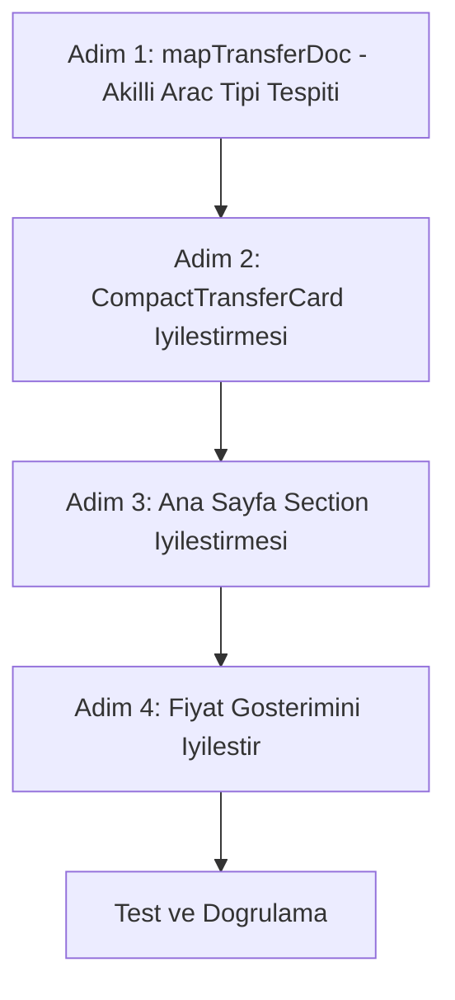

# Transfer Kartları Düzeltme Planı

## Sorun Analizi

Ana sayfadaki "Öne Çıkan Transferler" bölümünde tüm araçların "Sedan" olarak görünmesi sorunu tespit edildi.

### Kök Neden

[`mapTransferDoc`](web-app/src/lib/firebase/domain.ts:124-128) fonksiyonunda geçersiz `vehicleType` değerleri için varsayılan olarak "sedan" atanıyor:

```typescript
const vehicleType: VehicleType = validVehicleTypes.includes(rawVehicle as VehicleType)
  ? (rawVehicle as VehicleType)
  : "sedan";  // ← Hep sedan'a düşüyor
```

Firebase'de `vehicleType` alanı boş veya tanımsız olunca tüm araçlar "Sedan" olarak gösteriliyor.

---

## Mevcut Araç Fiyat Yapısı

[`VEHICLE_PRICING`](web-app/src/lib/transfers/pricing.ts:14-57) ve [`ROUTE_FIXED_PRICES`](web-app/src/lib/transfers/pricing.ts:67-95) verilerine göre en ucuz fiyatlar:

| Araç Tipi | Kapasite | Baz Fiyat | JED-Mekke | JED-Medine | Mekke-Medine |
|-----------|----------|-----------|-----------|-----------|--------------|
| Sedan     | 4 kişi   | 1.425 TL  | 1.425 TL  | 3.325 TL  | 2.375 TL     |
| Van       | 7 kişi   | 1.900 TL  | 1.900 TL  | 3.800 TL  | 2.850 TL     |
| Coster    | 12 kişi  | 2.375 TL  | 2.375 TL  | 4.275 TL  | 3.325 TL     |
| Jeep      | 5 kişi   | 2.000 TL  | ~1.853 TL | ~4.323 TL | ~3.088 TL    |
| VIP       | 4 kişi   | 3.000 TL  | 2.850 TL  | 6.650 TL  | 4.750 TL     |
| Bus       | 50 kişi  | 5.000 TL  | ~3.563 TL | ~6.413 TL | ~4.988 TL    |

---

## Çözüm Planı

### Adım 1: mapTransferDoc Akıllı Araç Tipi Tespiti

**Dosya**: [`web-app/src/lib/firebase/domain.ts`](web-app/src/lib/firebase/domain.ts:100-154)

Kapasiteye ve araç ismine göre akıllı `vehicleType` tahminleme ekle:

```typescript
function inferVehicleType(capacity: number, vehicleName: string): VehicleType {
  const nameLower = vehicleName.toLowerCase();
  
  // İsimden tespit
  if (nameLower.includes('vip') || nameLower.includes('luxury')) return 'vip';
  if (nameLower.includes('jeep') || nameLower.includes('suv')) return 'jeep';
  if (nameLower.includes('bus') || nameLower.includes('otobus')) return 'bus';
  if (nameLower.includes('coster') || nameLower.includes('hiace') || nameLower.includes('coaster')) return 'coster';
  if (nameLower.includes('van') || nameLower.includes('minibus')) return 'van';
  if (nameLower.includes('sedan') || nameLower.includes('camry')) return 'sedan';
  
  // Kapasiteden tespit
  if (capacity <= 4) return 'sedan';
  if (capacity <= 7) return 'van';
  if (capacity <= 15) return 'coster';
  return 'bus';
}
```

### Adım 2: CompactTransferCard İyileştirmesi

**Dosya**: [`web-app/src/components/transfers/CompactTransferCard.tsx`](web-app/src/components/transfers/CompactTransferCard.tsx:47-175)

Yapılacak iyileştirmeler:

1. Araç ismi varsa badge'de onu göster, yoksa tipi göster
2. Kapasite badge'ini daha belirgin yap
3. "Sedan" tekrarını kaldır - tek bir yerde göster
4. "Fiyat" bölümünde en ucuz başlayan fiyatı göster

### Adım 3: Ana Sayfa Transfer Section İyileştirmesi

**Dosya**: [`web-app/src/app/page.tsx`](web-app/src/app/page.tsx:89-162)

1. `topTransfers` hesaplamasını 3'ten 5'e çıkar (grid 5'li)
2. Her araç tipinden birer tane göster (çeşitlilik)
3. En ucuz fiyatlı araçları öne çıkar

### Adım 4: Fiyat Gösterimini İyileştir

**Dosya**: [`web-app/src/components/transfers/CompactTransferCard.tsx`](web-app/src/components/transfers/CompactTransferCard.tsx:150-158)

Her araç kartında en ucuz rotanın fiyatını göster:

```
"1.425 TL'den başlayan fiyatlarla" (sedan için)
"1.900 TL'den başlayan fiyatlarla" (van için)
```

---

## Uygulama Sırası



## Değiştirilecek Dosyalar

1. [`web-app/src/lib/firebase/domain.ts`](web-app/src/lib/firebase/domain.ts) - mapTransferDoc güncelle
2. [`web-app/src/components/transfers/CompactTransferCard.tsx`](web-app/src/components/transfers/CompactTransferCard.tsx) - Kart tasarımı iyileştir
3. [`web-app/src/app/page.tsx`](web-app/src/app/page.tsx) - Ana sayfa grid düzeni
