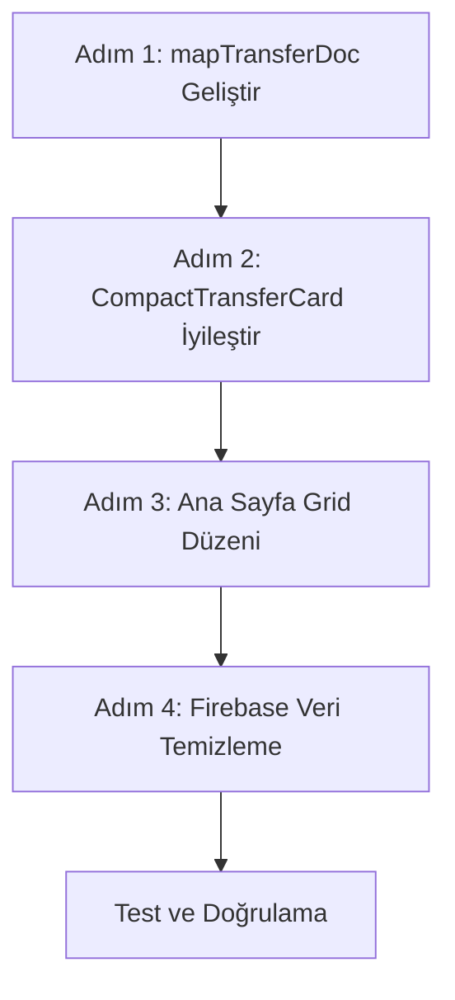

# Transfer Kartları Düzeltme Planı

## Sorun Analizi

Ana sayfadaki "Öne Çıkan Transferler" bölümünde tüm araçların "Sedan" olarak görünmesi sorunu tespit edildi.

### Tespit Edilen Sorunlar

1. **Veri Sorunu (Kök Neden)**: [`mapTransferDoc`](web-app/src/lib/firebase/domain.ts:100-154) fonksiyonunda, geçersiz `vehicleType` değerleri için varsayılan olarak "sedan" atanıyor:
   ```typescript
   const vehicleType: VehicleType = validVehicleTypes.includes(rawVehicle as VehicleType)
     ? (rawVehicle as VehicleType)
     : "sedan";  // ← Varsayılan değer
   ```

2. **Görsel Sorunlar**:
   - Kartlarda araç tipi badge'i tekrarlı görünüyor
   - Araç ismi (`vehicleName`) yerine sadece tip gösteriliyor
   - Görsel hiyerarşi yetersiz

3. **Veri Doğrulama Eksikliği**:
   - Firebase'de gelen verilerin `vehicleType` alanı boş veya geçersiz olabilir
   - Uygun fallback mekanizması yok

## Çözüm Planı

### Adım 1: Veri Doğrulama ve Fallback Mekanizması

**Dosya**: [`web-app/src/lib/firebase/domain.ts`](web-app/src/lib/firebase/domain.ts:100-154)

`mapTransferDoc` fonksiyonunu geliştir:

1. **Araç tipini kapasiteden türet** (eğer `vehicleType` boşsa):
   - 1-4 kişi → "sedan"
   - 5-8 kişi → "van"
   - 9-15 kişi → "coster"
   - 16+ kişi → "bus"

2. **Araç isminden türet** (eğer varsa):
   - `vehicleName` içinde "vip", "luxury" varsa → "vip"
   - "jeep", "suv" varsa → "jeep"

3. **Loglama**: Geçersiz vehicleType değerlerini console'a yaz

### Adım 2: CompactTransferCard Bileşenini İyileştir

**Dosya**: [`web-app/src/components/transfers/CompactTransferCard.tsx`](web-app/src/components/transfers/CompactTransferCard.tsx:47-175)

Görsel iyileştirmeler:

1. **Araç İsmi Öncelikli**: `vehicleName` varsa onu göster, yoksa tipi göster
2. **Badge Hiyerarşisi**:
   - Birincil: Araç ismi (varsa)
   - İkincil: Araç tipi badge'i
3. **Görsel Ayrım**: Farklı araç tipleri için farklı renkler/ikonlar

### Adım 3: Ana Sayfa Grid Düzeni

**Dosya**: [`web-app/src/app/page.tsx`](web-app/src/app/page.tsx:156-162)

Grid düzenini optimize et:
- Mobil: 2 sütun (mevcut)
- Tablet: 3 sütun (mevcut)
- Desktop: 4 sütun (5 yerine)
- Büyük ekran: 5 sütun

### Adım 4: Firebase Veri Temizleme Scripti

Admin panel için veri temizleme fonksiyonu ekle:
- Boş veya geçersiz `vehicleType` alanlarını tespit et
- Kapasiteye göre otomatik düzelt
- Toplu güncelleme imkanı

## Uygulama Sırası



## Beklenen Sonuç

1. Her araç kartında doğru araç tipi görünecek
2. Araç ismi varsa öncelikli gösterilecek
3. Görsel hiyerarşi net olacak
4. Geçersiz veriler için akıllı fallback çalışacak
