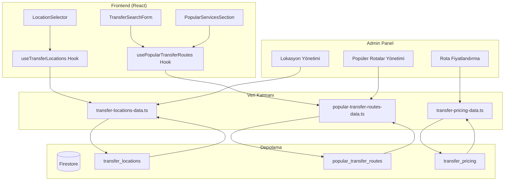
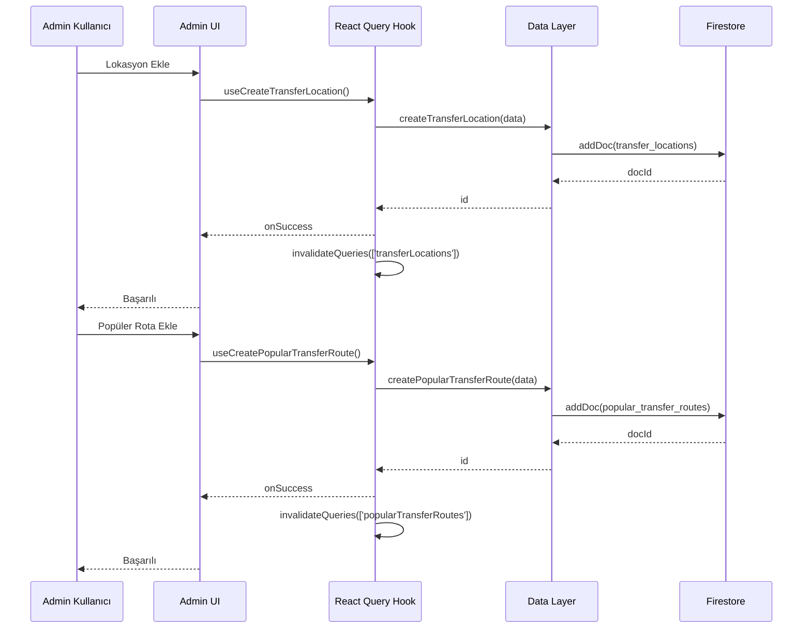
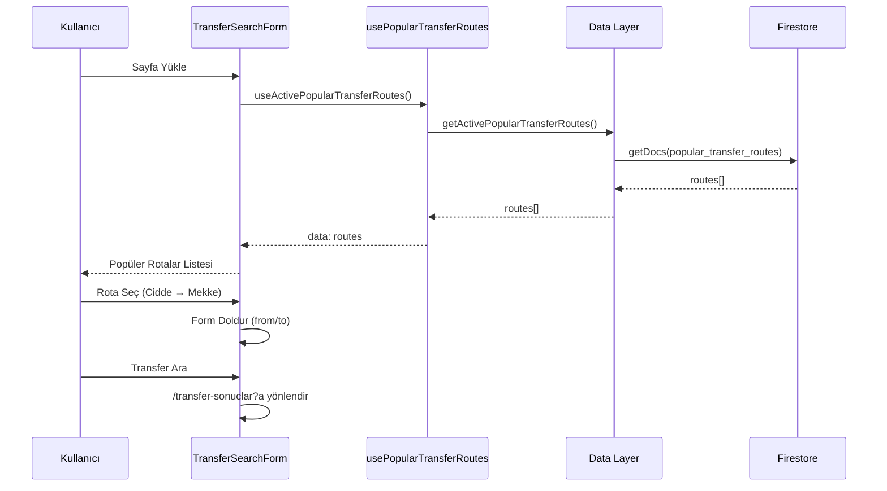
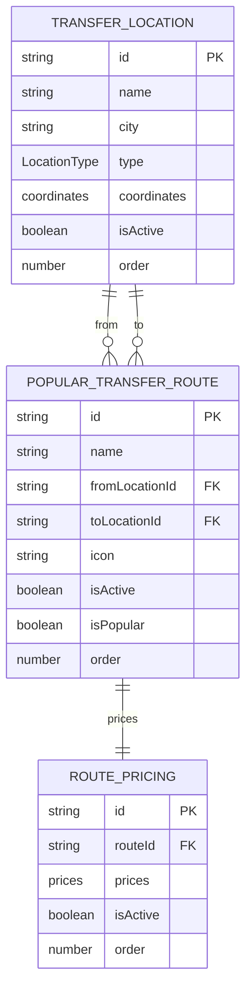
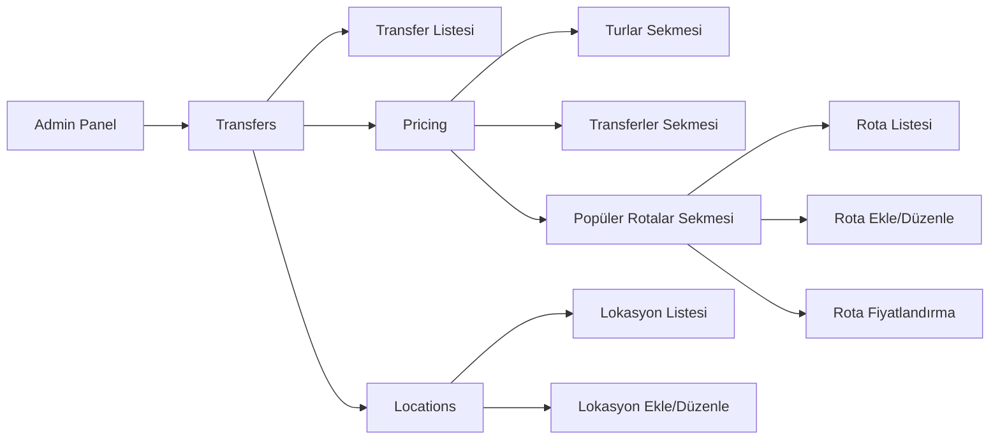
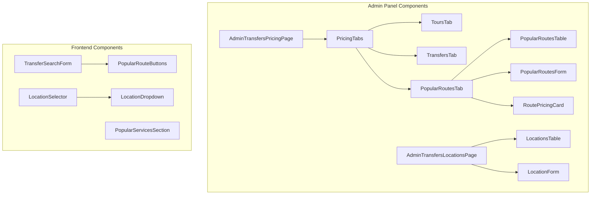
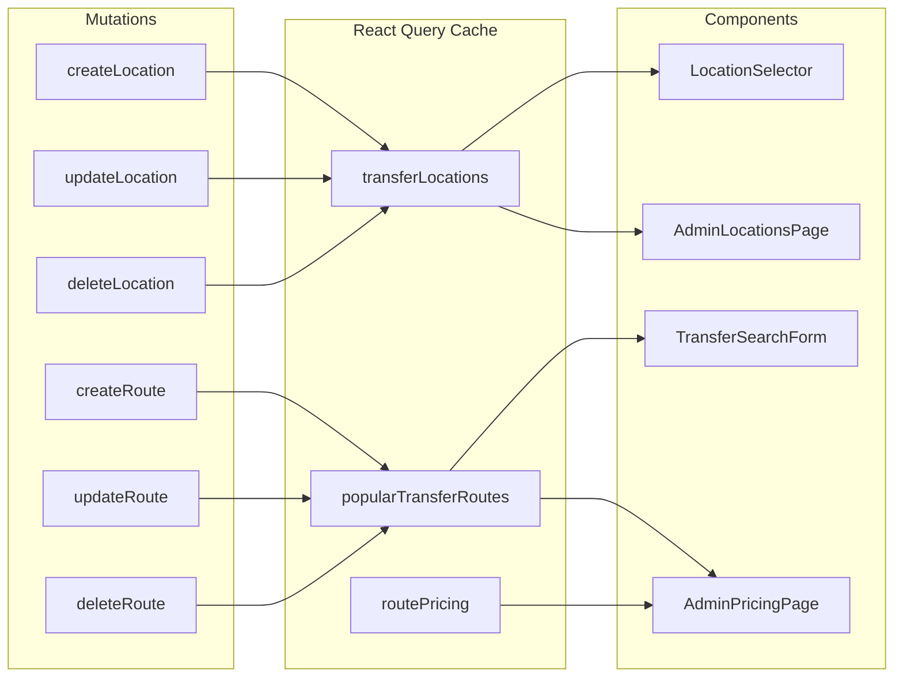
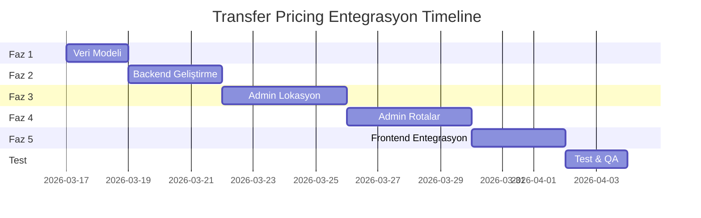

# Transfer Pricing - Mimari Diyagramlar

## Sistem Genel Mimari

## Veri Akışı - Admin Panel

## Veri Akışı - Frontend

## Veri Modeli İlişkileri

## Admin Panel Sayfa Yapısı

## Component Hiyerarşisi

## State Management

## Deployment Stratejisi

