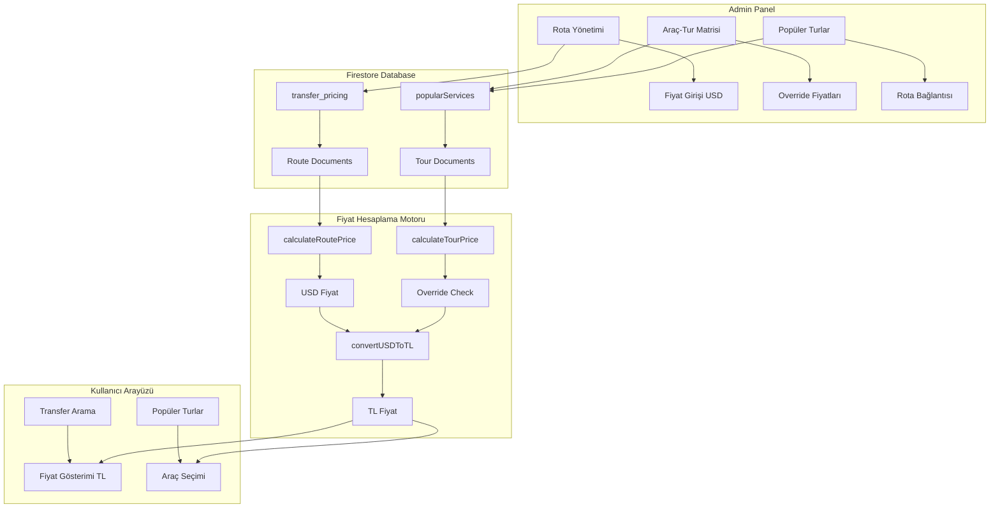
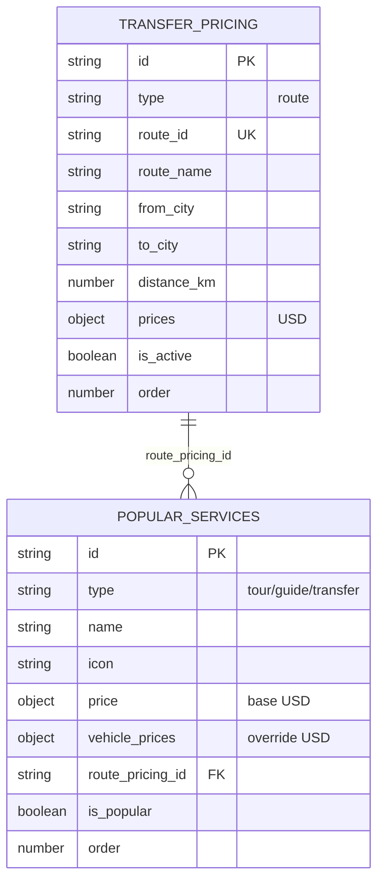
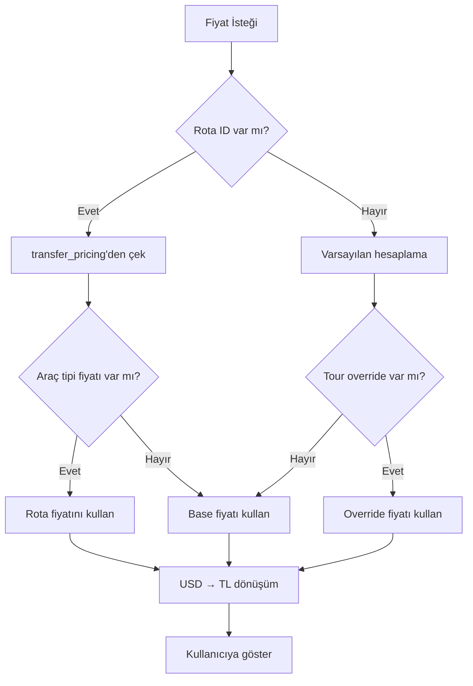
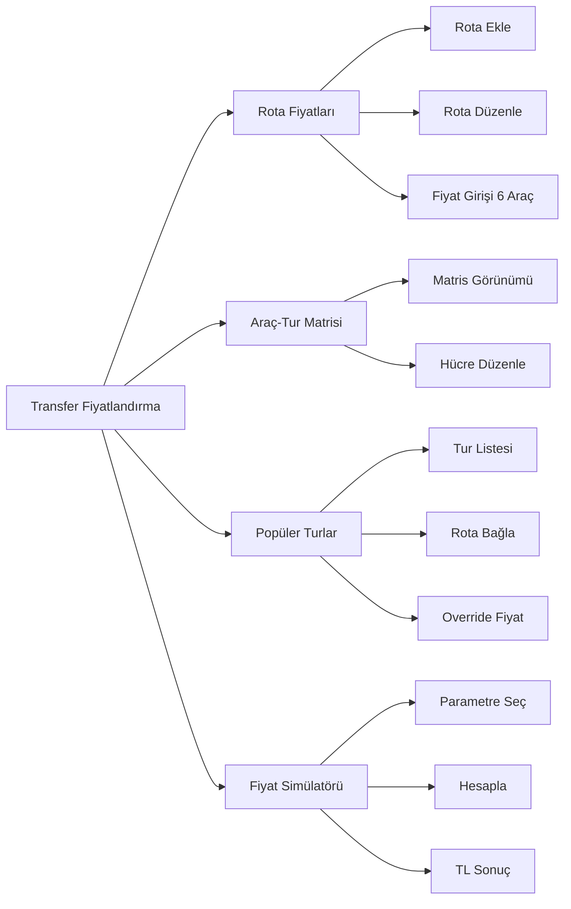
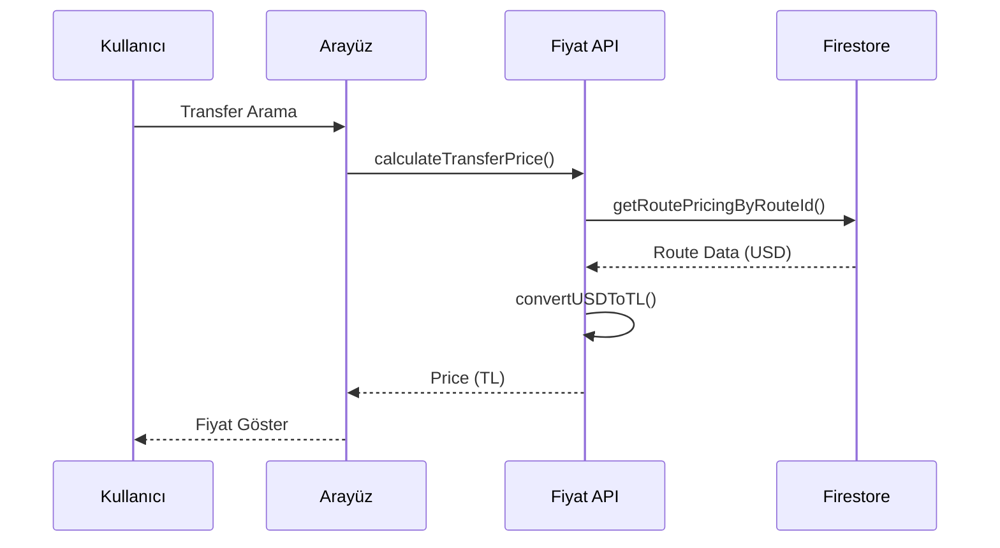

# Transfer Fiyatlandırma Sistemi - Mimari Diyagram

## Sistem Akış Diyagramı



## Veri Modeli İlişkileri



## Fiyat Hesaplama Mantığı



## Admin Panel Tab Yapısı



## Bileşen Hiyerarşisi

```
/admin/transfers/pricing/page.tsx
├── tabs/RoutePricingTab.tsx
│   ├── components/RoutePricingForm.tsx
│   ├── components/RoutePricingTable.tsx
│   └── components/VehiclePriceInputs.tsx
├── tabs/VehicleTourMatrixTab.tsx
│   └── components/PriceEditModal.tsx
├── tabs/PopularToursPricingTab.tsx
│   └── components/TourEditModal.tsx
└── tabs/PriceSimulatorTab.tsx
```

## API Fonksiyonları

### Firebase CRUD

```typescript
// Rota Fiyatları
createRoutePricing(data, updatedBy) -> Promise<string>
updateRoutePricing(id, data) -> Promise<void>
deleteRoutePricing(id) -> Promise<void>
getRoutePricingByRouteId(routeId) -> Promise<RoutePricingModel | null>
getAllRoutePricing() -> Promise<RoutePricingModel[]>

// Popüler Servisler
updatePopularService(id, data) -> Promise<void>
getAllPopularServices(filters?) -> Promise<PopularServiceModel[]>
```

### Fiyat Hesaplama

```typescript
// Ana hesaplama
calculateTransferPrice(input) -> PriceCalculationResult
calculateRoutePrice(routeId, vehicleType) -> number
calculateTourPrice(tourId, vehicleType) -> number

// Dönüşüm
convertUSDToTL(usdAmount) -> number
formatPrice(amount, currency) -> string

// Yardımcı
getRouteFixedPrice(routeId, vehicleType) -> number | null
isVehicleSuitable(vehicleType, passengerCount) -> boolean
```

## Kullanıcı Tarafı Entegrasyon



## Veri Akışı

1. **Admin Panel**
   - Admin rota ekler → `transfer_pricing` koleksiyonuna kaydet
   - Admin araç fiyatı girer → `prices` objesine USD olarak kaydet
   - Admin popüler tur ekler → `route_pricing_id` ile bağla

2. **Fiyat Hesaplama**
   - Kullanıcı transfer arar → `routeId` ile fiyat çek
   - Rota fiyatı yoksa → varsayılan hesaplama
   - Override varsa → override fiyatı kullan
   - USD → TL dönüşüm → kullanıcıya göster

3. **Popüler Turlar**
   - Tur listesi yüklenir → `route_pricing_id` kontrol et
   - Bağlantı varsa → rota fiyatlarını çek
   - Override varsa → override kullan
   - TL dönüşüm → göster
