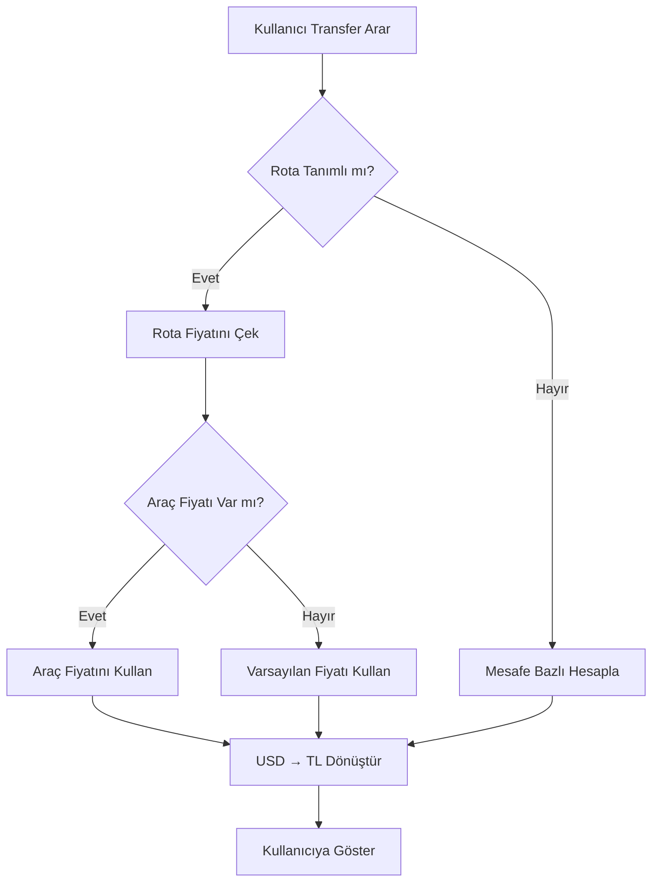

# Transfer Fiyatlandırma Sistemi Yeniden Tasarım Planı

## Genel Bakış

Transfer hizmetleri için admin panelde fiyat yönetimi sistemi. "Nereden Nereye" rotaları için araç bazlı fiyatlar belirlenecek ve popüler turlar bu fiyatları otomatik kullanacak.

## Sistem Gereksinimleri

1. **Fiyat Birimi**: USD olarak saklanacak, kullanıcı tarafında TL'ye çevrilecek
2. **Rota Yönetimi**: Admin panelde nereden-nereye rotaları tanımlanabilecek
3. **Araç Bazlı Fiyatlandırma**: Her rota için 6 araç tipi (sedan, van, coster, bus, vip, jeep) fiyatı
4. **Popüler Turlar Entegrasyonu**: Popüler turlar rota fiyatlarını otomatik çekecek

## Veri Yapısı

### Firestore Koleksiyonları

#### 1. `transfer_pricing` (Mevcut - Güncellenecek)

```typescript
// Rota bazlı fiyatlandırma
{
  id: string,
  type: "route",
  routeId: string,           // "jeddah-airport-mecca"
  routeName: string,         // "Jeddah Havalimanı → Mekke"
  fromCity: string,          // "Jeddah Havalimanı"
  toCity: string,            // "Mekke"
  fromLocationId?: string,   // transfer_locations referansı
  toLocationId?: string,     // transfer_locations referansı
  distanceKm: number,
  prices: {
    sedan: number,           // USD
    van: number,             // USD
    coster: number,          // USD
    bus: number,             // USD (opsiyonel)
    vip: number,             // USD (opsiyonel)
    jeep: number,            // USD (opsiyonel)
  },
  isActive: boolean,
  order: number,
  updatedAt: Date,
  updatedBy: string
}
```

#### 2. `popularServices` (Mevcut - Kullanılacak)

```typescript
{
  // ... mevcut alanlar ...
  vehiclePrices?: {
    sedan?: number,          // USD - Opsiyonel, rota fiyatından override
    van?: number,
    bus?: number,
    vip?: number,
    jeep?: number,
    coster?: number,
  },
  routePricingId?: string    // transfer_pricing referansı (otomatik fiyat için)
}
```

## Admin Panel Yapısı

### `/admin/transfers/pricing` Sayfası

#### Tab 1: Rota Fiyatları
- Tüm rotaları listeleyen tablo
- Rota ekleme formu (nereden-nereye seçimi)
- Her rota için 6 araç tipi fiyatı girişi
- Düzenleme ve silme işlemleri

#### Tab 2: Araç-Tur Matrisi
- Mevcut `VehicleTourMatrixTab` güncellenecek
- USD fiyatları ile çalışacak
- Popüler turlar için araç bazlı fiyatlar

#### Tab 3: Popüler Turlar
- Mevcut `PopularToursPricingTab` güncellenecek
- Rota fiyatlarından otomatik çekme
- Manuel override desteği

#### Tab 4: Fiyat Simülatörü
- Mevcut simülatör güncellenecek
- TL dönüşümü ile gösterim

## Bileşen Yapısı

```
/admin/transfers/pricing/
├── page.tsx                    (Ana sayfa - güncellenecek)
├── tabs/
│   ├── RoutePricingTab.tsx     (YENİ - Rota fiyatları yönetimi)
│   ├── VehicleTourMatrixTab.tsx (Güncellenecek)
│   ├── PopularToursPricingTab.tsx (Güncellenecek)
│   └── PriceSimulatorTab.tsx   (Güncellenecek)
└── components/
    ├── RoutePricingForm.tsx    (YENİ - Rota ekleme/düzenleme)
    ├── RoutePricingTable.tsx   (YENİ - Rota listesi)
    └── VehiclePriceInput.tsx   (YENİ - Araç fiyatı girişi)
```

## Firebase Fonksiyonları

### Yeni Fonksiyonlar

```typescript
// Rota fiyatları CRUD
createRoutePricing(data: RoutePricingInput, updatedBy: string): Promise<string>
updateRoutePricing(id: string, data: Partial<RoutePricingModel>): Promise<void>
deleteRoutePricing(id: string): Promise<void>
getRoutePricingByRouteId(routeId: string): Promise<RoutePricingModel | null>
getActiveRoutePricing(): Promise<RoutePricingModel[]>

// Fiyat hesaplama
calculateRoutePrice(routeId: string, vehicleType: VehicleType): number
calculateTourPrice(tourId: string, vehicleType: VehicleType): number
```

### Güncellenecek Fonksiyonlar

```typescript
// Mevcut fonksiyonlar güncellenecek
getAllRoutePricing(): Promise<RoutePricingModel[]>
getRoutePricingById(id: string): Promise<RoutePricingModel | null>
```

## Fiyat Hesaplama Akışı



## USD → TL Dönüşüm

```typescript
// Döviz kuru (admin panelinden veya API'den)
const USD_TO_TL_RATE = 32.50; // Örnek

function convertUSDToTL(usdAmount: number): number {
  return Math.round(usdAmount * USD_TO_TL_RATE);
}

function formatPrice(amount: number, currency: 'USD' | 'TL'): string {
  if (currency === 'USD') {
    return `$${amount.toFixed(0)}`;
  }
  return `${amount.toLocaleString('tr-TR')} ₺`;
}
```

## Popüler Turlar Entegrasyonu

Popüler tur eklendiğinde:
1. `routePricingId` alanı ile rota fiyatına bağla
2. `vehiclePrices` alanı boş bırakılırsa → rota fiyatlarını kullan
3. `vehiclePrices` alanı doldurulursa → override et

```typescript
// Fiyat çekme mantığı
function getTourVehiclePrice(tour: PopularServiceModel, vehicleType: VehicleType): number {
  // Önce override kontrol et
  if (tour.vehiclePrices?.[vehicleType]) {
    return tour.vehiclePrices[vehicleType];
  }

  // Rota fiyatından çek
  if (tour.routePricingId) {
    const routePricing = await getRoutePricingByRouteId(tour.routePricingId);
    if (routePricing?.prices[vehicleType]) {
      return routePricing.prices[vehicleType];
    }
  }

  // Varsayılan fiyat
  return tour.price.baseAmount;
}
```

## UI/UX Tasarımı

### Rota Fiyatları Tablosu

| Rota | Mesafe | Sedan | Van | Coster | Bus | VIP | Jeep | İşlem |
|------|--------|-------|-----|--------|-----|-----|------|-------|
| JED → Mekke | 80 km | $40 | $53 | $67 | - | - | - | Düzenle |
| JED → Medine | 350 km | $67 | $80 | $93 | - | - | - | Düzenle |

### Araç-Tur Matrisi

| Tur / Araç | Sedan | Van | Coster | Bus | VIP | Jeep |
|------------|-------|-----|--------|-----|-----|------|
| Mekke Şehir Turu | $50 | $67 | $80 | - | - | - |
| Ziyaret Turu | $40 | $53 | $67 | - | - | - |

## Uygulama Sırası

1. **Faz 1: Type Güncellemeleri**
   - `RoutePricingModel` güncelle
   - `PopularServiceModel` kontrol et

2. **Faz 2: Firebase Fonksiyonları**
   - CRUD fonksiyonlarını ekle/güncelle
   - Fiyat hesaplama mantığını güncelle

3. **Faz 3: Admin Panel Bileşenleri**
   - `RoutePricingTab` oluştur
   - Form ve tablo bileşenlerini oluştur
   - Mevcut tab'ları güncelle

4. **Faz 4: Kullanıcı Tarafı**
   - Fiyat hesaplama fonksiyonlarını güncelle
   - Bileşenleri yeni fiyatları kullanacak şekilde güncelle

5. **Faz 5: Test**
   - Admin panel testleri
   - Fiyat hesaplama testleri
   - TL dönüşüm testleri
