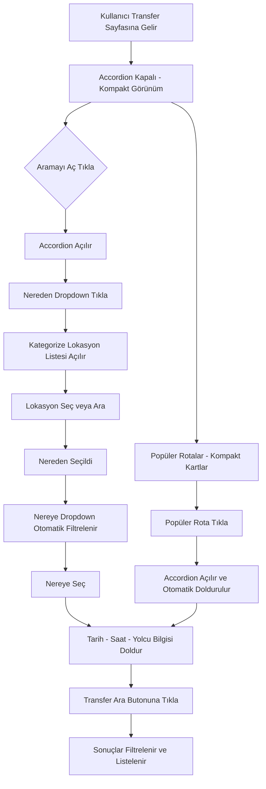

# Transfer Sayfası - Açılabilir Arama Bölümü ve Lokasyon Seçici Planı

## Özet
Transfer sayfasında "Nereden" ve "Nereye" alanları için kategorize edilmiş lokasyon dropdown'ları oluşturulacak ve arama formu accordion yapısına dönüştürülecek. Popüler rotalar bölümü daha kompakt hale getirilecek.

---

## Mevcut Durum

- `TransferSearchForm` bileşeni her zaman açık kalıyor, sayfada çok yer kaplıyor
- "Nereden" ve "Nereye" alanları serbest text input - kullanıcı ne yazacağını bilmiyor
- Popüler rotalar kartları büyük ve fazla yer kaplıyor
- Mevcut `popular-routes.ts` dosyasında sadece 6 rota var

---

## Planlanan Değişiklikler

### 1. Statik Lokasyon Veri Yapısı

Yeni dosya: `web-app/src/lib/transfers/transfer-locations.ts`

Kategorize edilmiş lokasyonlar:

#### TRANSFERLER

**Mekke Çıkışlı:**
- Mekke -> Cidde Airport
- Mekke -> Medine
- Mekke -> Taif Bölgesel Havaalanı
- Mekke -> Mekke Tren İstasyonu

**Mekke Varışlı:**
- Cidde Airport -> Mekke
- Medine -> Mekke
- Taif Bölgesel Havaalanı -> Mekke
- Mekke Tren İstasyonu -> Mekke

**Medine Çıkışlı:**
- Medine -> Mekke
- Medine -> Medine Havalimanı
- Medine -> Medine Tren İstasyonu
- Medine -> Cidde Airport

**Medine Varışlı:**
- Medine Havalimanı -> Medine
- Medine Tren İstasyonu -> Medine
- Cidde Airport -> Medine

#### TUR ve ZİYARETLER

**Mekke Çıkışlı:**
- Mekke -> Bedir -> Medine (Tur)
- Mekke -> Mekke (Çevre Ziyareti Turu)
- Mekke -> Taif (Tur)
- Mekke -> Cidde (Tur)
- Mekke -> Hudeybiye (Umre Ziyareti)
- Mekke -> Cirane (Umre Ziyareti)
- Mekke -> Aişe Tenim (Umre Ziyareti)
- Mekke -> Cebeli Nur (Ziyaret)
- Mekke -> Medine (MEKKE ve MEDİNE Tam Paket)

**Medine Çıkışlı:**
- Medine -> Medine (Çevre Ziyareti Turu)

### Veri Yapısı Tasarımı

```typescript
interface TransferLocation {
  id: string;
  name: string;             // Görünen isim
  city: string;             // Ana şehir
  type: 'airport' | 'train_station' | 'city' | 'religious_site' | 'tour_destination';
  coordinates?: { lat: number; lng: number };
}

interface TransferRoute {
  id: string;
  from: TransferLocation;
  to: TransferLocation;
  via?: TransferLocation[];  // Ara duraklar - Bedir gibi
  category: 'transfer' | 'tour';
  subCategory: 'mecca_departure' | 'mecca_arrival' | 'medina_departure' | 'medina_arrival';
  tag?: string;              // Tur, Umre Ziyareti, Ziyaret, Tam Paket gibi
  distance?: { km: number; text: string };
  duration?: { minutes: number; text: string };
  icon: string;
}
```

---

### 2. LocationSelector Bileşeni

Yeni dosya: `web-app/src/components/transfers/LocationSelector.tsx`

Özellikleri:
- Tıklandığında açılan bir dropdown
- Arama/filtre kutusu ile lokasyon filtreleme
- Kategori başlıkları ile gruplandırılmış lokasyonlar
- Her lokasyonda tip ikonu (havaalanı, tren, şehir, cami vb.)
- Seçilen lokasyonun görüntülenmesi

```
Tasarım Akışı:
┌────────────────────────────────┐
│ 📍 Nereden                     │
│ [Mekke - Harem / Oteller    ▼]│
├────────────────────────────────┤
│ 🔍 Lokasyon ara...             │
├────────────────────────────────┤
│ ✈️ Havalimanları               │
│   Cidde Havalimanı (JED)       │
│   Medine Havalimanı            │
│   Taif Bölgesel Havaalanı      │
├────────────────────────────────┤
│ 🕌 Şehirler                    │
│   Mekke                        │
│   Medine                       │
│   Cidde                        │
│   Taif                         │
├────────────────────────────────┤
│ 🚉 Tren İstasyonları           │
│   Mekke Tren İstasyonu         │
│   Medine Tren İstasyonu        │
├────────────────────────────────┤
│ 🕋 Dini Mekanlar               │
│   Hudeybiye                    │
│   Cirane                       │
│   Aişe Tenim                   │
│   Cebeli Nur                   │
│   Bedir                        │
└────────────────────────────────┘
```

---

### 3. Accordion Arama Formu

Mevcut `TransferSearchForm` bileşeni yeniden tasarlanacak:

```
Tasarım Akışı - Kapalı Durum:
┌─────────────────────────────────────────────┐
│ 🚗 Transfer Ara           [Aramayı Aç ▼]   │
│ Nereden ve nereye gideceğinizi seçin        │
└─────────────────────────────────────────────┘

Tasarım Akışı - Açık Durum:
┌─────────────────────────────────────────────┐
│ 🚗 Transfer Ara           [Aramayı Kapat ▲] │
├─────────────────────────────────────────────┤
│                                             │
│ ┌─────────────────┐ ┌─────────────────┐     │
│ │📍 Nereden       │ │📍 Nereye        │     │
│ │[Dropdown      ▼]│ │[Dropdown      ▼]│     │
│ └─────────────────┘ └─────────────────┘     │
│                                             │
│ ┌──────────┐ ┌──────────┐ ┌──────────┐     │
│ │📅 Tarih  │ │🕐 Saat   │ │👥 Yolcu  │     │
│ │[Input   ]│ │[Input   ]│ │[Select  ]│     │
│ └──────────┘ └──────────┘ └──────────┘     │
│                                             │
│ Araç Tipi: [Tümü] [Sedan] [Van] [VIP] ...  │
│                                             │
│ 💰 Tahmini Fiyat: 150-300 TL               │
│                                             │
│ [━━━━━━━ 🚗 Transfer Ara ━━━━━━━]          │
│                                             │
└─────────────────────────────────────────────┘
```

Önemli: "Nereden" seçildikten sonra "Nereye" dropdown'ı otomatik olarak uyumlu lokasyonları gösterecek. Örneğin Mekke seçildiğinde Mekke çıkışlı rotaların varış noktaları listelenecek.

---

### 4. Popüler Rotalar Kompakt Tasarım

Mevcut kartlar küçültülecek:

```
Değişiklikler:
- Kart padding: p-5 -> p-3
- İkon boyutu: text-2xl -> text-lg
- Grid: sm:grid-cols-2 lg:grid-cols-3 -> grid-cols-2 sm:grid-cols-3 lg:grid-cols-4
- Font boyutları küçültülecek
- h2 başlık: text-2xl -> text-lg
- Açıklama metni: kaldırılacak veya küçültülecek
```

---

## Dosya Değişiklikleri

### Yeni Dosyalar
1. `web-app/src/lib/transfers/transfer-locations.ts` - Tüm lokasyonlar ve rotalar
2. `web-app/src/components/transfers/LocationSelector.tsx` - Lokasyon seçim dropdown'ı

### Güncellenen Dosyalar
3. `web-app/src/components/transfers/TransferSearchForm.tsx` - Accordion + LocationSelector entegrasyonu
4. `web-app/src/app/transfers/page.tsx` - Popüler rotalar kompakt, genel düzen ayarları

---

## Akış Diyagramı


