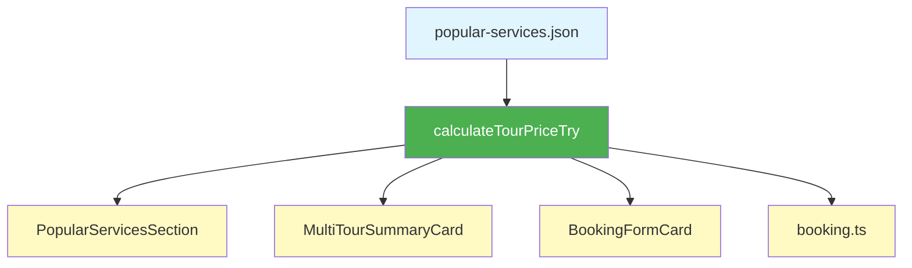

# Transfer Tur Fiyat Tutarlılığı Düzeltme Planı

## 🔍 Sorun Analizi

Kullanıcı, transfer rezervasyon sayfasında tur fiyatlarının farklı yerlerde **farklı** gösterildiğini ve bu fiyatların **tek bir kaynaktan** beslenmesi gerektiğini belirtti.

### Tespit Edilen Sorunlar

#### 1. **Fiyat Gösterim Tutarsızlıkları**

**Popüler Turlar Bölümünde (transfers/page.tsx):**
- Gösterilen: `₺2.500 / 250 SAR` 
- Kaynak: `popular-services.json` → `vehiclePrices.sedan = 250 SAR`
- Dönüşüm: `250 SAR × 10 TL = 2.500 TL` ✅

**Rezervasyon Sayfasında - MultiTourSummaryCard:**
- Gösterilen: `₺250 / $7` 
- Kaynak: `tour.price.baseAmount` (250)
- Sorun: **SAR olarak kaydedilmiş değer, direkt TL gibi gösteriliyor** ❌

**Rezervasyon Sayfasında - BookingFormCard:**
- Transfer: `₺1.600 / $42`
- Tur: `₺2.500 / $66` 
- Kaynak: `calculateBookingPrice()` fonksiyonu
- Sorun: Tur fiyatı doğru dönüştürülüyor ama gösterim farklı yerlerde farklı ❌

#### 2. **Veri Akışı Sorunları**

```
popular-services.json (250 SAR)
    ↓
PopularServicesSection → formatSarAsTry(250) → ₺2.500 ✅
    ↓
MultiTourSummaryCard → formatTlUsdPairFromTl(250) → ₺250 / $7 ❌ HATALI
    ↓
BookingFormCard → sarToTry(250) → ₺2.500 ✅
```

**Asıl Problem:** [`MultiTourSummaryCard.tsx`](web-app/src/components/transfers/booking/MultiTourSummaryCard.tsx:169-172) içinde:
- Satır 169: `tourPrice = tour.price.baseAmount * passengerCount` 
- Satır 171: `tourPrice = tour.price.baseAmount`
- **SAR değeri direkt kullanılıyor, TL'ye çevrilmiyor!**

#### 3. **Dönüşüm Mantığı Tutarsızlıkları**

**Doğru Yaklaşım (BookingFormCard):**
```typescript
// booking.ts:66-78
const baseTourPriceSar = tour.vehiclePrices?.[vehicleType] ?? tour.price.baseAmount;
const baseTourPriceTry = sarToTry(baseTourPriceSar); // SAR → TL
```

**Yanlış Yaklaşım (MultiTourSummaryCard):**
```typescript
// MultiTourSummaryCard.tsx:168-172
const tourPrice = tour.price.type === "per_person"
  ? tour.price.baseAmount * passengerCount  // SAR değeri direkt kullanılıyor!
  : tour.price.baseAmount;
```

---

## 🎯 Çözüm Planı

### Adım 1: Tek Fiyat Hesaplama Utility Fonksiyonu

**Dosya:** `web-app/src/lib/transfers/tour-pricing.ts` (YENİ)

```typescript
import { sarToTry } from "@/lib/currency";
import type { PopularServiceModel } from "@/types/popular-service";
import type { VehicleType } from "@/types/transfer";

/**
 * Tur için fiyat hesaplar (TL cinsinden)
 * 
 * @param tour - Popüler tur servisi
 * @param vehicleType - Araç tipi (sedan, van, vip vb.)
 * @param passengerCount - Yolcu sayısı
 * @returns TL cinsinden fiyat
 */
export function calculateTourPriceTry(
  tour: PopularServiceModel,
  vehicleType?: VehicleType,
  passengerCount: number = 1
): number {
  // 1. Araç tipine özel fiyat var mı kontrol et
  let basePriceSar = tour.price.baseAmount; // Varsayılan SAR fiyatı

  if (vehicleType && tour.vehiclePrices) {
    const vehiclePrice = tour.vehiclePrices[vehicleType];
    if (vehiclePrice && vehiclePrice > 0) {
      basePriceSar = vehiclePrice;
    }
  }

  // 2. SAR'ı TL'ye çevir
  const basePriceTry = sarToTry(basePriceSar);

  // 3. Fiyat tipine göre hesapla
  if (tour.price.type === "per_person") {
    return basePriceTry * passengerCount;
  }

  return basePriceTry;
}

/**
 * Minimum tur fiyatını hesaplar (en ucuz araç tipi)
 * 
 * @param tour - Popüler tur servisi
 * @returns SAR cinsinden minimum fiyat
 */
export function getMinTourPriceSar(tour: PopularServiceModel): number {
  if (tour.vehiclePrices) {
    const prices = Object.values(tour.vehiclePrices).filter(p => p != null && p > 0);
    if (prices.length > 0) {
      return Math.min(...prices);
    }
  }
  return tour.price.baseAmount;
}

/**
 * Minimum tur fiyatını TL olarak hesaplar
 */
export function getMinTourPriceTry(tour: PopularServiceModel): number {
  const minSar = getMinTourPriceSar(tour);
  return sarToTry(minSar);
}
```

---

### Adım 2: MultiTourSummaryCard Düzeltmesi

**Dosya:** [`web-app/src/components/transfers/booking/MultiTourSummaryCard.tsx`](web-app/src/components/transfers/booking/MultiTourSummaryCard.tsx)

**Değişiklik:** Satır 1-50 arası

```typescript
import { calculateTourPriceTry } from "@/lib/transfers/tour-pricing"; // YENİ IMPORT

// Satır 42-50 DEĞİŞTİR:
const totalTourPrice = useMemo(() => {
  return tours.reduce((sum, tour) => {
    // ✅ YENİ: Tek merkezi fonksiyon kullan
    const tourPriceTry = calculateTourPriceTry(tour, undefined, passengerCount);
    return sum + tourPriceTry;
  }, 0);
}, [tours, passengerCount]);
```

**Değişiklik:** Satır 160-173 arası (TourItem component)

```typescript
// Satır 167-172 DEĞİŞTİR:
const tourPrice = useMemo(() => {
  // ✅ YENİ: Tek merkezi fonksiyon kullan
  return calculateTourPriceTry(tour, undefined, passengerCount);
}, [tour, passengerCount]);
```

---

### Adım 3: BookingFormCard Refactor

**Dosya:** [`web-app/src/components/transfers/booking/BookingFormCard.tsx`](web-app/src/components/transfers/booking/BookingFormCard.tsx)

**Değişiklik:** Satır 165-205 arası

```typescript
import { calculateTourPriceTry } from "@/lib/transfers/tour-pricing"; // YENİ IMPORT

// Satır 166-206 DEĞİŞTİR:
const priceResult = useMemo(() => {
  // Ana tur ile temel fiyat hesapla
  const baseResult = calculateBookingPrice({
    transfer,
    tour,
    dateTime,
    passengers,
    luggageCount,
    childSeatNeeded,
    couponCode: couponCode.trim() || undefined,
  });

  // ✅ YENİ: Ek turların fiyatlarını merkezi fonksiyonla hesapla
  if (extraTours.length > 0) {
    let extraTourTotal = 0;
    for (const extraTour of extraTours) {
      const extraTourPrice = calculateTourPriceTry(
        extraTour, 
        transfer.vehicleType, 
        getTotalPassengers(passengers)
      );
      extraTourTotal += extraTourPrice;
    }

    // Ek tur fiyatlarını mevcut sonuca ekle
    baseResult.price.tourPrice += extraTourTotal;
    baseResult.price.subtotal += extraTourTotal;
    baseResult.price.total += extraTourTotal;

    // Breakdown'a ek turları ekle
    for (const extraTour of extraTours) {
      const price = calculateTourPriceTry(
        extraTour, 
        transfer.vehicleType, 
        getTotalPassengers(passengers)
      );
      baseResult.price.breakdown.push(
        `Ek tur (${extraTour.name}): ${formatTlUsdPairFromTl(price)}`
      );
    }
  }

  return baseResult;
}, [transfer, tour, extraTours, dateTime, passengers, luggageCount, childSeatNeeded, couponCode]);
```

---

### Adım 4: booking.ts Refactor

**Dosya:** [`web-app/src/lib/transfers/booking.ts`](web-app/src/lib/transfers/booking.ts)

**Değişiklik:** Satır 58-87 arası

```typescript
import { calculateTourPriceTry } from "./tour-pricing"; // YENİ IMPORT

// Satır 58-87 DEĞİŞTİR:
// ────────── Tur Fiyatı ──────────

let tourPrice = 0;
let tourPricePerPerson = 0;

if (tour) {
  // ✅ YENİ: Merkezi fiyat hesaplama fonksiyonu kullan
  const totalPassengers = getTotalPassengers(passengers);
  tourPrice = calculateTourPriceTry(tour, transfer.vehicleType, totalPassengers);
  
  // Kişi başı fiyat hesapla
  if (tour.price.type === "per_person") {
    tourPricePerPerson = tourPrice / totalPassengers;
  } else {
    tourPricePerPerson = tourPrice / totalPassengers;
  }
}
```

---

### Adım 5: PopularServicesSection Güncellemesi

**Dosya:** [`web-app/src/components/transfers/PopularServicesSection.tsx`](web-app/src/components/transfers/PopularServicesSection.tsx)

**Değişiklik:** Satır 50-53 ve 316

```typescript
import { getMinTourPriceSar, getMinTourPriceTry } from "@/lib/transfers/tour-pricing"; // YENİ IMPORT

// Satır 50-53 DEĞİŞTİR:
const getMinSarPrice = useCallback((service: PopularServiceModel): number => {
  // ✅ YENİ: Merkezi fonksiyon kullan
  return getMinTourPriceSar(service);
}, []);

// Satır 316 DEĞİŞTİR:
const priceTl = formatSarAsTry(minSarPrice); // Aynı kalıyor, zaten doğru
```

---

### Adım 6: PriceSummaryCard Doğrulama

**Dosya:** [`web-app/src/components/transfers/booking/PriceSummaryCard.tsx`](web-app/src/components/transfers/booking/PriceSummaryCard.tsx)

✅ **Değişiklik Gerekmiyor** - Bu component zaten `PriceBreakdown` tipini kullanıyor ve fiyatlar TL olarak geliyor.

---

## 📋 Değişiklik Özeti

### Yeni Dosyalar
1. ✨ `web-app/src/lib/transfers/tour-pricing.ts` - Merkezi tur fiyat hesaplama

### Güncellenecek Dosyalar
1. 🔧 [`MultiTourSummaryCard.tsx`](web-app/src/components/transfers/booking/MultiTourSummaryCard.tsx:42-50) - Fiyat hesaplama düzeltmesi
2. 🔧 [`BookingFormCard.tsx`](web-app/src/components/transfers/booking/BookingFormCard.tsx:166-206) - Ek tur fiyat hesaplama
3. 🔧 [`booking.ts`](web-app/src/lib/transfers/booking.ts:58-87) - Ana tur fiyat hesaplama
4. 🔧 [`PopularServicesSection.tsx`](web-app/src/components/transfers/PopularServicesSection.tsx:50-53) - Minimum fiyat hesaplama

### Değişmeyecek Dosyalar
- ✅ [`PriceSummaryCard.tsx`](web-app/src/components/transfers/booking/PriceSummaryCard.tsx) - Zaten doğru
- ✅ [`currency.ts`](web-app/src/lib/currency.ts) - Dönüşüm fonksiyonları doğru
- ✅ [`popular-services.json`](web-app/src/data/popular-services.json) - Veri yapısı doğru

---

## 🎨 Beklenen Sonuç

### Önce (Hatalı)
```
Popüler Turlar: ₺2.500 / 250 SAR ✅
    ↓
Araç Seçimi: ₺2.500 / 250 SAR ✅
    ↓
Rezervasyon: ₺250 / $7 ❌ YANLIŞ
    ↓
Fiyat Özeti: ₺4.100 (Transfer + Tur) ✅ AMA YANLIŞ HESAP
```

### Sonra (Doğru)
```
Popüler Turlar: ₺2.500 / 250 SAR ✅
    ↓
Araç Seçimi: ₺2.500 / 250 SAR ✅
    ↓
Rezervasyon: ₺2.500 / $66 ✅ DOĞRU
    ↓
Fiyat Özeti: ₺4.100 (Transfer + Tur) ✅ DOĞRU HESAP
```

---

## 🔄 Tek Veri Kaynağı Prensibi



**Avantajlar:**
1. ✅ Tek merkezi fonksiyon - [`calculateTourPriceTry()`](web-app/src/lib/transfers/tour-pricing.ts)
2. ✅ Tüm fiyatlar SAR'dan TL'ye doğru çevriliyor
3. ✅ Araç tipi fiyatlandırması merkezi yönetiliyor
4. ✅ Kişi başı / sabit fiyat mantığı tek yerde
5. ✅ Test edilebilir ve bakımı kolay

---

## ⚠️ Dikkat Edilecek Noktalar

1. **SAR ↔ TL Dönüşümü:** Her zaman [`sarToTry()`](web-app/src/lib/currency.ts:67-71) kullan
2. **Araç Tipi:** [`calculateTourPriceTry()`](web-app/src/lib/transfers/tour-pricing.ts) araç tipini parametre alıyor
3. **Yolcu Sayısı:** `per_person` tipindeki turlarda çarpan olarak kullanılıyor
4. **Minimum Fiyat:** Kart gösterimlerinde en ucuz araç tipi fiyatı gösteriliyor

---

## 🧪 Test Senaryoları

### Test 1: Mekke Şehir Turu (Sedan)
```typescript
const tour = { 
  price: { baseAmount: 250, type: "fixed" },
  vehiclePrices: { sedan: 250 }
};

calculateTourPriceTry(tour, "sedan", 1) 
// Beklenen: 250 SAR × 10 = 2500 TL ✅
```

### Test 2: Çoklu Tur Seçimi
```typescript
Tur 1: 250 SAR → 2.500 TL
Tur 2: 230 SAR → 2.300 TL
Toplam: 4.800 TL
Transfer: 1.600 TL
TOPLAM: 6.400 TL ✅
```

### Test 3: Kişi Başı Fiyatlı Tur
```typescript
const tour = { 
  price: { baseAmount: 100, type: "per_person" }
};

calculateTourPriceTry(tour, undefined, 4) 
// Beklenen: 100 SAR × 10 × 4 = 4000 TL ✅
```

---

## 📊 Etki Analizi

| Component | Değişiklik | Etki |
|-----------|-----------|------|
| MultiTourSummaryCard | Orta | Fiyat hesaplama değişiyor |
| BookingFormCard | Düşük | Sadece import ve çağrı değişiyor |
| booking.ts | Orta | Fiyat hesaplama basitleşiyor |
| PopularServicesSection | Düşük | Sadece import değişiyor |
| tour-pricing.ts | Yeni | Merkezi utility dosyası |

**Risk Seviyesi:** 🟡 Orta  
**Geriye Dönük Uyumluluk:** ✅ Korunuyor  
**Test Gereksinimi:** 🟢 Düşük (Mevcut davranış korunuyor)

---

## 🚀 Uygulama Sırası

1. ✅ `tour-pricing.ts` dosyasını oluştur
2. ✅ `MultiTourSummaryCard.tsx` güncelle ve test et
3. ✅ `BookingFormCard.tsx` güncelle ve test et
4. ✅ `booking.ts` güncelle ve test et
5. ✅ `PopularServicesSection.tsx` güncelle ve test et
6. ✅ Tüm akışı end-to-end test et

---

## ✨ Sonuç

Bu plan ile:
- ✅ Tüm fiyatlar **tek kaynaktan** beslenecek
- ✅ SAR → TL dönüşümü **tutarlı** olacak
- ✅ Fiyat gösterimleri **her yerde aynı** olacak
- ✅ Kod **daha kolay bakım** yapılabilir olacak
- ✅ Yeni araç tipleri **kolayca eklenebilir** olacak
