# Transferler Sayfası - Birleşik Tasarım Diyagramları

## 1. Genel Sayfa Akışı

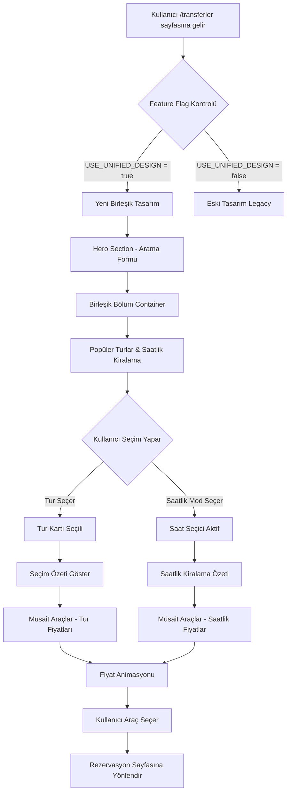

## 2. State Yönetimi Akışı

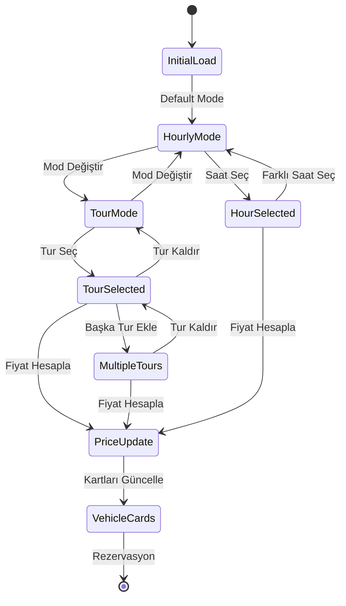

## 3. Bileşen Hiyerarşisi

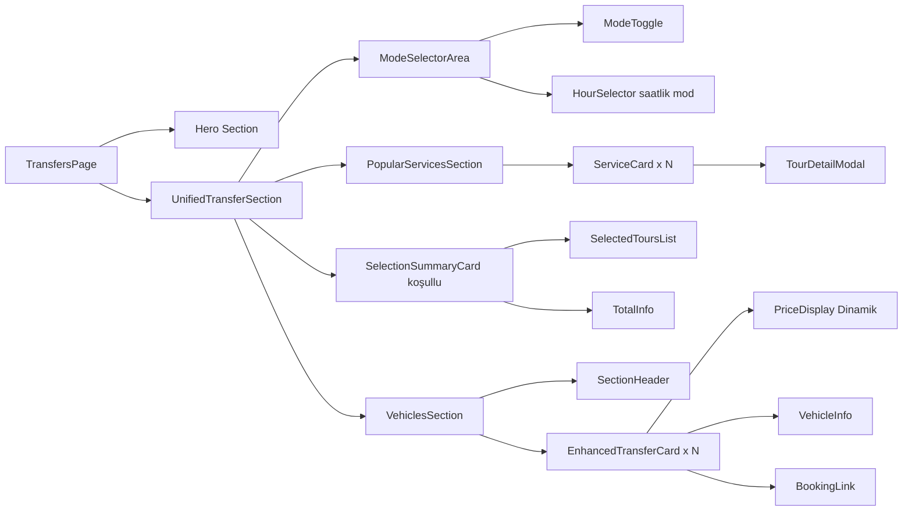

## 4. Fiyat Hesaplama Akışı

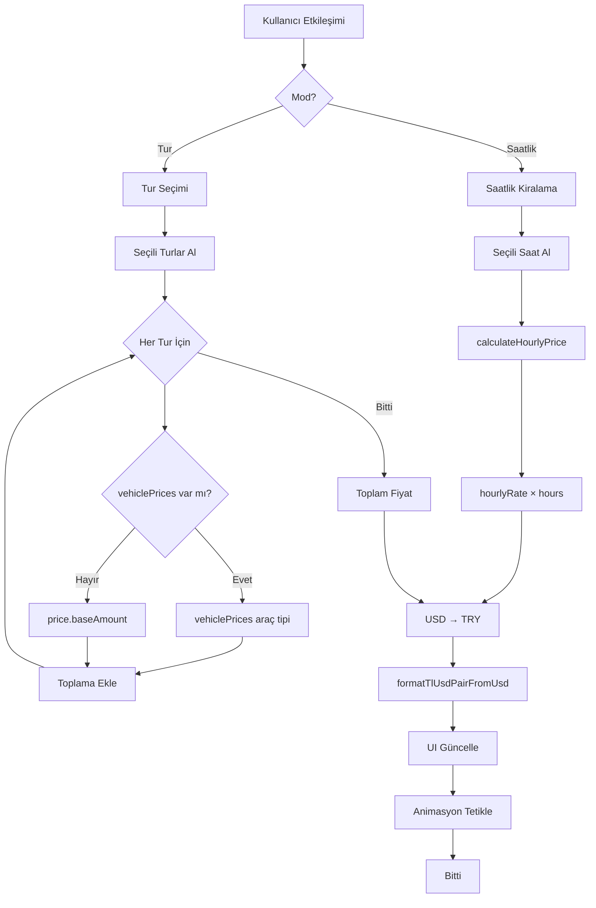

## 5. Kullanıcı Etkileşim Akışı - Tur Seçimi

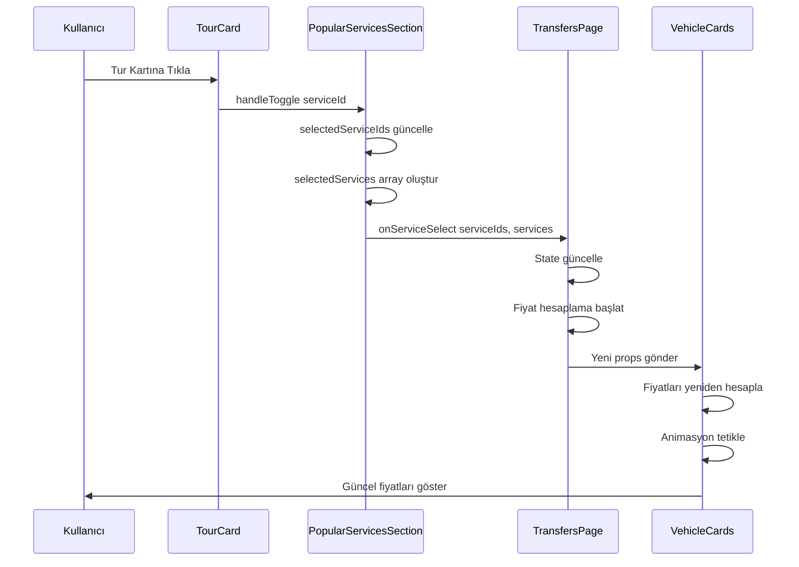

## 6. Kullanıcı Etkileşim Akışı - Saatlik Kiralama

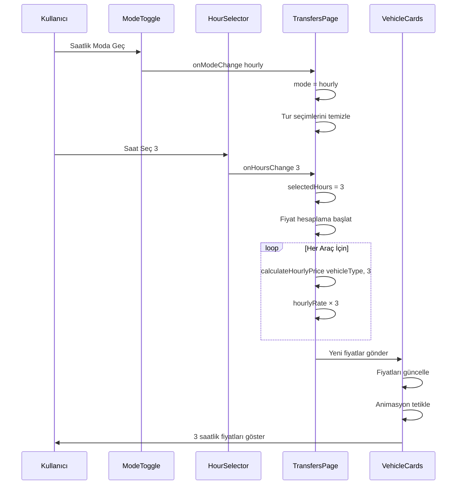

## 7. Bileşen İletişimi - Props ve State

```mermaid
graph TB
    subgraph TransfersPage State
        S1[mode: tour/hourly]
        S2[selectedServiceIds: string]
        S3[selectedServices: PopularServiceModel]
        S4[selectedHours: number]
        S5[priceChanged: boolean]
    end
    
    subgraph ModeToggle Props
        P1[mode]
        P2[onModeChange]
        P3[selectedHours]
        P4[onHoursChange]
    end
    
    subgraph PopularServicesSection Props
        P5[onServiceSelect]
        P6[selectedServiceIds]
    end
    
    subgraph SelectionSummaryCard Props
        P7[selectedServices]
        P8[mode]
        P9[selectedHours]
        P10[onRemove]
        P11[onClearAll]
    end
    
    subgraph VehicleCards Props
        P12[mode]
        P13[selectedServices]
        P14[selectedHours]
        P15[priceChanged]
    end
    
    S1 --> P1
    S1 --> P8
    S1 --> P12
    
    S2 --> P6
    
    S3 --> P7
    S3 --> P13
    
    S4 --> P3
    S4 --> P9
    S4 --> P14
    
    S5 --> P15
```

## 8. Responsive Layout Dönüşümü

```mermaid
graph LR
    subgraph Desktop > 1024px
        D1[Hero Section]
        D2[Mode Toggle Inline]
        D3[4-5 Tur Kartı Görünür]
        D4[Seçim Özeti Tam Genişlik]
        D5[Araç Kartları 4 Kolon]
    end
    
    subgraph Tablet 640-1024px
        T1[Hero Section]
        T2[Mode Toggle Inline]
        T3[2-3 Tur Kartı Görünür]
        T4[Seçim Özeti Tam Genişlik]
        T5[Araç Kartları 2-3 Kolon]
    end
    
    subgraph Mobile < 640px
        M1[Hero Section Kompakt]
        M2[Mode Toggle Stack]
        M3[1 Tur Kartı Görünür]
        M4[Seçim Özeti Collapsible]
        M5[Araç Kartları 1 Kolon]
    end
    
    Desktop --> T1
    Tablet --> M1
```

## 9. Fiyat Animasyonu Sıralaması

```mermaid
gantt
    title Fiyat Değişim Animasyonu Timeline
    dateFormat X
    axisFormat %Lms
    
    section Kullanıcı Etkileşimi
    Tur Seç/Saat Değiştir :0, 50ms
    
    section State Güncelleme
    State Update :50, 100ms
    Price Calculation :100, 150ms
    
    section UI Güncelleme
    Props Değişimi :150, 200ms
    Re-render Başlat :200, 250ms
    
    section Animasyon
    Scale Effect :250, 550ms
    Background Pulse :250, 550ms
    Color Transition :250, 550ms
    
    section Sonlandırma
    Animation Complete :550, 600ms
    Normal State :600, 650ms
```

## 10. Veri Akışı - API'den UI'ye

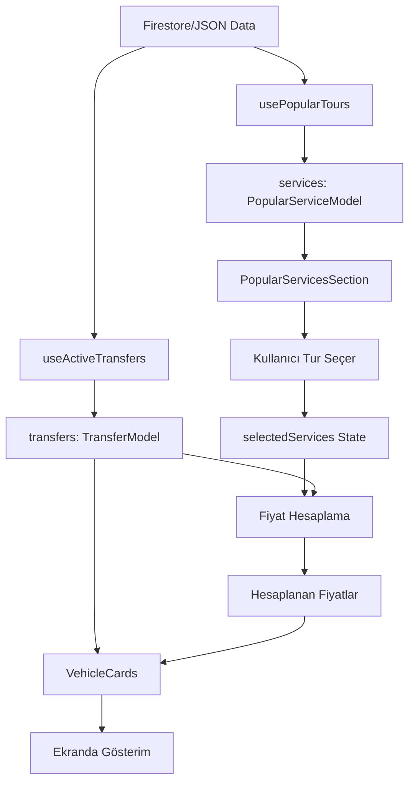

## 11. Hata Yönetimi Akışı

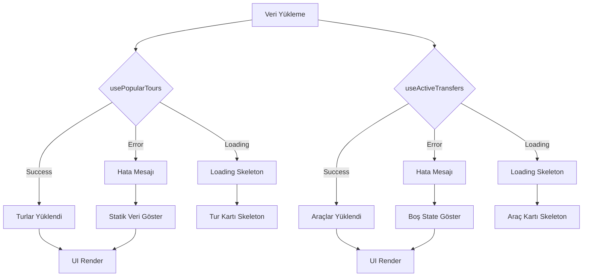

## 12. Feature Flag Implementasyonu

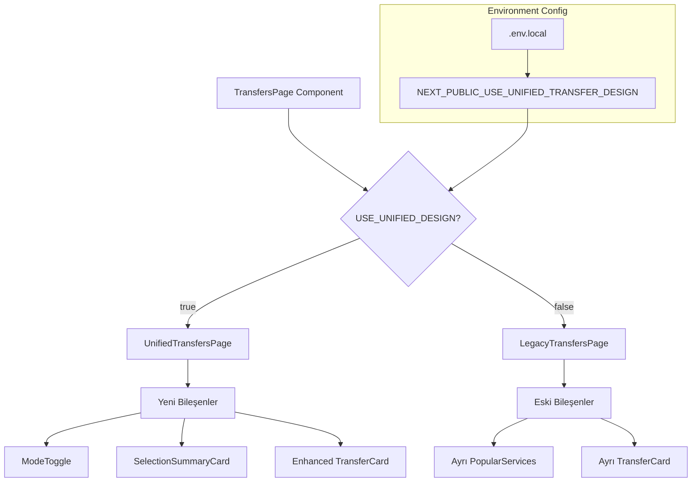

## 13. Animasyon Detayları

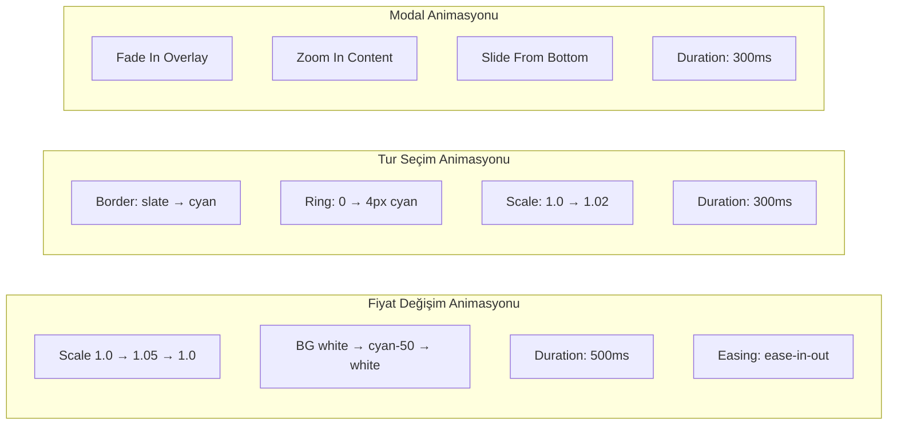

## 14. Performans Optimizasyonu

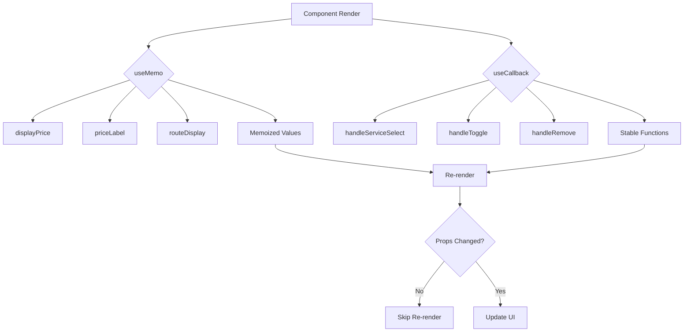

## 15. Test Stratejisi

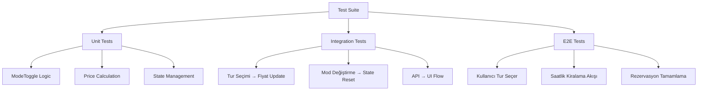

---

## Notlar

- Tüm diyagramlar Mermaid formatında
- VSCode'da Preview ile görüntülenebilir
- Implementasyon sırasında referans olarak kullanılabilir
- Gerçek zamanlı güncellenebilir
