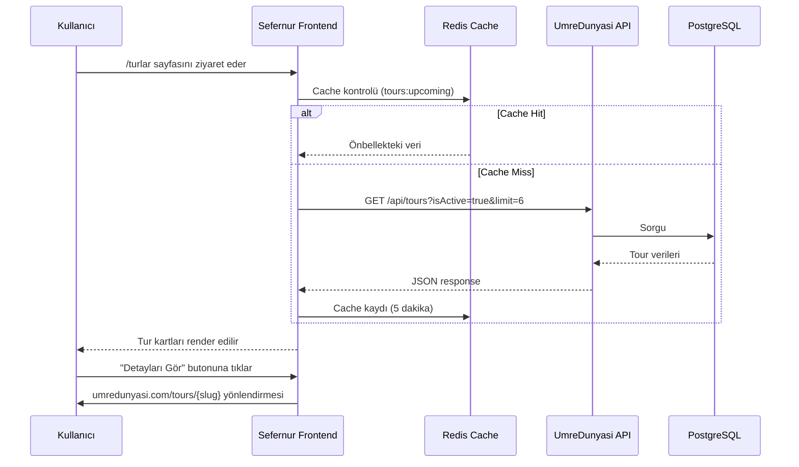
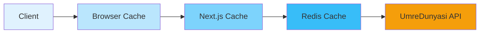

# UmreDunyasi API Entegrasyon Planı

## Proje Özeti

Sefernur'un `/turlar/` sayfasında UmreDunyasi.com'dan gelen "Yaklaşan Umre Turları" listelenecek. Kullanıcılar Sefernur'da önizleme yapabilecek, detaylar için ise UmreDunyasi'ye yönlendirilecek.

## Mimari Diyagram

```mermaid
graph TB
    subgraph Sefernur
        A[Turlar Sayfası] --> B[UpcomingToursWidget]
        B --> C[UmreDunyasiClient]
        C --> D[API Route /api/umredunyasi/tours]
        D --> E[Redis Cache]
    end
    
    subgraph UmreDunyasi
        F[API Server] --> G[/api/tours]
        G --> H[(PostgreSQL)]
    end
    
    C -->|HTTP Request| F
    E -->|Cache Miss| C
    E -->|Cache Hit| D
    
    B -->|Detay için| I[umredunyasi.com]
    
    style A fill:#10b981
    style B fill:#3b82f6
    style C fill:#8b5cf6
    style F fill:#f59e0b
    style I fill:#ef4444
```

## Veri Akışı



## 1. Teknik Analiz ve Ön Hazırlık

### 1.1 UmreDunyasi API Analizi

**Kullanılacak Endpoint:**
- `GET /api/tours` - Ana tur listesi endpoint'i
- `GET /api/tours/featured` - Öne çıkan turlar
- `GET /api/tours/best-by-firm` - Firma bazlı en iyi turlar

**Query Parametreleri:**
- `isActive=true` - Sadece aktif turlar
- `limit=6` - İlk 6 tur
- `sortBy=date` - Tarihe göre sıralama
- `sortOrder=asc` - Yaklaşan turlar önce

**Response Format:**
```typescript
{
  success: true,
  data: [
    {
      id: string,
      slug: string,
      title: string,
      description: string,
      price: number,
      priceCurrency: string,
      startDate: string,
      endDate: string,
      duration: number,
      hotelStars: number,
      hotelMakkah: string,
      hotelMadinah: string,
      makkahNights: number,
      madinahNights: number,
      images: string[],
      firm: {
        id: string,
        name: string,
        slug: string,
        logo: string,
        isVerified: boolean
      },
      categories: Array<{
        category: {
          id: string,
          name: string,
          slug: string,
          icon: string,
          color: string
        }
      }>
    }
  ],
  pagination: {
    page: number,
    limit: number,
    total: number,
    totalPages: number
  }
}
```

### 1.2 CORS Yapılandırması

UmreDunyasi API'sinde `sefernur.com` domain'i için CORS izni gerekiyor.

**Gerekli Değişiklik:** `C:/projedosyasi/umredunyasi-main/apps/api/src/index.ts`

```typescript
const allowedOrigins = [
  'https://sefernur.com',
  'https://www.sefernur.com',
  'http://localhost:3000', // Development
];
```

## 2. API Client Kütüphanesi

### 2.1 Dosya Yapısı

```
web-app/src/lib/umredunyasi/
├── client.ts           # Ana API client
├── types.ts            # TypeScript tipleri
├── adapters.ts         # Veri dönüşümü
└── constants.ts        # API URL ve config
```

### 2.2 Client Implementation

**`web-app/src/lib/umredunyasi/constants.ts`**
```typescript
export const UMREDUNYASI_CONFIG = {
  baseURL: process.env.NEXT_PUBLIC_UMREDUNYASI_API_URL || 'https://umredunyasi.com/api',
  timeout: 10000,
  cacheTTL: 300, // 5 dakika
} as const;
```

**`web-app/src/lib/umredunyasi/types.ts`**
```typescript
export interface UmreDunyasiTour {
  id: string;
  slug: string;
  title: string;
  description: string;
  price: number;
  priceCurrency: string;
  startDate: string;
  endDate: string;
  duration: number;
  hotelStars: number | null;
  hotelMakkah: string | null;
  hotelMadinah: string | null;
  makkahNights: number | null;
  madinahNights: number | null;
  images: string[];
  firm: {
    id: string;
    name: string;
    slug: string;
    logo: string | null;
    isVerified: boolean;
  };
  categories: Array<{
    category: {
      id: string;
      name: string;
      slug: string;
      icon: string | null;
      color: string | null;
    };
  }>;
}

export interface UmreDunyasiResponse {
  success: boolean;
  data: UmreDunyasiTour[];
  pagination: {
    page: number;
    limit: number;
    total: number;
    totalPages: number;
  };
}
```

**`web-app/src/lib/umredunyasi/client.ts`**
```typescript
import { UMREDUNYASI_CONFIG } from './constants';
import type { UmreDunyasiResponse, UmreDunyasiTour } from './types';

export class UmreDunyasiClient {
  private baseURL: string;
  private timeout: number;

  constructor(config = UMREDUNYASI_CONFIG) {
    this.baseURL = config.baseURL;
    this.timeout = config.timeout;
  }

  async getUpcomingTours(limit = 6): Promise<UmreDunyasiTour[]> {
    const params = new URLSearchParams({
      isActive: 'true',
      limit: limit.toString(),
      sortBy: 'date',
      sortOrder: 'asc',
    });

    const response = await this.fetch(`/tours?${params}`);
    const data = await response.json() as UmreDunyasiResponse;
    
    if (!data.success) {
      throw new Error('API request failed');
    }

    return data.data;
  }

  async getFeaturedTours(limit = 4): Promise<UmreDunyasiTour[]> {
    const response = await this.fetch(`/tours/featured?limit=${limit}`);
    return response.json();
  }

  private async fetch(path: string): Promise<Response> {
    const controller = new AbortController();
    const timeoutId = setTimeout(() => controller.abort(), this.timeout);

    try {
      const response = await fetch(`${this.baseURL}${path}`, {
        signal: controller.signal,
        headers: {
          'Content-Type': 'application/json',
        },
        next: { revalidate: UMREDUNYASI_CONFIG.cacheTTL },
      });

      if (!response.ok) {
        throw new Error(`HTTP ${response.status}: ${response.statusText}`);
      }

      return response;
    } finally {
      clearTimeout(timeoutId);
    }
  }
}

export const umredunyasiClient = new UmreDunyasiClient();
```

## 3. Veri Dönüşüm Katmanı (Adapter)

**`web-app/src/lib/umredunyasi/adapters.ts`**
```typescript
import type { UmreDunyasiTour } from './types';
import type { TourModel } from '@/types/tour';

export function toSefernurTour(udTour: UmreDunyasiTour): Partial<TourModel> {
  return {
    id: udTour.id,
    title: udTour.title,
    description: udTour.description,
    basePrice: Number(udTour.price),
    durationDays: udTour.duration,
    startDate: new Date(udTour.startDate),
    endDate: new Date(udTour.endDate),
    images: udTour.images,
    company: udTour.firm.name,
    mekkeNights: udTour.makkahNights || undefined,
    medineNights: udTour.madinahNights || undefined,
    isActive: true,
    isPopular: false,
    rating: 0,
    reviewCount: 0,
  };
}

export function getTourUrl(slug: string): string {
  return `https://umredunyasi.com/tours/${slug}`;
}
```

## 4. Frontend Bileşenleri

### 4.1 API Route (Server-Side Proxy)

**`web-app/src/app/api/umredunyasi/tours/route.ts`**
```typescript
import { NextRequest, NextResponse } from 'next/server';
import { umredunyasiClient } from '@/lib/umredunyasi/client';

export async function GET(request: NextRequest) {
  try {
    const searchParams = request.nextUrl.searchParams;
    const limit = parseInt(searchParams.get('limit') || '6');

    const tours = await umredunyasiClient.getUpcomingTours(limit);

    return NextResponse.json({
      success: true,
      data: tours,
      count: tours.length,
    });
  } catch (error) {
    console.error('[UmreDunyasi API] Error:', error);
    
    return NextResponse.json(
      {
        success: false,
        error: 'Failed to fetch tours from UmreDunyasi',
        data: [],
      },
      { status: 500 }
    );
  }
}
```

### 4.2 React Hook

**`web-app/src/hooks/useUmredunyasiTours.ts`**
```typescript
import { useQuery } from '@tanstack/react-query';

export function useUmredunyasiTours(limit = 6) {
  return useQuery({
    queryKey: ['umredunyasi', 'tours', 'upcoming', limit],
    queryFn: async () => {
      const response = await fetch(`/api/umredunyasi/tours?limit=${limit}`);
      if (!response.ok) {
        throw new Error('Failed to fetch tours');
      }
      return response.json();
    },
    staleTime: 5 * 60 * 1000, // 5 dakika
    refetchOnWindowFocus: false,
  });
}
```

### 4.3 Upcoming Tours Widget

**`web-app/src/components/tours/UpcomingUmrahTours.tsx`**
```typescript
"use client";

import { useUmredunyasiTours } from "@/hooks/useUmredunyasiTours";
import { Badge } from "@/components/ui/Badge";
import { Card, CardContent } from "@/components/ui/Card";
import { formatTlUsdPairFromTl } from "@/lib/currency";
import { getTourUrl } from "@/lib/umredunyasi/adapters";
import { Building2, CalendarDays, ExternalLink, Moon, Star } from "lucide-react";
import Link from "next/link";

export function UpcomingUmrahTours({ limit = 6 }: { limit?: number }) {
  const { data, isLoading, isError } = useUmredunyasiTours(limit);

  if (isLoading) {
    return <LoadingState />;
  }

  if (isError || !data?.data?.length) {
    return null; // Hata durumunda gösterme
  }

  const tours = data.data;

  return (
    <section className="py-8">
      <div className="flex items-center justify-between mb-6">
        <div>
          <h2 className="text-2xl font-bold text-slate-900">
            Yaklaşan Umre Turları
          </h2>
          <p className="text-slate-600 mt-1">
            UmreDunyasi güvencesiyle yaklaşan umre turları
          </p>
        </div>
        <Link
          href="https://umredunyasi.com/tours"
          target="_blank"
          rel="noopener noreferrer"
          className="text-emerald-700 hover:text-emerald-800 font-medium flex items-center gap-1"
        >
          Tümünü Gör
          <ExternalLink className="w-4 h-4" />
        </Link>
      </div>

      <div className="grid sm:grid-cols-2 lg:grid-cols-3 gap-6">
        {tours.map((tour: any) => (
          <UpcomingTourCard key={tour.id} tour={tour} />
        ))}
      </div>
    </section>
  );
}

function UpcomingTourCard({ tour }: { tour: any }) {
  const firstImage = tour.images?.[0];
  const totalNights = (tour.makkahNights ?? 0) + (tour.madinahNights ?? 0);

  return (
    <Link href={getTourUrl(tour.slug)} target="_blank" rel="noopener noreferrer">
      <Card className="group overflow-hidden border-slate-200 bg-white hover:border-emerald-300 transition-colors duration-200 cursor-pointer h-full">
        {/* Image Section */}
        <div className="relative h-48 overflow-hidden bg-slate-100">
          {firstImage ? (
            
          ) : (
            <div className="w-full h-full flex items-center justify-center bg-gradient-to-br from-emerald-50 to-teal-50">
              <Building2 className="w-12 h-12 text-emerald-300" />
            </div>
          )}

          {/* External Link Badge */}
          <div className="absolute top-3 right-3">
            <Badge className="bg-emerald-600 text-white border-0 text-xs gap-1">
              UmreDunyasi
              <ExternalLink className="w-3 h-3" />
            </Badge>
          </div>

          {/* Bottom - Nights Badge */}
          {totalNights > 0 ? (
            <div className="absolute bottom-3 left-3">
              <Badge className="bg-emerald-600 text-white border-0 text-xs gap-1">
                <Moon className="w-3 h-3" />
                {tour.makkahNights ? `Mekke ${tour.makkahNights}` : ""}
                {tour.makkahNights && tour.madinahNights ? " · " : ""}
                {tour.madinahNights ? `Medine ${tour.madinahNights}` : ""}
                {" "}Gece
              </Badge>
            </div>
          ) : null}
        </div>

        {/* Content */}
        <CardContent className="p-4">
          <h3 className="font-semibold text-slate-900 text-sm line-clamp-1 group-hover:text-emerald-700 transition-colors">
            {tour.title}
          </h3>
          
          {/* Firm Info */}
          {tour.firm && (
            <p className="text-xs text-slate-500 mt-1">
              {tour.firm.name}
            </p>
          )}

          {/* Info Row */}
          <div className="mt-3 flex items-center gap-3 text-xs text-slate-500">
            {tour.startDate ? (
              <div className="flex items-center gap-1">
                <CalendarDays className="w-3.5 h-3.5 text-slate-400" />
                {new Date(tour.startDate).toLocaleDateString("tr-TR", { 
                  day: "numeric", 
                  month: "short" 
                })}
              </div>
            ) : null}
            {tour.duration ? (
              <span>{tour.duration} Gün</span>
            ) : null}
          </div>

          {/* Price Row */}
          <div className="mt-4 pt-3 border-t border-slate-100 flex items-end justify-between">
            <div className="text-right">
              <p className="text-[10px] text-slate-400 uppercase tracking-wider">Başlangıç</p>
              <p className="text-base font-bold text-emerald-700 leading-tight">
                {formatTlUsdPairFromTl(Number(tour.price))}
              </p>
            </div>
          </div>
        </CardContent>
      </Card>
    </Link>
  );
}

function LoadingState() {
  return (
    <section className="py-8">
      <h2 className="text-2xl font-bold text-slate-900 mb-6">
        Yaklaşan Umre Turları
      </h2>
      <div className="grid sm:grid-cols-2 lg:grid-cols-3 gap-6">
        {[1, 2, 3, 4, 5, 6].map((i) => (
          <div key={i} className="h-80 bg-slate-100 animate-pulse rounded-xl" />
        ))}
      </div>
    </section>
  );
}
```

### 4.4 Turlar Sayfası Entegrasyonu

**`web-app/src/app/tours/page.tsx`** (Güncellenmiş)

```typescript
// Mevcut Firebase turları
{filteredTours.length > 0 && (
  <section className="max-w-7xl mx-auto px-4 sm:px-6 lg:px-8 py-8">
    <h2 className="text-2xl font-bold text-slate-900 mb-6">
      Sefernur Özel Turları
    </h2>
    {/* Mevcut tur kartları */}
  </section>
)}

// UmreDunyasi entegrasyonu
<UpcomingUmrahTours limit={6} />
```

## 5. Cache ve Güncelleme Stratejisi

### 5.1 Çok Katmanlı Cache



**Cache Katmanları:**

| Katman | TTL | Strateji |
|--------|-----|----------|
| Browser (Next.js) | 5 dakika | `next: { revalidate: 300 }` |
| Server (Redis) | 5 dakika | Otomatik invalidation |
| CDN (Vercel) | 5 dakika | Stale-while-revalidate |

### 5.2 Güncelleme Zamanlaması

- **Otomatik Güncelleme:** Her 5 dakikada bir
- **Manuel Yenileme:** Admin panelinden buton
- **Invalidation:** Tur eklendiğinde/güncellendiğinde

## 6. Error Handling ve Fallback

### 6.1 Hata Senaryoları

```typescript
// API Error Handler
export async function GET(request: NextRequest) {
  try {
    // ...
  } catch (error) {
    // Loglama
    console.error('[UmreDunyasi API] Error:', error);
    
    // Sentry'ye bildir
    if (typeof window === 'undefined') {
      const Sentry = (await import('@sentry/nextjs')).Sentry;
      Sentry.captureException(error);
    }
    
    // Fallback response
    return NextResponse.json({
      success: false,
      error: 'Turlar geçici olarak alınamıyor',
      data: [],
      fallback: true,
    }, { status: 200 }); // 500 yerine 200, UI bozulmasın
  }
}
```

### 6.2 Fallback UI

```typescript
// Component'te fallback
if (isError) {
  return (
    <section className="py-8">
      <div className="bg-amber-50 border border-amber-200 rounded-xl p-6 text-center">
        <p className="text-amber-800">
          Umre turları şu anda gösterilemiyor. 
          <Link href="https://umredunyasi.com" className="underline ml-1">
            UmreDunyasi'yi ziyaret edin
          </Link>
        </p>
      </div>
    </section>
  );
}
```

## 7. Performans Optimizasyonu

### 7.1 Optimizasyon Stratejileri

1. **Parallel Fetching:** Firebase ve UmreDunyasi API'leri paralel çağır
2. **Progressive Loading:** Önce Firebase turları, sonra UmreDunyasi
3. **Image Optimization:** Next.js Image component kullan
4. **Code Splitting:** Widget lazy load

### 7.2 Monitoring

```typescript
// Performance tracking
export async function GET(request: NextRequest) {
  const startTime = Date.now();
  
  try {
    const tours = await umredunyasiClient.getUpcomingTours(limit);
    
    // Analytics
    const duration = Date.now() - startTime;
    await logMetric('umredunyasi_api_duration', duration);
    
    return NextResponse.json({ success: true, data: tours });
  } catch (error) {
    await logMetric('umredunyasi_api_error', 1);
    throw error;
  }
}
```

## 8. Environment Değişkenleri

**`.env.local`**
```bash
# UmreDunyasi API Configuration
NEXT_PUBLIC_UMREDUNYASI_API_URL=https://umredunyasi.com/api
NEXT_PUBLIC_UMREDUNYASI_SITE_URL=https://umredunyasi.com
```

## 9. Deployment Checklist

- [ ] UmreDunyasi API'sine CORS izni ekle
- [ ] Environment değişkenlerini yapılandır
- [ ] API route'larını test et
- [ ] Cache stratejisini doğrula
- [ ] Error handling'i test et
- [ ] Monitoring'i aktifleştir
- [ ] Production build ve deploy

## 10. Test Senaryoları

```typescript
// Test Cases
describe('UmreDunyasi Integration', () => {
  it('should fetch upcoming tours', async () => {
    const tours = await umredunyasiClient.getUpcomingTours(6);
    expect(tours).toHaveLength(6);
    expect(tours[0]).toHaveProperty('id');
    expect(tours[0]).toHaveProperty('slug');
  });

  it('should handle API errors gracefully', async () => {
    // Mock error response
    const result = await fetch('/api/umredunyasi/tours');
    expect(result.ok).toBe(true); // Hata olsa bile 200
  });

  it('should cache responses', async () => {
    const first = await fetch('/api/umredunyasi/tours');
    const second = await fetch('/api/umredunyasi/tours');
    // Second request should be faster (cached)
  });
});
```

## Özet

Bu entegrasyon ile:

1. Sefernur kullanıcıları UmreDunyasi turlarını görüntüleyebilecek
2. Detaylar için UmreDunyasi'ye yönlendirilecek
3. Cache ile performans optimize edilecek
4. Error handling ile kullanıcı deneyimi korunacak
5. Monitoring ile sorunlar takip edilebilecek
