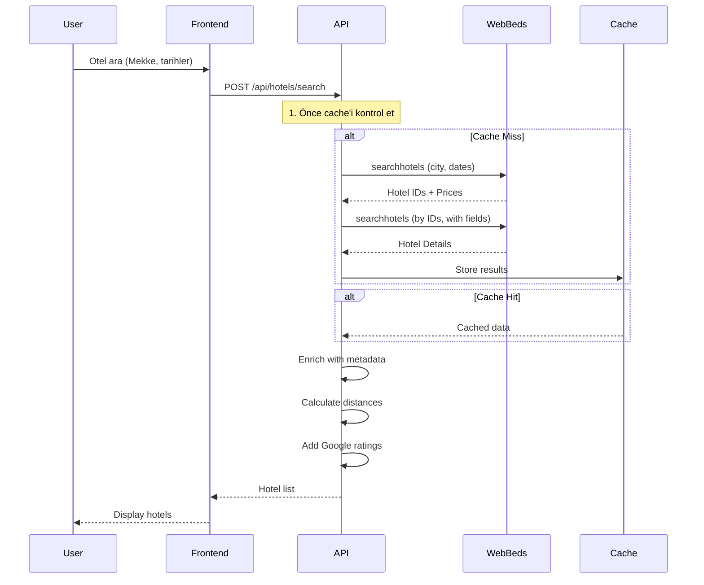

# WebBeds API Yeniden Tasarım Planı

## 📋 Durum Analizi

### Mevcut Sorunlar

1. **Otel İsimleri Çekilmiyor**
   - `searchhotels` API yanıtında otel isimleri (`@_HotelName`) boş geliyor
   - V4 API'de otel isimleri `<fields>` parametresi ile istenmelidir
   - Mevcut `buildSearchHotelsXML` fonksiyonunda `<fields>` bloğu yok

2. **Otel Detayları Eksik**
   - Adres, resim, rating gibi bilgiler `searchhotels` yanıtında gelmiyor
   - `hotel/[hotelId]` endpoint'i `searchByIds` kullanıyor ama yetersiz

3. **XML Parser Karmaşık**
   - `normalizeHotelNode` fonksiyonunda çok fazla fallback mekanizması
   - API yanıt yapısı ile parser beklentisi uyuşmuyor

4. **API Endpoint Yapısı**
   - `/api/webbeds/search` - Fiyat araması için
   - `/api/webbeds/hotel/[hotelId]` - Detay için
   - `/api/webbeds/rooms` - Oda listesi için
   - Endpoint'ler arası veri tutarsızlığı var

### WebBeds V4 API Gerçekleri

1. **V4 searchhotels Yanıt Yapısı**
   - Varsayılan olarak sadece fiyat ve müsaitlik döner
   - Otel detayları için `<fields>` parametresi gerekli
   - `noPrice=true` ile `<fields>` birlikte kullanılamaz (Error 26)

2. **Önerilen Arama Stratejisi**
   - Şehir bazlı arama yerine Hotel ID bazlı arama (max 50 ID)
   - Daha hızlı ve güvenilir sonuçlar

3. **getRooms Zorunlu**
   - V4'te `searchhotels` sonrası `getRooms` çağrısı zorunlu
   - İptal kuralları ve `allocationDetails` sadece `getRooms`'te gelir

---

## 🏗️ Yeni API Mimarisi

### Mimari Diyagram

```mermaid
graph TB
    subgraph Frontend
        A[Hotels Page]
        B[Hotel Detail Page]
    end
    
    subgraph API Layer
        C[/api/hotels/search]
        D[/api/hotels/list]
        E[/api/hotels/:id]
        F[/api/hotels/:id/rooms]
    end
    
    subgraph WebBeds Service
        G[WebBeds Client]
        H[XML Builder]
        I[XML Parser]
    end
    
    subgraph Cache Layer
        J[Hotel Metadata Cache]
        K[Static Data Store]
    end
    
    A --> C
    A --> D
    B --> E
    B --> F
    
    C --> G
    D --> G
    E --> G
    F --> G
    
    G --> H
    G --> I
    G --> J
    G --> K
```

### Endpoint Tasarımı

#### 1. `/api/hotels/search` - Fiyat Araması
**Amaç:** Belirli tarihler için müsait otelleri ve fiyatları getirir

**Request:**
```typescript
POST /api/hotels/search
{
  cityCode: 164,           // Mekke
  checkIn: "2025-03-15",
  checkOut: "2025-03-18",
  rooms: [{ adults: 2, children: 0, childAges: [] }],
  nationality: 5,          // Türkiye
  currency: 520            // USD
}
```

**Response:**
```typescript
{
  success: true,
  data: [
    {
      hotelId: "12345",
      hotelName: "Makkah Clock Royal Tower",
      price: 250.00,
      currency: "USD",
      stars: 5,
      distanceToHaram: 100,  // metre
      rating: 4.5,
      reviewCount: 1250,
      image: "https://...",
      boardBasis: "Room Only"
    }
  ],
  count: 42
}
```

#### 2. `/api/hotels/list` - Statik Otel Listesi
**Amaç:** Şehirdeki tüm otelleri (fiyatsız) listeler

**Request:**
```typescript
GET /api/hotels/list?cityCode=164
```

**Response:**
```typescript
{
  success: true,
  cityCode: 164,
  data: [
    {
      hotelId: "12345",
      hotelName: "Makkah Clock Royal Tower",
      address: "Abraj Al Bait",
      cityName: "Makkah",
      stars: 5,
      rating: 4.5,
      image: "https://...",
      geoPoint: { lat: 21.418, lng: 39.826 }
    }
  ],
  count: 150
}
```

#### 3. `/api/hotels/:id` - Otel Detayı
**Amaç:** Tek bir otelin tüm detaylarını getirir

**Request:**
```typescript
GET /api/hotels/12345
```

**Response:**
```typescript
{
  success: true,
  data: {
    hotelId: "12345",
    hotelName: "Makkah Clock Royal Tower",
    description: "Otel açıklaması...",
    address: "Abraj Al Bait, Makkah",
    stars: 5,
    rating: 4.5,
    reviewCount: 1250,
    images: ["url1", "url2", ...],
    amenities: ["WiFi", "Restaurant", ...],
    geoPoint: { lat: 21.418, lng: 39.826 },
    checkInTime: "14:00",
    checkOutTime: "12:00",
    distanceToHaram: 100
  }
}
```

#### 4. `/api/hotels/:id/rooms` - Oda ve Fiyat Listesi
**Amaç:** Belirli tarihler için odaları ve fiyatları getirir

**Request:**
```typescript
POST /api/hotels/12345/rooms
{
  checkIn: "2025-03-15",
  checkOut: "2025-03-18",
  rooms: [{ adults: 2, children: 0, childAges: [] }],
  nationality: 5,
  currency: 520
}
```

**Response:**
```typescript
{
  success: true,
  data: {
    hotel: {
      hotelId: "12345",
      hotelName: "Makkah Clock Royal Tower",
      checkInTime: "14:00",
      checkOutTime: "12:00"
    },
    rooms: [
      {
        rateId: "12345_0",
        roomName: "Standard Room",
        roomTypeCode: "12345",
        boardBasis: "Room Only",
        price: 250.00,
        currency: "USD",
        minSellingPrice: 275.00,
        refundable: true,
        maxAdults: 2,
        maxChildren: 1,
        maxOccupancy: 3,
        cancellation: [
          {
            fromDate: "2025-03-10",
            charge: 0
          },
          {
            fromDate: "2025-03-13",
            charge: 100.00
          }
        ],
        allocationDetails: "..."
      }
    ]
  }
}
```

---

## 🔧 Uygulama Adımları

### Adım 1: WebBeds Client Oluştur

**Dosya:** `web-app/src/lib/webbeds/client.ts`

```typescript
/**
 * WebBeds V4 API Client
 * Tüm WebBeds API çağrılarını merkezi bir noktadan yönetir
 */

import { WEBBEDS_CONFIG } from "./config";
import { buildSearchHotelsXML, buildSearchAllHotelsXML, buildSearchByIdsXML, buildGetRoomsXML } from "./xml-builder";
import { parseWebBedsXML, extractHotelsFromSearchResponse, extractRoomsFromResponse } from "./xml-parser";
import axios from "axios";

const V4_HEADERS = {
  "Content-Type": "text/xml; charset=utf-8",
  Accept: "text/xml",
  Accept-Encoding: "gzip, deflate",
};

export class WebBedsClient {
  private baseUrl: string;
  
  constructor() {
    this.baseUrl = WEBBEDS_CONFIG.baseUrl;
  }

  /**
   * Şehir bazlı fiyat araması
   * Otel isimleri ve detayları DAHİL DEĞİL, sadece fiyat
   */
  async searchByCity(params: SearchByCityParams): Promise<SearchResult> {
    const xml = buildSearchHotelsXML({
      cityCode: params.cityCode,
      checkIn: params.checkIn,
      checkOut: params.checkOut,
      rooms: params.rooms,
      nationality: params.nationality,
      currency: params.currency,
    });

    const response = await axios.post(this.baseUrl, xml, {
      headers: V4_HEADERS,
      timeout: 60000,
    });

    const parsed = parseWebBedsXML(response.data);
    const hotels = extractHotelsFromSearchResponse(parsed);

    return {
      success: true,
      data: hotels.map(h => ({
        hotelId: h["@_HotelId"] || "",
        price: h["@_Price"] || "0",
        currency: params.currency,
      })),
      count: hotels.length,
    };
  }

  /**
   * Şehirdeki tüm otelleri (fiyatsız) getirir
   * Otel isimleri ve detayları DAHİL
   */
  async getAllHotelsInCity(params: GetAllHotelsParams): Promise<HotelListResult> {
    // Önce hotel ID'leri al
    const xml = buildSearchAllHotelsXML({
      cityCode: params.cityCode,
      checkIn: params.checkIn,
      checkOut: params.checkOut,
      currency: params.currency,
      nationality: params.nationality,
    });

    const response = await axios.post(this.baseUrl, xml, {
      headers: V4_HEADERS,
      timeout: 60000,
    });

    const parsed = parseWebBedsXML(response.data);
    const hotels = extractHotelsFromSearchResponse(parsed);

    // Hotel ID'leri 50'şer gruplar halinde detaylı sorgula
    const hotelIds = hotels.map(h => h["@_HotelId"]).filter(Boolean);
    const detailedHotels = await this.getHotelsByIds({
      hotelIds,
      checkIn: params.checkIn,
      checkOut: params.checkOut,
      currency: params.currency,
      nationality: params.nationality,
    });

    return {
      success: true,
      cityCode: params.cityCode,
      data: detailedHotels,
      count: detailedHotels.length,
    };
  }

  /**
   * Hotel ID'lerine göre detaylı sorgu
   * Max 50 ID per request
   */
  async getHotelsByIds(params: GetHotelsByIdsParams): Promise<Hotel[]> {
    const results: Hotel[] = [];
    
    // 50'şer gruplar halinde
    for (let i = 0; i < params.hotelIds.length; i += 50) {
      const batch = params.hotelIds.slice(i, i + 50);
      
      const xml = buildSearchByIdsXML({
        hotelIds: batch,
        checkIn: params.checkIn,
        checkOut: params.checkOut,
        currency: params.currency,
        nationality: params.nationality,
      });

      const response = await axios.post(this.baseUrl, xml, {
        headers: V4_HEADERS,
        timeout: 60000,
      });

      const parsed = parseWebBedsXML(response.data);
      const hotels = extractHotelsFromSearchResponse(parsed);
      
      results.push(...hotels);
    }

    return results;
  }

  /**
   * Otel odalarını ve fiyatlarını getirir
   */
  async getRooms(params: GetRoomsParams): Promise<RoomsResult> {
    const xml = buildGetRoomsXML({
      hotelId: params.hotelId,
      checkIn: params.checkIn,
      checkOut: params.checkOut,
      rooms: params.rooms,
      nationality: params.nationality,
      currency: params.currency,
    });

    const response = await axios.post(this.baseUrl, xml, {
      headers: V4_HEADERS,
      timeout: 60000,
    });

    const parsed = parseWebBedsXML(response.data);
    const rooms = extractRoomsFromResponse(parsed);

    // Otel bilgilerini al
    const hotelInfo = this.extractHotelInfoFromGetRooms(parsed);

    return {
      success: true,
      data: {
        hotel: hotelInfo,
        rooms,
      },
    };
  }

  private extractHotelInfoFromGetRooms(parsed: any): HotelInfo {
    // result > hotel > @_name, checkInTime, checkOutTime
    const hotel = parsed?.result?.hotel;
    
    return {
      hotelId: hotel?.["@_hotelid"] || "",
      hotelName: hotel?.["@_name"] || "",
      checkInTime: hotel?.checkInTime || "14:00",
      checkOutTime: hotel?.checkOutTime || "12:00",
    };
  }
}

// Singleton instance
export const webBedsClient = new WebBedsClient();
```

### Adım 2: XML Builder Güncelleme

**Dosya:** `web-app/src/lib/webbeds/xml-builder.ts`

Mevcut `buildSearchHotelsXML` fonksiyonuna `<fields>` bloğu eklenmeli:

```typescript
export function buildSearchHotelsXML(params: {
  cityCode?: number;
  countryCode?: number;
  checkIn: string;
  checkOut: string;
  rooms: Room[];
  nationality: number;
  currency: number;
  includeFields?: boolean;  // YENİ: Detayları dahil et
}): string {
  const roomsXml = buildRoomsXml(params.rooms, params.nationality, params.nationality);

  // Build filters
  let filters = '';
  if (params.cityCode) {
    filters = `<filters xmlns:a="http://us.dotwconnect.com/xsd/atomicCondition" xmlns:c="http://us.dotwconnect.com/xsd/complexCondition">
                <city>${params.cityCode}</city>
              </filters>`;
  } else if (params.countryCode) {
    filters = `<filters xmlns:a="http://us.dotwconnect.com/xsd/atomicCondition" xmlns:c="http://us.dotwconnect.com/xsd/complexCondition">
                <country>${params.countryCode}</country>
              </filters>`;
  }

  // YENİ: İsteğe bağlı fields bloğu
  const fieldsXml = params.includeFields ? `
        <fields>
            <field>hotelName</field>
            <field>address</field>
            <field>fullAddress</field>
            <field>rating</field>
            <field>hotelImages</field>
            <field>geoPoint</field>
            <field>cityName</field>
            <field>cityCode</field>
        </fields>` : '';

  const inner = `<request command="searchhotels">
    <bookingDetails>
        <fromDate>${params.checkIn}</fromDate>
        <toDate>${params.checkOut}</toDate>
        <currency>${params.currency}</currency>
        ${roomsXml}
    </bookingDetails>
    <return>
        ${filters}
        ${fieldsXml}
    </return>
</request>`;

  return wrapWithCustomer(inner);
}
```

### Adım 3: XML Parser Güncelleme

**Dosya:** `web-app/src/lib/webbeds/xml-parser.ts`

`normalizeHotelNode` fonksiyonu basitleştirilmeli ve V4 yanıt yapısına uygun hale getirilmeli:

```typescript
function normalizeHotelNode(rawHotel: unknown): XmlObject {
  const hotel = asObject(rawHotel) ?? {};

  // V4 API yanıt yapısına göre alanları al
  // @_name (getRooms), hotelName (search with fields)
  const hotelId = getString(hotel, ["@_HotelId", "@_hotelid", "hotelid"]);
  const hotelName = getString(hotel, ["@_name", "hotelName", "name"]) || `Otel #${hotelId}`;
  
  const address = extractAddress(hotel);
  const cityName = extractCityOnly(hotel);
  const rawRating = getString(hotel, ["@_Stars", "rating", "stars"]);
  const stars = dotwRatingToStars(rawRating);
  
  // Fiyat
  const directPrice = getString(hotel, ["@_Price", "price"]);
  const fallbackMinPrice = getMinPriceFromDynamicHotel(hotel);
  
  // Resim
  const imageUrl = extractImageUrl(hotel);
  
  // Koordinat
  const geoPoint = asObject(hotel["geoPoint"]);
  const lat = getString(geoPoint ?? {}, ["lat", "@_lat"]);
  const lng = getString(geoPoint ?? {}, ["lng", "@_lng"]);

  return {
    "@_HotelId": hotelId ?? "",
    "@_HotelName": hotelName,
    "@_Address": address || "Adres bilgisi bulunamadı",
    "@_CityName": cityName || "",
    "@_Stars": stars || "",
    "@_Price": directPrice || fallbackMinPrice || "0",
    "@_Image": imageUrl || "",
    "@_Lat": lat || "",
    "@_Lng": lng || "",
  };
}
```

### Adım 4: Yeni API Route'ları

**Dosya:** `web-app/src/app/api/hotels/search/route.ts`

```typescript
import { webBedsClient } from "@/lib/webbeds/client";
import { NextRequest, NextResponse } from "next/server";

export async function POST(request: NextRequest) {
  try {
    const body = await request.json();
    const {
      cityCode,
      checkIn,
      checkOut,
      rooms,
      nationality = 5,
      currency = 520,
    } = body;

    // Validation
    if (!cityCode || !checkIn || !checkOut || !rooms || rooms.length === 0) {
      return NextResponse.json(
        { error: "Missing required fields" },
        { status: 400 }
      );
    }

    // WebBeds API çağrısı
    const result = await webBedsClient.searchByCity({
      cityCode,
      checkIn,
      checkOut,
      rooms,
      nationality,
      currency,
    });

    // Metadata ile birleştir
    const enrichedData = await enrichWithMetadata(result.data, cityCode);

    return NextResponse.json({
      success: true,
      data: enrichedData,
      count: enrichedData.length,
    });
  } catch (error) {
    console.error("Hotels search error:", error);
    return NextResponse.json(
      { error: "Failed to search hotels" },
      { status: 500 }
    );
  }
}

async function enrichWithMetadata(hotels: any[], cityCode: number) {
  // Metadata'dan isim, resim vb. al
  // Google Places rating ekle
  // Mesafe hesapla
  return hotels.map(hotel => {
    const metadata = getHotelMetadata(hotel.hotelId);
    
    return {
      ...hotel,
      hotelName: metadata?.name || hotel.hotelName,
      image: metadata?.imageUrl || hotel.image,
      rating: metadata?.rating,
      reviewCount: metadata?.reviewCount,
    };
  });
}
```

---

## 📊 Veri Akışı Diyagramı



---

## 🎯 Optimizasyon Stratejileri

### 1. Cache Katmanı

- **Statik Veri Cache:** Otel listesi 24 saat cache'lenebilir
- **Fiyat Cache:** 5-15 dakika (müsaitlik değişebilir)
- **Detay Cache:** 1 saat

### 2. Batch Processing

- Hotel ID sorguları 50'şer gruplar
- Paralel istekler (max 3 concurrent)

### 3. Fallback Mekanizması

1. API yanıtında isim yoksa → Metadata'dan al
2. Metadata'da yoksa → "Otel #ID" formatı
3. Resim yoksa → Şehir fallback resmi

---

## 🧪 Test Senaryoları

### Senaryo 1: Mekke Otel Arama
```
Request:
- cityCode: 164
- checkIn: 2025-04-01
- checkOut: 2025-04-03
- rooms: [{ adults: 2, children: 0 }]

Expected:
- En az 20 otel
- Her otelde isim, fiyat, resim
- Fiyatlar > 0
```

### Senaryo 2: Medine Otel Detayı
```
Request:
- hotelId: 12345
- checkIn: 2025-04-01
- checkOut: 2025-04-03

Expected:
- Otel ismi dolu
- En az 3 resim
- Check-in/out times
- En az 1 oda tipi
```

### Senaryo 3: Oda Listesi
```
Request:
- hotelId: 12345
- checkIn: 2025-04-01
- checkOut: 2025-04-03
- rooms: [{ adults: 2, children: 0 }]

Expected:
- En az 1 oda
- Fiyat > 0
- İptal kuralları mevcut
- allocationDetails mevcut
```

---

## 📝 Sonraki Adımlar

1. [ ] WebBeds Client sınıfını oluştur
2. [ ] XML Builder'ı güncelle (fields desteği)
3. [ ] XML Parser'ı basitleştir
4. [ ] Yeni API route'larını oluştur
5. [ ] Frontend'i yeni API'ye göre güncelle
6. [ ] Test senaryolarını çalıştır
7. [ ] Dokümantasyonu güncelle
